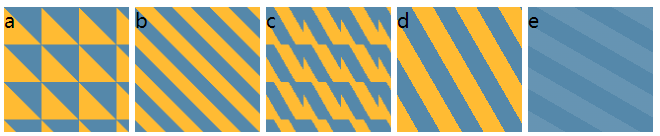
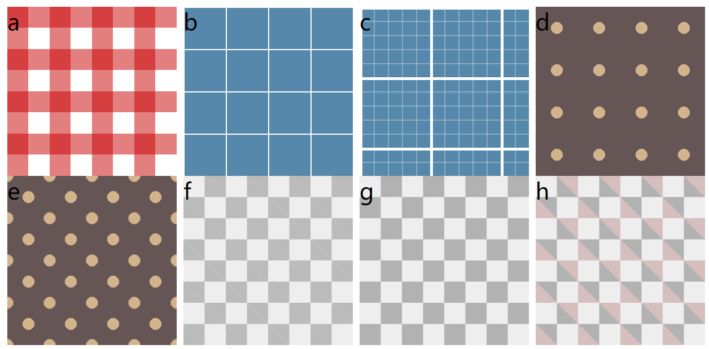
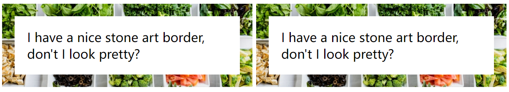
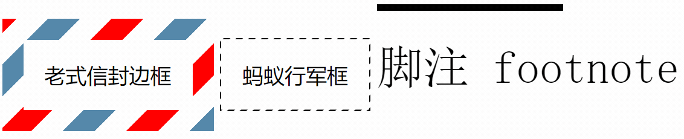

# 第2章：背景与边框

<!-- @import "[TOC]" {cmd="toc" depthFrom=3 depthTo=6 orderedList=false} -->

<!-- code_chunk_output -->

- [盒模型](#盒模型)
- [强大的条纹背景：基于线性渐变](#强大的条纹背景基于线性渐变)
  - [重复的条纹？垂直/斜向的条纹？](#重复的条纹垂直斜向的条纹)
- [基于复杂拼接的条纹](#基于复杂拼接的条纹)
  - [令人惊奇的 CSS3 Patterns Gallery](#令人惊奇的-css3-patterns-gallery)
  - [计算 CSS 体积 bytesizenatters.com](#计算-css-体积-bytesizenatterscom)
  - [网格、波点、棋盘](#网格-波点-棋盘)
- [连续的图像边框](#连续的图像边框)
  - [基于不同的 box](#基于不同的-box)
  - [老式信封、蚂蚁行军边框、脚注](#老式信封-蚂蚁行军边框-脚注)

<!-- /code_chunk_output -->

我从没想过 background 还可以组成如此强大的花纹...这真是 CSS 必读经典。

CSS规范：
- 背景与边框 https://www.w3.org/TR/css-backgrounds/
- 基本 UI 特性 https://www.w3.org/TR/css-ui-3/

### 盒模型

https://developer.mozilla.org/zh-CN/docs/Learn/CSS/Building_blocks/The_box_model

无论如何盒模型应该搞懂，从外至内三层分别是：
- Border Box
- Padding Box
- Content Box

书中举的例子是：我们想要调整 background 的位置， 于是去调整 `background-position` ：

```css
background: url(code-priate.svg) no-repeat #58a;
background-position: right 10px bottom 10px;  /* 处于右下角 */
```

但是这样不够 DRY ，于是想着用 padding 来控制：

```css
padding: 10px;
background: url(code-priate.svg) no-repeat #58a
            bottom right;
background-origin: content-box;
```

我们默认 `background-origin` 是 `padding-box` 的，为了让 padding 对 background 位置生效，这里设置为 `content-box` 即可。

### 强大的条纹背景：基于线性渐变

```css
body {
  background: linear-gradient(#fb3 20% #58a 80%);
}
```

如上，容器顶部 20% 的区域将被填充为 #fb3 实色，底部 20% 的区域 #58a 实色。中间是渐变。

如果设置为都是 50% ，则没有渐变。是条纹了。

CSS 图像（w3.org/TR/css3-images）： **如果某个色标的位置值比整个列表中在它之前的色标位置值都小，则该色标的位置值会被置为它前面所有色标位置值的最大值。**

```css
body {
  background: linear-gradient(#fb3 20% #58a 0);
}
```

如上会在上方 20% 处出现突然的颜色变化。相当于 `(#fb3 20% #58a 20%)` 。

#### 重复的条纹？垂直/斜向的条纹？

```css
body {
  background: linear-gradient(#fb3 20% #58a 0);
  background-position: 100% 30px;
}
```

如上，宽度是 100% ，但是条纹高度是 30px ，因此会自动产生重复的条纹。

如何让条纹垂直？

```css
body {
  background: linear-gradient(to right, #fb3 20% #58a 0);
  background-position: 100% 30px;
}
```

倾斜？比你想的复杂点。



```css
#a {
  background: linear-gradient(45deg, #fb3 50%, #58a 0);
  background-size: 30px 30px;
}

#b {
  background: linear-gradient(45deg,
      #fb3 25%, #58a 0, #58a 50%,
      #fb3 0, #fb3 75%, #58a 0);
  background-size: 30px 30px;
}

#c {
  background: linear-gradient(60deg,
      #fb3 25%, #58a 0, #58a 50%,
      #fb3 0, #fb3 75%, #58a 0);
  background-size: 30px 30px;
}

#d {
  background: repeating-linear-gradient(60deg, #fb3, #fb3 15px, #58a 0, #58a 30px);
}

#e {
  background: #58a;
  background-image: repeating-linear-gradient(30deg,
    hsla(0, 0%, 100%, .1),
    hsla(0, 0%, 100%, .1) 15px,
    transparent 0, transparent 30px
  );
}
```

注意从 a 到 b 带来的启发：
- 我们构造一个连续的背景，实际上就是找到这个背景的最小重复单元，因此像 a 那样单纯地构造一个左下黄色、右上蓝色的块块是不行的

b 、 c 和 d 的启发：
- 我们使用 linear-gradient 构造，会有一些心智负担
- 这里使用 repeating-linear-gradient 可以很轻松地调整角度，并且也不再是设置最小重复单元了

e 的启发：
- e 可以很好地进行浏览器回退，因为单独声明了简单的 background
- e 而言，只需要改变主色， background-image 是用来加透明叠层的

### 基于复杂拼接的条纹

这里并非有什么特殊的使用技巧，而是关于几何、关于大开脑洞的环节。

我这里记录几个很妙的设计，都是基于拼接的。没必要解释了，不明白的话就自己把颜色改改看看由哪几部分组成吧。

#### 令人惊奇的 CSS3 Patterns Gallery

作者已经有很棒的实现，我真没想过可以这么强大：
- http://lea.verou.me/css3patterns

#### 计算 CSS 体积 bytesizenatters.com

计算 css 代码体积可以去 http://bytesizematters.com/ 。

#### 网格、波点、棋盘



```css
#a {
  background: white;
  background-image: linear-gradient(90deg,
      rgba(200, 0, 0, .5) 50%, transparent 0),
    linear-gradient(rgba(200, 0, 0, .5) 50%, transparent 0);
  background-size: 30px 30px;
}

#b {
  background: #58a;
  background-image:
    linear-gradient(white 1px, transparent 0),
    linear-gradient(90deg, white 1px, transparent 0);
  background-size: 30px 30px;
}

#c {
  background: #58a;
  background-image: linear-gradient(white 2px, transparent 0),
    linear-gradient(90deg, white 2px, transparent 0),
    linear-gradient(hsla(0, 0%, 100%, .3) 1px, transparent 0),
    linear-gradient(90deg, hsla(0, 0%, 100%, .3) 1px, transparent 0);
  background-size: 50px 50px, 50px 50px,
    10px 10px, 10px 10px;
}

#d {
  background: #655;
  background-image: radial-gradient(tan 20%, transparent 0);
  background-size: 30px 30px;
}

#e {
  background: #655;
  background-image: radial-gradient(tan 20%, transparent 0),
    radial-gradient(tan 20%, transparent 0);
  background-size: 30px 30px;
  background-position: 0 0, 15px 15px;
}

#f {
  background: #eee;
  background-image:
    linear-gradient(45deg, #bbb 25%, transparent 0),
    linear-gradient(45deg, transparent 75%, #bbb 0),
    linear-gradient(45deg, #bbb 25%, transparent 0),
    linear-gradient(45deg, transparent 75%, #bbb 0);
  background-position: 0 0, 15px 15px,
    15px 15px, 30px 30px;
  background-size: 30px 30px;

  min-height: 100%;
}

#g {
  background: #eee;
  background-image:
    linear-gradient(45deg, rgba(0, 0, 0, .25) 25%, transparent 0, transparent 75%, rgba(0, 0, 0, .25) 0),
    linear-gradient(45deg, rgba(0, 0, 0, .25) 25%, transparent 0, transparent 75%, rgba(0, 0, 0, .25) 0);
  background-position: 0 0, 15px 15px;
  background-size: 30px 30px;

  min-height: 100%;
}

#h {
  background: #eee;
  background-image:
    linear-gradient(45deg, rgba(143, 50, 50, 0.25) 25%, transparent 0, transparent 75%, rgba(143, 50, 50, 0.25) 0),
    linear-gradient(45deg, rgba(0, 0, 0, .25) 25%, transparent 0, transparent 75%, rgba(0, 0, 0, .25) 0);
  background-position: 0 0, 15px 15px;
  background-size: 30px 30px;

  min-height: 100%;
}
```

如上，注意除了渐变位置本身，我们还可以通过 `background-position` 来移动每个矩形块。

### 连续的图像边框

基于九宫格伸缩法的 `border-image` 这里我不讨论。

#### 基于不同的 box



```html
<div class="a"><div>
  I have a nice stone art border,
  don't I look pretty?
</div></div>
<div class="b">
    I have a nice stone art border,
    don't I look pretty?
</div>
```

```css
.a {
  background: url(https://unsplash.com/photos/4_jhDO54BYg/download?ixid=MnwxMjA3fDB8MXxhbGx8fHx8fHx8fHwxNjQyODMzNjEz&force=true&w=640);
  background-size: cover;
  padding: 1em;
}

.a>div {
  background: white;
  padding: 1em;
}

.b {
  padding: 1em;
  border: 1em solid transparent;
  background: linear-gradient(white, white),
    url(https://unsplash.com/photos/4_jhDO54BYg/download?ixid=MnwxMjA3fDB8MXxhbGx8fHx8fHx8fHwxNjQyODMzNjEz&force=true&w=640);
  background-size: cover;
  background-clip: padding-box, border-box;
  background-origin: border-box;
}
```

如上，同样的效果，但是后者通过不同位置（不同的盒模型），只用了一层 tag 就实现了效果。

简写效果如下。

```css
div {
  border: 1em solid transparent;
  background: linear-gradient(white, white) padding-box,
              url(http://csssecrets.io/images/stone-art.jpg) border-box  0 / cover;
  
  /* Styling & enable resize */
  width: 21em;
  padding: 1em;
  overflow: hidden;
  resize: both;
  font: 100%/1.6 Baskerville, Palatino, serif;
}
```

#### 老式信封、蚂蚁行军边框、脚注



```html
<div class="a" id="d">
  老式信封边框
</div>
<div class="b" id="d">
  蚂蚁行军框
</div>
<div class="c" id="d">
  脚注 footnote
</div>
```

```css
.a {
  padding: 1em;
  border: 1em solid transparent;
  background: linear-gradient(white, white) padding-box,
    repeating-linear-gradient(-45deg, red 0, red 12.5%, transparent 0, transparent 25%,
      #58a 0, #58a 37.5%, transparent 0, transparent 50%) 0 / 6em 6em;
}

@keyframes ants {
  to {
    background-position: 100% 100%
  }
}

.b {
  padding: 1em;
  border: 1px solid transparent;
  background: linear-gradient(white, white) padding-box,
    repeating-linear-gradient(-45deg, black 0, black 25%, transparent 0, transparent 50%) 0 / .6em .6em;
  animation: ants 12s linear infinite;
}

.c {
  border-top: .15em solid transparent;
  border-image: 100% 0 0 linear-gradient(90deg, currentColor 4em, transparent 0);
  padding-top: .5em;
  font: 220%/1.4 Baskerville, Palatino, serif;
}
```
