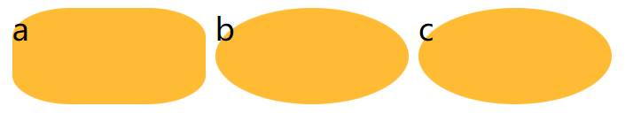
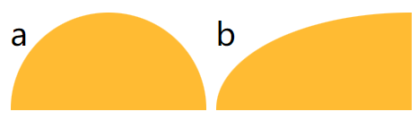
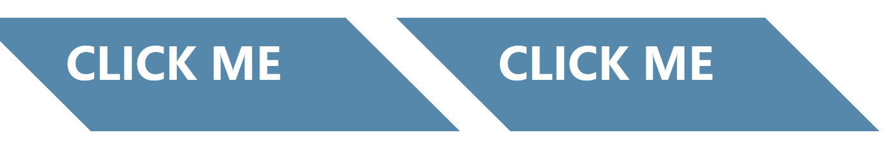
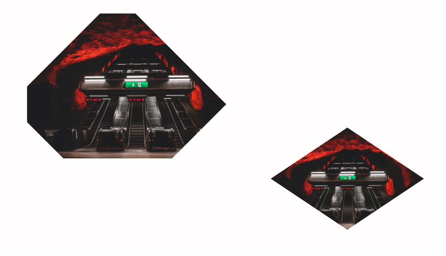

# 第3章：形状

<!-- @import "[TOC]" {cmd="toc" depthFrom=3 depthTo=6 orderedList=false} -->

<!-- code_chunk_output -->

- [椭圆与 border-radius](#椭圆与-border-radius)
  - [自适应椭圆](#自适应椭圆)
  - [使用斜杠范例以及半椭圆](#使用斜杠范例以及半椭圆)
- [平行四边形](#平行四边形)
  - [transform中的skew](#transform中的skew)
  - [菱形图片与clip-path](#菱形图片与clip-path)
  - [切角效果](#切角效果)
  - [梯形标签页与简单的饼图](#梯形标签页与简单的饼图)

<!-- /code_chunk_output -->

一些有趣的网站：
- https://simurai.com/archive/buttons/

### 椭圆与 border-radius

#### 自适应椭圆



```css
.a {
  /* 用斜杠分开这两个值，分别指定水平和垂直半径 */
  border-radius: 30px / 15px;
}

.b {
  /* 自适应椭圆 */
  border-radius: 50% / 50%;
}

.c {
  border-radius: 50%;
}
```

#### 使用斜杠范例以及半椭圆

实际上，可以用 border-radius 分别对左上、右上、右下、左下四个角指定水平和垂直半径。

当我们指定 `10px / 5px 20px` 时，实际上是相当于指定 `10px 10px 10px 10px / 5px 20px 5px 20px` 。



```css
.a {
  /* 
  水平方向 都是 50%
  垂直方向 左上和右上都是 50% ，其他是 0
   */
  border-radius: 50% / 100% 100% 0 0;
}

.b {
  /* 四分之一椭圆 */
  border-radius: 100% 0 0 0;
}
```

### 平行四边形

#### transform中的skew



```html
<div class="a" id="d">
  <div>Click me</div>
</div>
<div class="b" id="d">
  Click me
</div>
```

```css
.a {
  transform: skewX(45deg);
}

.a>div {
  /* 对内部容器反向变形，抵消容器变形 */
  transform: skewX(-45deg);
}

/**
 * Parallelograms — with pseudoelements
 */

.b::before {
  content: '';
  /* To generate the box */
  position: absolute;
  top: 0;
  right: 0;
  bottom: 0;
  left: 0;
  z-index: -1;
  background: #58a;
  transform: skew(45deg);
}
```

如上，可以用变形与伪元素的方案实现相同效果。

#### 菱形图片与clip-path



```html
<div class="a" id="d">
  
</div>
<div class="b" id="d">
  
</div>
```

```css
.a {
  width: 250px;
  height: 250px;
  transform: rotate(45deg);
  overflow: hidden;
  margin: 100px;
}

.a img {
  max-width: 100%;
  transform: rotate(-45deg) scale(1.42);
  z-index: -1;
  position: relative;
}

/**
 * Diamond images — via clip-path
 */

.b > img {
  max-width: 250px;
  margin: 20px;
  -webkit-clip-path: polygon(50% 0, 100% 50%, 50% 100%, 0 50%);
  clip-path: polygon(50% 0, 100% 50%, 50% 100%, 0 50%);
  transition: 1s;
}

.b > img:hover {
  -webkit-clip-path: polygon(0 0, 100% 0, 100% 100%, 0 100%);
  clip-path: polygon(0 0, 100% 0, 100% 100%, 0 100%);
}
```

如上，第一种基于变形的方法，不适于非正方形的图片。

#### 切角效果

书中介绍了基于 background 、 SVG 、 clip-path 等方法。

这里参考 [http://play.csssecrets.io/](http://play.csssecrets.io/) 中 bevel-corners-gradients 至 bevel-corners-clipped ，不再详记。

#### 梯形标签页与简单的饼图

基于一些变形、 SVG 技巧等，不详记：
- https://dabblet.com/gist/1345dc9399dc8e794502
- https://dabblet.com/gist/722909b9808c14eb7300
- https://dabblet.com/gist/66e1e52ac2a44ad87aa4
- https://dabblet.com/gist/e324a92d31b7f67da5c0
- https://dabblet.com/gist/4696e4c6700fe9f346d8
