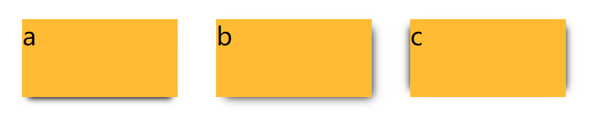
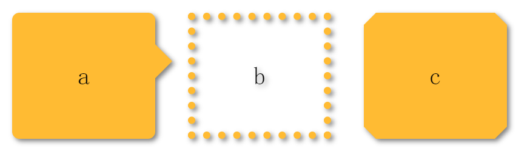
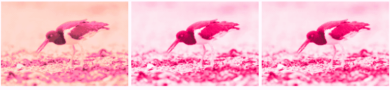
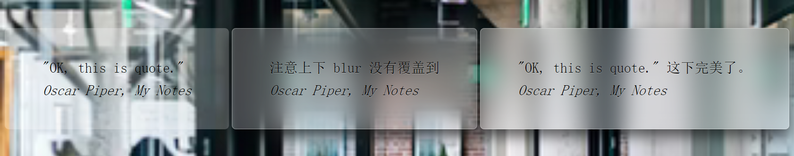

# 第4章：视觉效果

<!-- @import "[TOC]" {cmd="toc" depthFrom=3 depthTo=6 orderedList=false} -->

<!-- code_chunk_output -->

- [单双侧投影 box-shadow](#单双侧投影-box-shadow)
  - [box-shadow 意味着什么？](#box-shadow-意味着什么)
  - [单双侧投影技巧](#单双侧投影技巧)
- [不规则投影与 filter 中的 drop-shadow](#不规则投影与-filter-中的-drop-shadow)
- [染色效果与 filter 技巧以及混合模式 mix-blend-mode 和 background-blend-mode](#染色效果与-filter-技巧以及混合模式-mix-blend-mode-和-background-blend-mode)
- [毛玻璃效果与 blur](#毛玻璃效果与-blur)
- [基于背景条纹或者伪元素的折角效果](#基于背景条纹或者伪元素的折角效果)

<!-- /code_chunk_output -->

### 单双侧投影 box-shadow

#### box-shadow 意味着什么？

```css
box-shadow: 2px 3px 4px rgba(0,0,0,.5);
```

如上，相当于：
- 参照元素的尺寸（border box尺寸）和位置，画一个 rgba(0,0,0,.5) 的矩形
- 把它向右移 2px ，向下移 3px
- 使用高斯模糊算法（或类似算法）将它进行 4px 的模糊处理。这在本质上表示在阴影边缘发生阴影色和纯透明色之间的颜色过渡长度近似于模糊半径的两倍（比如在这里是 8px）
- 接下来，模糊后的矩形与原始元素的交集部分会被切除掉

这里有两点值得注意：
- **模糊后的矩形与原始元素的交集部分会被切除掉** ，这里是切除掉，因此如果元素是透明的，下方也不会有阴影，与 text-shadow 不同（ text-shadow 下方会是实实在在的颜色）
- 实际上这里上边缘与左边缘也是有阴影的，因为高斯模糊 4px 使得边缘向外扩张了 4px ，但是这里并不明显，因为渐变不是线性的（我们为了让尺寸可控，引入扩张半径）

#### 单双侧投影技巧

单双侧投影如下。



```css
.a {
  box-shadow: 0 5px 4px -4px black;
  /* -4 是扩张半径 */
}

.b {
  box-shadow: 3px 3px 6px -3px black;
}

.c {
  box-shadow: 5px 0 5px -5px black,
    -5px 0 5px -5px black;
}
```

### 不规则投影与 filter 中的 drop-shadow

注意投影并不会让伪元素、边框、文字等内容产生阴影。如果需要的话，可以使用 filter 的 drop-shadow 。



```css
div {
  position: relative;
  display: inline-flex;
  flex-direction: column;
  justify-content: center;
  vertical-align: bottom;
  box-sizing: border-box;
  width: 5.9em;
  height: 5.2em;
  margin: .6em;
  background: #fb3;
  /*box-shadow: .1em .1em .3em rgba(0,0,0,.5);*/
  -webkit-filter: drop-shadow(.1em .1em .1em rgba(0, 0, 0, .5));
  filter: drop-shadow(.1em .1em .1em rgba(0, 0, 0, .5));
  font: 200%/1.6 Baskerville, Palatino, serif;
  text-align: center;
}

.a {
  border-radius: .3em;
}

.a::before {
  content: '';
  position: absolute;
  top: 1em;
  right: -.7em;
  width: 0;
  height: 0;
  border: 1em solid transparent;
  border-left-color: #fb3;
  border-right-width: 0;
}

.b {
  background: transparent;
  border: .3em dotted #fb3;
}

.c {
  border: .5em solid #58a;
  border-image: 1 url('data:image/svg+xml, \
  <svg xmlns="http://www.w3.org/2000/svg" width="3" height="3" \
  fill="%23fb3"> <polygon points="0,1 1,0 2,0 3,1 3,2 2,3 1,3 0,2"/> \
  </svg>');
  background-clip: padding-box;
}
```

### 染色效果与 filter 技巧以及混合模式 mix-blend-mode 和 background-blend-mode



```html
<div class="a">
  
</div>
<div class="b">
  
</div>
<div class="c"
      style="background-image: url(https://images.unsplash.com/photo-1643993941838-34b20f686112?ixlib=rb-1.2.1&ixid=MnwxMjA3fDB8MHxwaG90by1wYWdlfHx8fGVufDB8fHx8&auto=format&fit=crop&w=1170&q=80)">
</div>
```

```css
.a>img {
  max-width: 200px;
  transition: 1s filter, 1s -webkit-filter;
  -webkit-filter: sepia() saturate(4) hue-rotate(295deg);
  filter: sepia() saturate(4) hue-rotate(295deg);
}

.a>img:hover,
.a>img:focus {
  -webkit-filter: none;
  filter: none;
}

.b {
  background: hsl(335, 100%, 50%);
}

.b>img {
  max-width: 200px;
  /* luminosity 混合模式保留上层元素的 HSL 亮度信息，从下层吸取色相和饱和度信息 */
  mix-blend-mode: luminosity;
}

.c {
  width: 200px;
  height: 133px;
  background-size: cover;
  background-color: hsl(335, 100%, 50%);
  background-blend-mode: luminosity;
  transition: .5s background-color;
}

.c:hover {
  background-color: transparent;
}
```

如上，使用混合模式的效果好于滤镜，但是单纯的混合模式没办法动画，因此使用一个巧妙的方法，对背景进行混合模式。

注意，第三种方法虽然视觉效果和动画效果都不错，但是：
- 图片尺寸需要写死
- 在语义上，这个元素并不是一张图片，因此不会被读屏器之类的设备读出来

### 毛玻璃效果与 blur



```html
<div class="a">
  <main>
    <blockquote>
      "OK, this is quote."
      <footer>
        <cite>
          Oscar Piper, My Notes
        </cite>
      </footer>
    </blockquote>
  </main>
</div>
<div class="b">
  <main>
    <blockquote>
      注意上下 blur 没有覆盖到
      <footer>
        <cite>
          Oscar Piper, My Notes
        </cite>
      </footer>
    </blockquote>
  </main>
</div>
<div class="c">
  <main>
    <blockquote>
      "OK, this is quote." 这下完美了。
      <footer>
        <cite>
          Oscar Piper, My Notes
        </cite>
      </footer>
    </blockquote>
  </main>
</div>
```

```css
div {
  position: relative;
  display: inline-flex;
  flex-direction: column;
  justify-content: center;
  vertical-align: bottom;
  box-sizing: border-box;
  padding-top: calc(50vh - 6em);
  font: 150%/1.6 Baskerville, Palatino, serif;
}

body, main::before {
  background: url("https://images.unsplash.com/photo-1504297050568-910d24c426d3?ixlib=rb-1.2.1&ixid=MnwxMjA3fDF8MHxwaG90by1wYWdlfHx8fGVufDB8fHx8&auto=format&fit=crop&w=387&q=80") 0 / cover fixed;
}

.a>main {
  position: relative;
  margin: 0 auto;
  padding: 1em;
  max-width: 23em;
  background: hsla(0, 0%, 100%, .25) border-box;
  overflow: hidden;
  border-radius: .3em;
}

.a>blockquote {
  font-style: italic
}

.a>blockquote .a>cite {
  font-style: normal;
}

.b>main {
  position: relative;
  margin: 0 auto;
  padding: 1em;
  max-width: 23em;
  background: hsla(0, 0%, 100%, .25) border-box;
  border-radius: .3em;
  box-shadow: 0 0 0 1px hsla(0, 0%, 100%, .3) inset,
    0 .5em 1em rgba(0, 0, 0, 0.6);
  text-shadow: 0 1px 1px hsla(0, 0%, 100%, .3);
}

.b>main::before {
  content: '';
  position: absolute;
  top: 0;
  right: 0;
  bottom: 0;
  left: 0;
  /* 把伪元素移动到宿主元素后面 */
  z-index: -1;
  -webkit-filter: blur(20px);
  filter: blur(20px);
}

.b>blockquote {
  font-style: italic
}

.b>blockquote .b>cite {
  font-style: normal;
}

.c>main {
  position: relative;
  margin: 0 auto;
  padding: 1em;
  max-width: 23em;
  background: hsla(0, 0%, 100%, .25) border-box;
  /* 让溢出的模糊内容 hidden */
  overflow: hidden;
  border-radius: .3em;
  box-shadow: 0 0 0 1px hsla(0, 0%, 100%, .3) inset,
    0 .5em 1em rgba(0, 0, 0, 0.6);
  text-shadow: 0 1px 1px hsla(0, 0%, 100%, .3);
}

.c>main::before {
  content: '';
  position: absolute;
  top: 0;
  right: 0;
  bottom: 0;
  left: 0;
  /* 使用 margin 扩大模糊覆盖范围 */
  margin: -30px;
  z-index: -1;
  -webkit-filter: blur(20px);
  filter: blur(20px);
}

.c>blockquote {
  font-style: italic
}

.c>blockquote .c>cite {
  font-style: normal;
}
```

### 基于背景条纹或者伪元素的折角效果

这个不详细记录：
- http://play.csssecrets.io/folded-corner
- http://play.csssecrets.io/folded-corner-realistic
- http://play.csssecrets.io/folded-corner-mixin
