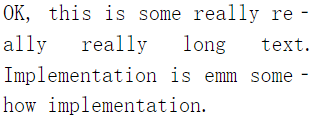
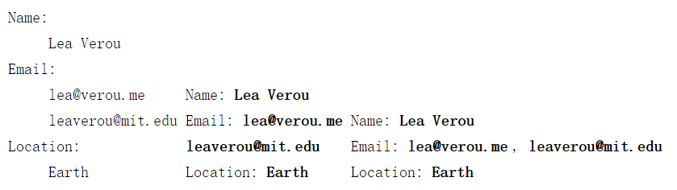
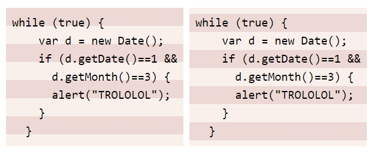
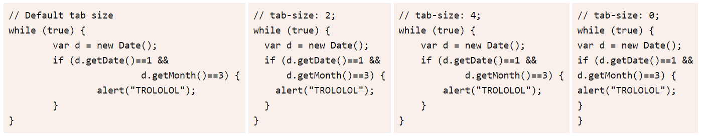
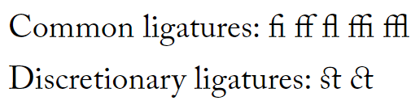
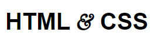
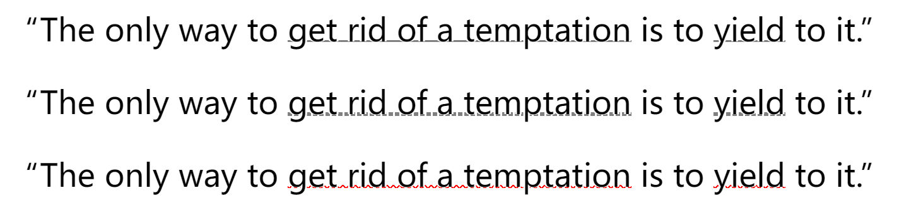
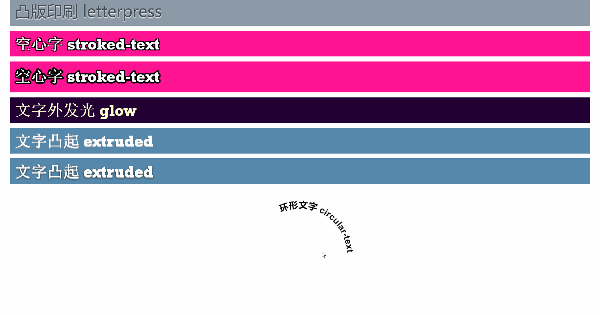

# 第5章：字体排印

<!-- @import "[TOC]" {cmd="toc" depthFrom=3 depthTo=6 orderedList=false} -->

<!-- code_chunk_output -->

- [连字符断行 hyphens](#连字符断行-hyphens)
- [结合伪元素与选择器插入换行](#结合伪元素与选择器插入换行)
- [代码块/文本行的斑马条纹（背景渐变实现）](#代码块文本行的斑马条纹背景渐变实现)
- [调整 tab 的宽度 tab-size](#调整-tab-的宽度-tab-size)
- [连字解决方案（font-variant相关）](#连字解决方案font-variant相关)
- [通过@font-face实现字体嵌入并设立范围](#通过font-face实现字体嵌入并设立范围)
- [自定义下划线（基于背景实现虚线）](#自定义下划线基于背景实现虚线)
- [一些文字特效（凸版印刷、空心字、外发光、凸起、基于SVG的环形文字）](#一些文字特效凸版印刷-空心字-外发光-凸起-基于svg的环形文字)

<!-- /code_chunk_output -->

### 连字符断行 hyphens



```css
.a {
  font: 110%/1.4 Baskerville, serif;
  text-align: justify;
  hyphens: auto;
}
```

### 结合伪元素与选择器插入换行



```html
<div class="x">
  <dl>
    <dt>Name:</dt>
    <dd>Lea Verou</dd>
  
    <dt>Email:</dt>
    <dd>lea@verou.me</dd>
    <dd>leaverou@mit.edu</dd>
  
    <dt>Location:</dt>
    <dd>Earth</dd>
  </dl>
</div>
```

```css

.b dt, .b dd {
  display: inline;
  margin: 0;
}

.b dd {
  font-weight: 600;
}

.b dd::after {  /* 把换行符加在 dd 后面并不明智 */
  content: "\A";
  white-space: pre;
}

.b dt, .b dd {
  display: inline;
  margin: 0;
}

.c dt, .c dd {
  display: inline;
  margin: 0;
}

.c dd {
  font-weight: 600;
}

.c dd+dt::before {  /* 把 换行符加在非首个 dt 前面 */
  content: "\A";
  white-space: pre;
}

.c dd+dd::before {
  content: ', ';
  font-weight: normal;
  margin-left: -.25em;
}
```

如上，值得注意的是 white-space 。一般而言，在 html 中添加换行符会导致其与相邻的空白符合并。使用 pre 保留源代码中的换行符和空白。

### 代码块/文本行的斑马条纹（背景渐变实现）



```html
<div class="x">
  <pre><code>while (true) {
    var d = new Date();
    if (d.getDate()==1 &amp;&amp;
      d.getMonth()==3) {
      alert("TROLOLOL");
    }
  }</code></pre>
</div>
```

```css
.a pre {
  padding: .5em;
  line-height: 1.5;
  background: hsl(20, 50%, 95%);
  background-image: linear-gradient(rgba(120, 0, 0, .1) 50%, transparent 0);
  background-size: auto 3em;
  font-family: Consolas, Monaco, monospace;
}

.a code {
  font: inherit
}

.b pre {
  padding: .5em;
  line-height: 1.5;
  background: hsl(20, 50%, 95%);
  background-image: linear-gradient(rgba(120, 0, 0, .1) 50%, transparent 0);
  background-size: auto 3em;
  background-origin: content-box;  /* 很有必要 */
  font-family: Consolas, Monaco, monospace;
}

.b code {
  font: inherit
}
```

### 调整 tab 的宽度 tab-size



```html
<pre><code>// Default tab size
while (true) {
	var d = new Date();
	if (d.getDate()==1 &amp;&amp;
			d.getMonth()==3) {
		alert("TROLOLOL");
	}
}</code></pre>

<pre><code>// tab-size: 2;
while (true) {
	var d = new Date();
	if (d.getDate()==1 &amp;&amp;
			d.getMonth()==3) {
		alert("TROLOLOL");
	}
}</code></pre>

<pre><code>// tab-size: 4;
while (true) {
	var d = new Date();
	if (d.getDate()==1 &amp;&amp;
			d.getMonth()==3) {
		alert("TROLOLOL");
	}
}</code></pre>

<pre><code>// tab-size: 0;
while (true) {
	var d = new Date();
	if (d.getDate()==1 &amp;&amp;
			d.getMonth()==3) {
		alert("TROLOLOL");
	}
}</code></pre>
```

注意上面都是 tab 而非空格。

```css
pre {
  padding: .5em;
  line-height: 1.5;
  background: hsl(20, 50%, 95%);
  font-family: Consolas, Monaco, monospace;
  display: inline-block;
}

pre:nth-of-type(2) {
  tab-size: 2
}

pre:nth-of-type(3) {
  tab-size: 4
}

pre:nth-of-type(4) {
  tab-size: 0
}

code {
  font: inherit;
}
```

### 连字解决方案（font-variant相关）



```html
Common ligatures: fi ff fl ffi ffl <br />
Discretionary ligatures: st ct
```

```css
body {
  font: 200%/1.6 "Adobe Caslon Pro", Baskerville, serif;
  font-variant-ligatures: common-ligatures discretionary-ligatures historical-ligatures;
}
```

这个只能用的时候查查文档。

### 通过@font-face实现字体嵌入并设立范围



```html
<h1>HTML & CSS</h1>
```

```css
@font-face {
  font-family: Ampersand;
  src: local('Baskerville-Italic'), local('GoudyOldStyleT-Italic'), local('Garamond-Italic'), local('Palatino-Italic');
  unicode-range: U+26;
}

h1 {
  font-family: Ampersand, Helvetica, sans-serif;
}
```

如上，可以用 unicode-range 限制字符范围， U+26 限制了一个符号，多个字符也是允许的： U+26, U+4??, U+2665-2670 。

### 自定义下划线（基于背景实现虚线）



```html
<p>“The only way to <a>get rid of a temptation</a> is to <a>yield</a> to it.”</p>
<p>“The only way to <a>get rid of a temptation</a> is to <a>yield</a> to it.”</p>
<p>“The only way to <a>get rid of a temptation</a> is to <a>yield</a> to it.”</p>
```

```css
a {
  background: linear-gradient(gray, gray) no-repeat;
  background-size: 100% 1px;
  background-position: 0 1.02em;
  text-shadow: .05em 0 white, -.05em 0 white;
}

p:nth-child(2) a {
  background: linear-gradient(90deg, gray 66%, transparent 0) repeat-x;
  background-size: .2em 2px;
  background-position: 0 1em;
}

p:nth-child(3) a {
  background: linear-gradient(-45deg, transparent 40%, red 0, red 60%, transparent 0) 0 1em,
    linear-gradient(45deg, transparent 40%, red 0, red 60%, transparent 0) .1em 1em;
  background-repeat: repeat-x;
  background-size: .2em .1em;
  text-shadow: .05em 0 white, -.05em 0 white;
}
```

### 一些文字特效（凸版印刷、空心字、外发光、凸起、基于SVG的环形文字）



```html
  <div class="a"> 凸版印刷 letterpress </div>
  <div class="b"> 空心字 stroked-text </div>
  <div class="b">
    <svg overflow="visible" width="2em" height="1.2em">
      <use xlink:href="#css" /><text id="css" y="1em"> 空心字 stroked-text </text>
    </svg>
  </div>
  <div class="c"> 文字外发光 glow </div>
  <div class="d"> 文字凸起 extruded </div>
  <div class="d"> 文字凸起 extruded </div>
  <div class="e">
    环形文字 circular-text
  </div>
```

```css

.a {
  background: hsl(210, 13%, 60%);
  color: hsl(210, 13%, 30%);
  text-shadow: 0 1px 1px hsla(0, 0%, 100%, .8);
}

.b {
  color: white;
  background: deeppink;
  font: bold 100%/1 Rockwell, serif;
}

.b:nth-child(2) {
  /* 对应父元素的第 2 个元素，这对应第一个 .b */
  text-shadow: 1px 1px black, -1px -1px black, 1px -1px black, -1px 1px black;
}

/* 使用 text-shadow 还是面临不自然的效果 */

.b text {
  fill: currentColor
}

.b use {
  /* SVG 可以实现较为完美的方案 */
  stroke: black;
  stroke-width: 3;
  stroke-linejoin: round;
}

.c {
  background: #203;
  font: bold 100%/1 Rockwell, serif;
  color: #ffc;
  text-decoration: none;
  transition: 1s;
}

.c:hover {
  /* X Y Blur */
  text-shadow: 0 0 .1em, 0 0 .3em;
}

.d {
  background: #58a;
  color: white;
  text-shadow: 0 .2px hsl(0, 0%, 85%),
    0 .4px hsl(0, 0%, 80%),
    0 .6px hsl(0, 0%, 75%),
    0 .8px hsl(0, 0%, 70%),
    0 1px hsl(0, 0%, 65%);
  font: bold 100%/1 Rockwell, serif;
}

.d+.d {
  background: #58a;
  color: white;
  text-shadow: 0 .2px hsl(0, 0%, 85%),
    0 .4px hsl(0, 0%, 80%),
    0 .6px hsl(0, 0%, 75%),
    0 .8px hsl(0, 0%, 70%),
    0 1px hsl(0, 0%, 65%),
    0 1px 2px black;
  /* 阴影增加了不少真实度 */
  font: bold 100%/1 Rockwell, serif;
}

.e {
  font: bold 60% Helvetica, sans-serif;
  width: 10em;
  height: 10em;
  margin: 2em auto 0;
}

.e svg {
  display: block;
  overflow: visible;
  transition: 10s linear transform;
}

.e svg:hover {
  transform: rotate(-2turn);
}

.e text {
  fill: currentColor
}

.e path {
  fill: none;
}
```

```javascript
function $$(selector, context) {
    context = context || document;
    var elements = context.querySelectorAll(selector);
    return Array.prototype.slice.call(elements);
  }

  $$('.e').forEach(function (el) {
    var NS = "http://www.w3.org/2000/svg";

    var svg = document.createElementNS(NS, "svg");
    svg.setAttribute("viewBox", "0 0 100 100");

    var circle = document.createElementNS(NS, "path");
    circle.setAttribute("d", "M0,50 a50,50 0 1,1 0,1z");
    circle.setAttribute("id", "circle");

    var text = document.createElementNS(NS, "text");
    var textPath = document.createElementNS(NS, "textPath");
    textPath.setAttributeNS("http://www.w3.org/1999/xlink", 'xlink:href', '#circle');
    textPath.textContent = el.textContent;
    text.appendChild(textPath);

    svg.appendChild(circle);
    svg.appendChild(text);

    el.textContent = '';
    el.appendChild(svg);
  });
```