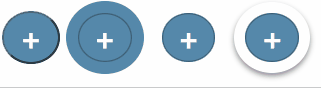
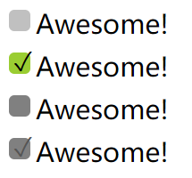
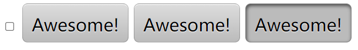
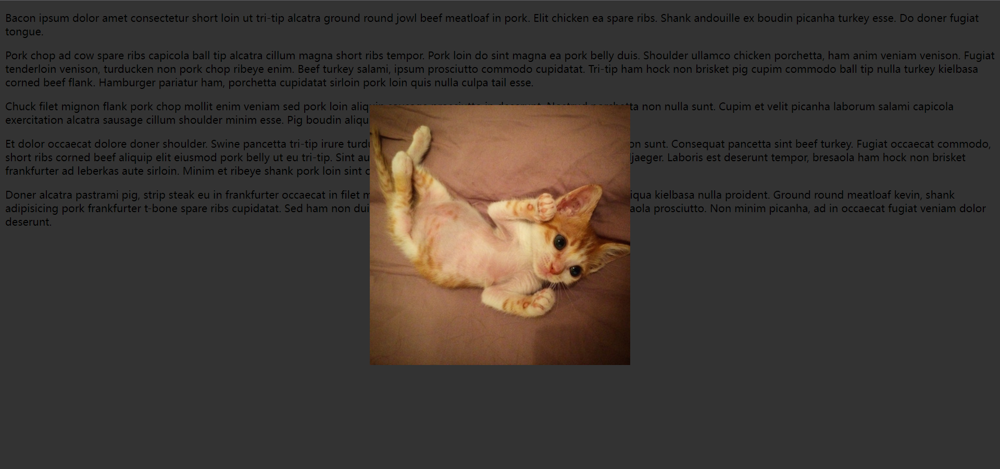
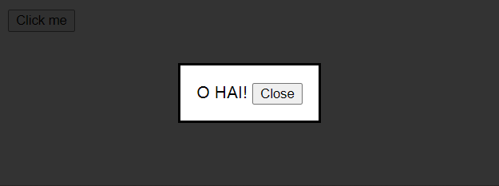
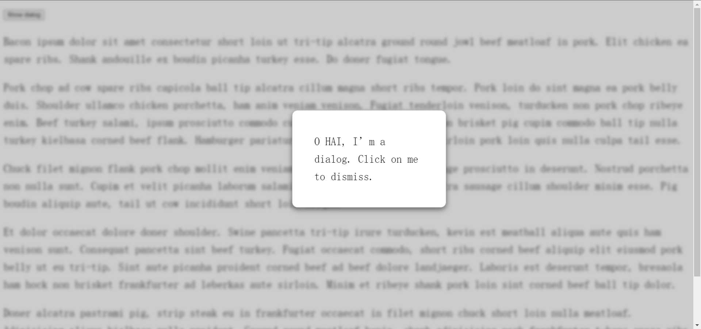
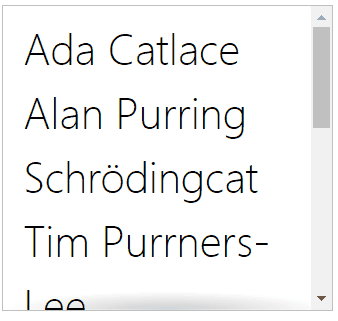
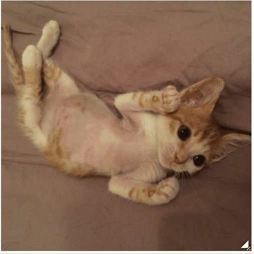

# 第6章：用户体验

<!-- @import "[TOC]" {cmd="toc" depthFrom=3 depthTo=6 orderedList=false} -->

<!-- code_chunk_output -->

- [选用合适的鼠标光标 cursor](#选用合适的鼠标光标-cursor)
- [扩大可点击区域](#扩大可点击区域)
  - [使用 border 扩大热区 hit-area](#使用-border-扩大热区-hit-area)
  - [利用伪元素扩大热区 hit-area](#利用伪元素扩大热区-hit-area)
- [自定义复选框（使用 clip rect(0,0,0,0) 隐藏原有复选框）](#自定义复选框使用-clip-rect0000-隐藏原有复选框)
- [开关式按钮](#开关式按钮)
- [弱化背景](#弱化背景)
  - [使用 box-shadow](#使用-box-shadow)
  - [使用 dialog 标签与 backdrop 伪元素（不完全支持）](#使用-dialog-标签与-backdrop-伪元素不完全支持)
  - [模糊背景示例：给背景添加类](#模糊背景示例给背景添加类)
- [基于 backgroud-attachment 的滚动提示](#基于-backgroud-attachment-的滚动提示)
- [交互式的图片对比控件](#交互式的图片对比控件)

<!-- /code_chunk_output -->

### 选用合适的鼠标光标 cursor

```css
:disabled, [disabled], [aria-disabled="true"] {
  cursor: not-allowed;
}
```

也可以加 url 比如 gif 等：

```css
video {
  cursor: url(transparent.gif);
}
```

当然了，为视频加上 url 以隐藏鼠标还不如直接设置 none ：

```css
video {
  cursor: url(transparent.gif);  // 用于回退
  cursor: none;
}
```

### 扩大可点击区域

#### 使用 border 扩大热区 hit-area



```html
  <button>+</button>
  <button>+</button>
  <button>+</button>
  <button>+</button>
```

```css
button:nth-child(1) {
  padding: .3em .5em;
  border-radius: 50%;
  background: #58a;
  color: white;
  font: bold 150%/1 sans-serif;
  cursor: pointer;
}

button:nth-child(2) {
  padding: .3em .5em;
  /* 使用透明的 border 但依然会导致问题 */
  /* 背景会蔓延到边框的下层 */
  border: 10px solid transparent;
  border-radius: 50%;
  background: #58a;
  /* 我们想给按钮加一块边框，这里使用 box-shadow */
  box-shadow: 0 0 0 1px rgba(0, 0, 0, .3) inset;
  color: white;
  font: bold 150%/1 sans-serif;
  cursor: pointer;
}

button:nth-child(3) {
  padding: .3em .5em;
  border: 10px solid transparent;
  border-radius: 50%;
  background: #58a;
  /* 因此这里用 clip 把超过 padding 的背景剪掉 */
  background-clip: padding-box;
  box-shadow: 0 0 0 1px rgba(0, 0, 0, .3) inset;
  color: white;
  font: bold 150%/1 sans-serif;
  cursor: pointer;
}

button:nth-child(4) {
  padding: .3em .5em;
  border: 10px solid transparent;
  border-radius: 50%;
  background: #58a;
  background-clip: padding-box;
  /* 这个解决方案还是存在问题，因为给外部投影是在 border box 外部的 */
  box-shadow: 0 0 0 1px rgba(0, 0, 0, .3) inset,
              0 .1em .2em -.05em rgba(0, 0, 0, .5);
  color: white;
  font: bold 150%/1 sans-serif;
  cursor: pointer;
}
```

#### 利用伪元素扩大热区 hit-area

```css
button {
  position: relative;
  padding: .3em .5em;
  background: #58a;
  border-radius: 50%;
  border: 1px solid rgba(0, 0, 0, .3);
  box-shadow: 0 .1em .2em -.05em rgba(0, 0, 0, .5);
  color: white;
  font: bold 150%/1 sans-serif;
  cursor: pointer;
}

button:before {
  content: '';
  position: absolute;
  top: -10px;
  right: -10px;
  bottom: -10px;
  left: -10px;
}
```

### 自定义复选框（使用 clip rect(0,0,0,0) 隐藏原有复选框）



```html
<input type="checkbox" id="awesome" autofocus />
<label for="awesome">Awesome!</label>
<br />
<input type="checkbox" id="awesome2" checked />
<label for="awesome2">Awesome!</label>
<br />
<input type="checkbox" id="awesome3" disabled />
<label for="awesome3">Awesome!</label>
<br />
<input type="checkbox" id="awesome4" checked disabled />
<label for="awesome4">Awesome!</label>
```

```css
input[type="checkbox"] {
  position: absolute;
  clip: rect(0, 0, 0, 0);  /* 把原来的复选框去掉 */
}

input[type="checkbox"]+label::before {
  content: '\a0';  /* 不换行空格 */
  display: inline-block;
  vertical-align: .2em;
  width: .8em;
  height: .8em;
  margin-right: .2em;
  border-radius: .2em;
  background: silver;
  text-indent: .15em;
  line-height: .65;
}

input[type="checkbox"]:checked+label::before {
  content: '\2713';
  background: yellowgreen;
}

input[type="checkbox"]:focus+label::before {
  box-shadow: 0 0 .1em .1em #58a;
}

input[type="checkbox"]:disabled+label::before {
  background: gray;
  box-shadow: none;
  color: #555;
  cursor: not-allowed;
}

body {
  font: 150%/1.6 sans-serif;
}
```

### 开关式按钮



```html
<input type="checkbox" id="awesome" autofocus />
<label for="awesome">Awesome!</label>

<input type="checkbox" id="awesome1" autofocus />
<label for="awesome1">Awesome!</label>

<input type="checkbox" id="awesome2" checked />
<label for="awesome2">Awesome!</label>
```

```css
input[type="checkbox"]:not(:first-child) {
  position: absolute;
  clip: rect(0, 0, 0, 0);  /* 隐藏原有复选框 */
}

input[type="checkbox"]+label {
  display: inline-block;
  padding: .35em .5em .2em;
  background: #ccc;
  background-image: linear-gradient(#ddd, #bbb);
  border: 1px solid rgba(0, 0, 0, .2);
  border-radius: .3em;
  box-shadow: 0 1px white inset;
  text-align: center;
  text-shadow: 0 1px 1px white;
  cursor: pointer;
}

input[type="checkbox"]:checked+label,
input[type="checkbox"]:active+label {
  box-shadow: .04em .1em .2em rgba(0, 0, 0, .6) inset;
  border-color: rgba(0, 0, 0, .3);
  background: #bbb;
}

body {
  font: 150%/1.6 sans-serif;
}
```

### 弱化背景

#### 使用 box-shadow

使用伪元素无法绑定独立的 js 事件。使用 box-shadow 又无法防止鼠标与其他部分交互。

这里举例 box-shadow 例子。



```html

<p>Bacon ipsum dolor amet consectetur
</p>
```

```css
.lightbox {
  position: fixed;
  top: 50%;
  left: 50%;
  margin: -200px;
  box-shadow: 0 0 0 50vmax rgba(0, 0, 0, .8);
}
```

#### 使用 dialog 标签与 backdrop 伪元素（不完全支持）



```html
<button onclick="document.querySelector('#modal').showModal()">Click me</button>
<dialog id="modal">
  O HAI!
  <button onclick="this.parentNode.close()">Close</button>
</dialog>
```

```css
dialog::backdrop {
  background: rgba(0, 0, 0, .8)
}
```

#### 模糊背景示例：给背景添加类



```html
<main>
  <button>Show dialog</button>
  <p>Bacon ipsum dolor sit amet consectetur</p>
</main>
```

```css
main {
  transition: .6s;
  background: white;
}

main.de-emphasized {
  -webkit-filter: blur(3px);
  filter: blur(3px);
}

dialog {
  position: fixed;
  top: 50%;
  left: 50%;
  z-index: 1;
  width: 10em;
  padding: 2em;
  margin: -5em;
  border: 1px solid silver;
  border-radius: .5em;
  box-shadow: 0 .2em .5em rgba(0, 0, 0, .5),
    0 0 0 100vmax rgba(0, 0, 0, .2);
}

dialog:not([open]) {
  display: none;
}

body {
  font: 150%/1.6 Baskerville, Palatino, serif;
}
```

```javascript
function $(sel) {
  return document.querySelector(sel);
}

var dialog = $('dialog');
var main = $('main');

$('button').onclick = function () {

  dialog.setAttribute('open', '');

  main.classList.add('de-emphasized');
}

dialog.onclick = function () {
  if (dialog.close) {
    dialog.close();
  }
  else {
    dialog.removeAttribute('open');
  }

  main.classList.remove('de-emphasized');
}
```

### 基于 backgroud-attachment 的滚动提示



```html
<ul>
  <li>Ada Catlace</li>
  <li>Alan Purring</li>
  <li>Schrödingcat</li>
  <li>Tim Purrners-Lee</li>
  <li>Webkitty</li>
  <li>Json</li>
  <li>Void</li>
  <li>Neko</li>
  <li>NaN</li>
  <li>Cat5</li>
  <li>Vector</li>
</ul>
```

```css
ul {
  display: inline-block;
  overflow: auto;
  width: 7.2em;
  height: 7em;
  border: 1px solid silver;
  padding: .3em .5em;
  list-style: none;
  margin-top: 2em;
  font: 100 200%/1.6 'Frutiger LT Std', sans-serif;
  background: linear-gradient(white 15px, hsla(0, 0%, 100%, 0)) 0 0 / 100% 50px,
    radial-gradient(at top, rgba(0, 0, 0, .2), transparent 70%) 0 0 / 100% 15px,
    linear-gradient(to top, white 15px, hsla(0, 0%, 100%, 0)) bottom / 100% 50px,
    radial-gradient(at bottom, rgba(0, 0, 0, .2), transparent 70%) bottom / 100% 15px;
  background-repeat: no-repeat;
  background-attachment: local, scroll, local, scroll;
  margin-top: 30px;
}
```

这里用背景与滚动覆盖实现阴影效果。

### 交互式的图片对比控件



```html
<div class="image-slider">
  <div></div>
  
</div>
```

```css
.image-slider {
  position: relative;
  display: inline-block;
}

.image-slider>div {
  position: absolute;
  top: 0;
  bottom: 0;
  left: 0;
  width: 50%;
  max-width: 100%;
  overflow: hidden;
  resize: horizontal;
}

.image-slider>div:before {
  content: '';
  position: absolute;
  right: 0;
  bottom: 0;
  width: 12px;
  height: 12px;
  padding: 5px;
  background: linear-gradient(-45deg, white 50%, transparent 0);
  background-clip: content-box;
  cursor: ew-resize;
  -webkit-filter: drop-shadow(0 0 2px black);
  filter: drop-shadow(0 0 2px black);
}

.image-slider img {
  display: block;
  user-select: none;
}
```
