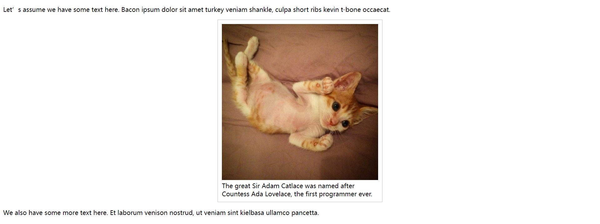
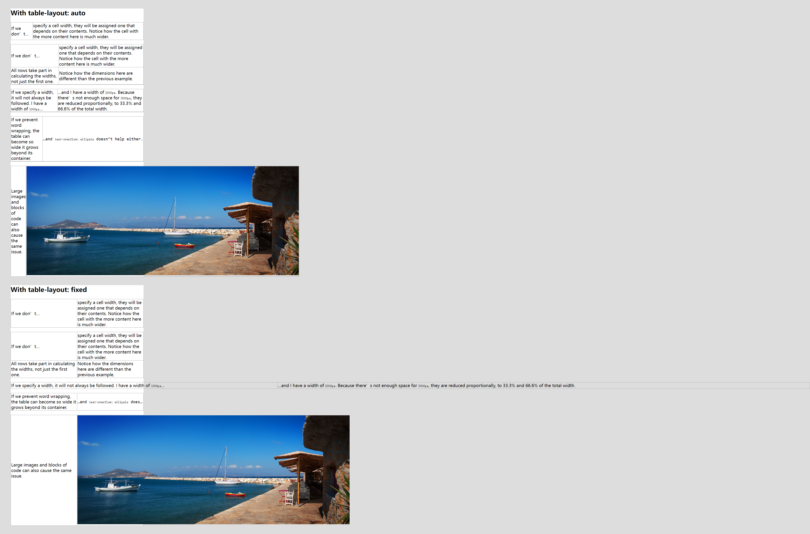
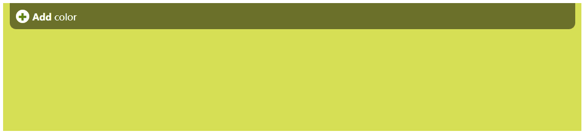
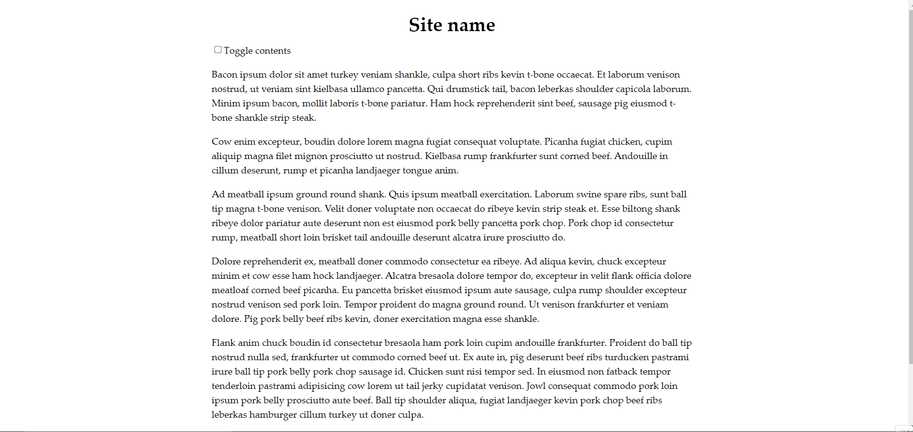

# 第7章：结构与布局

<!-- @import "[TOC]" {cmd="toc" depthFrom=3 depthTo=6 orderedList=false} -->

<!-- code_chunk_output -->

- [基于 min-content 实现自适应内部元素](#基于-min-content-实现自适应内部元素)
- [基于 table-layout 精确控制表格列宽](#基于-table-layout-精确控制表格列宽)
- [CSS选择器：根据兄弟元素数量](#css选择器根据兄弟元素数量)
  - [当列表包含2到6项时，命中所有列表项](#当列表包含2到6项时命中所有列表项)
  - [根据兄弟元素数量设置样式综合案例](#根据兄弟元素数量设置样式综合案例)
- [基于 calc 实现页面内容定宽](#基于-calc-实现页面内容定宽)
- [垂直居中](#垂直居中)
  - [margin 的百分比值是以父元素宽度作为解析基准的](#margin-的百分比值是以父元素宽度作为解析基准的)
  - [基于绝对定位和 flexbox 的解决方案](#基于绝对定位和-flexbox-的解决方案)
- [将页脚紧贴底部](#将页脚紧贴底部)
  - [固定高度的解决方案（计算 em 距离）](#固定高度的解决方案计算-em-距离)
  - [基于 flex 的更加灵活的解决方案](#基于-flex-的更加灵活的解决方案)

<!-- /code_chunk_output -->

### 基于 min-content 实现自适应内部元素

如果不给元素指定一个具体的 width ，其并不会自适应其内容的宽度。

有以下几个常见方法来实现宽度自适应：
- 让元素浮动，但是会破坏布局模式
- 设置为 inline-block ，我们则很难完成水平居中的任务
- 开发者走投无路时，往往会设置一个 max-width

但这都不是合理的方式，可以应用 css3-sizing 中的 min-content 。



```html
<p>Let’s assume we have some text here. Bacon ipsum dolor sit amet turkey veniam shankle, culpa short ribs kevin t-bone occaecat.</p>
<figure>
	
	<figcaption>
		The great Sir Adam Catlace was named after Countess Ada Lovelace, the first programmer ever.
	</figcaption>
</figure>
<p>We also have some more text here. Et laborum venison nostrud, ut veniam sint kielbasa ullamco pancetta.</p>
```

```css
/**
 * Intrinsic sizing
 */

figure {
  max-width: 300px;  /* 浏览器回退 */
  max-width: min-content;
  margin: auto;
}

figure>img {
  max-width: inherit
}

/* Basic styling */

figure {
  padding: 10px;
  border: 1px solid silver;
}
```

### 基于 table-layout 精确控制表格列宽



```html
<section>
  <h1>With table-layout: auto</h1>
  <div>
    <table>
      <tr>
        <td>If we don’t…</td>
        <td>specify a cell width, they will be assigned one that depends on their contents. Notice how the cell with
          the
          more content here is much wider.</td>
      </tr>
    </table>

    <table>
      <tr>
        <td>If we don’t…</td>
        <td>specify a cell width, they will be assigned one that depends on their contents. Notice how the cell with
          the
          more content here is much wider.</td>
      </tr>
      <tr>
        <td>All rows take part in calculating the widths, not just the first one.</td>
        <td>Notice how the dimensions here are different than the previous example.</td>
      </tr>
    </table>

    <table>
      <tr>
        <td style="width: 1000px">If we specify a width, it will not always be followed. I have a width of
          <code>1000px</code>…
        </td>
        <td style="width: 2000px">…and I have a width of <code>2000px</code>. Because there’s not enough space for
          <code>3000px</code>, they are reduced proportionally, to 33.3% and 66.6% of the total width.
        </td>
      </tr>
    </table>

    <table>
      <tr>
        <td>If we prevent word wrapping, the table can become so wide it grows beyond its container.</td>
        <td class="preformatted">…and <code>text-overflow: ellipsis</code> doesn’t help either.</td>
      </tr>
    </table>

    <table>
      <tr>
        <td>Large images and blocks of code can also cause the same issue.</td>
        <td></td>
      </tr>
    </table>
  </div>
</section>

<section>
  <h1>With table-layout: fixed</h1>
  <div>
    <table>
      <tr>
        <td>If we don’t…</td>
        <td>specify a cell width, they will be assigned one that depends on their contents. Notice how the cell with
          the
          more content here is much wider.</td>
      </tr>
    </table>

    <table>
      <tr>
        <td>If we don’t…</td>
        <td>specify a cell width, they will be assigned one that depends on their contents. Notice how the cell with
          the
          more content here is much wider.</td>
      </tr>
      <tr>
        <td>All rows take part in calculating the widths, not just the first one.</td>
        <td>Notice how the dimensions here are different than the previous example.</td>
      </tr>
    </table>

    <table>
      <tr>
        <td style="width: 1000px">If we specify a width, it will not always be followed. I have a width of
          <code>1000px</code>…
        </td>
        <td style="width: 2000px">…and I have a width of <code>2000px</code>. Because there’s not enough space for
          <code>3000px</code>, they are reduced proportionally, to 33.3% and 66.6% of the total width.
        </td>
      </tr>
    </table>

    <table>
      <tr>
        <td>If we prevent word wrapping, the table can become so wide it grows beyond its container.</td>
        <td class="preformatted">…and <code>text-overflow: ellipsis</code> doesn’t help either.</td>
      </tr>
    </table>

    <table>
      <tr>
        <td>Large images and blocks of code can also cause the same issue.</td>
        <td></td>
      </tr>
    </table>
  </div>
</section>
```

```css
/**
 * Taming table column widths
 */

body { background: #ddd }

section {
	width: 500px;
	margin: 2em;
	background: white;
}

table {
	border-collapse: collapse;
	margin-bottom: 1em;
	width: 100%;
}

section + section table { table-layout: fixed }

td {
	border: 1px solid #aaa;
}

td.preformatted {
	white-space: pre;
	font-family: Consolas, Monaco, monospace;
	text-overflow: ellipsis;
	overflow: hidden;
}
```

### CSS选择器：根据兄弟元素数量

首先看个例子：

```css
li:first-child:nth-last-child(1) {
  /* 相当于 li:only-child */
}

li:first-child:nth-last-child(4),
li:first-child:nth-last-child(4) ~ li {
  /* 当列表正好包含四项时，命中所有列表项 */
}
```

#### 当列表包含2到6项时，命中所有列表项

```css
li:first-child:nth-last-child(n+2):nth-last-child(-n+6),
li:first-child:nth-last-child(n+2):nth-last-child(-n+6) ~ li { }
```

#### 根据兄弟元素数量设置样式综合案例



```html
<ul class="palette">
  <li>
    <div class="color-options">
      <a class="add" href="#">Add</a>
      <a class="delete" href="#">Delete</a>
    </div>
  </li>
</ul>
```

```css
/**
 * Styling by sibling count: Color palette example
 */

/* Hide "color" 4 items or more */
.palette li:first-child:nth-last-child(n+4) .color-options a:after,
.palette li:first-child:nth-last-child(n+4)~li .color-options a:after {
  content: none;
}

/* Hide word when 6 items or more */
.palette li:first-child:nth-last-child(n+6) .color-options a,
.palette li:first-child:nth-last-child(n+6)~li .color-options a {
  color: transparent;
  font-size: 0;
}

.palette li:only-child .delete {
  display: none;
}

/* From this point it’s just styling */
.palette {
  display: flex;
  height: 200px;
  max-width: 900px;
  font: bold 90%/1 sans-serif;
}

.palette li {
  flex: 1;
  list-style: none;
  background: #D6E055;
}

.color-options {
  background: rgba(0, 0, 0, .5);
  padding: 10px;
  margin: 0 10px;
  overflow: hidden;
  border-radius: 0 0 10px 10px;
}

.color-options .add {
  float: left;
}

.color-options .delete {
  float: right;
}

.color-options a {
  color: white;
  text-decoration: none;
}

.color-options a:before {
  display: inline-block;
  font-size: 1rem;
  width: 1.3rem;
  margin-right: .3rem;
  text-align: center;
  line-height: 1.3;
  background: white;
  border-radius: 50%;
  letter-spacing: normal;
}

.color-options .add:before {
  content: '✚';
  color: #590;
}

.color-options .delete:before {
  content: '✖';
  color: #b00;
}

.color-options a:after {
  content: ' color';
  font-weight: normal;
}
```

```javascript
function $$(expr, con) { return [].slice.call((con || document).querySelectorAll(expr)); }

var colors = [
  '#D6E055', // Agave
  '#082323', '#E6E2AF', '#A7A37E', '#EFECCA', '#046380', // Sandy stone beach
  '#1C171D', '#FEE169', '#CDD452', '#F9722E', '#C9313D', // Sushi Maki
  '#2E95A3', '#50B8B4', '#C6FFFA', '#E2FFA8'  // Agave
],
  palette = document.querySelector('.palette'),
  template = palette.firstElementChild;

function addColor(template) {
  var li = template.cloneNode(true);
  var color = colors.pop();
  colors.unshift(color);
  li.style.background = color;
  palette.insertBefore(li, template.nextSibling);
}

palette.onclick = function (evt) {
  var button = evt.target;

  if (button.className == 'add') {
    addColor(button.parentNode.parentNode);
  }
  else if (button.className == 'delete') {
    var li = button.parentNode.parentNode;
    li.parentNode.removeChild(li);
  }
}
```

### 基于 calc 实现页面内容定宽

我们可以将如下

```css
header, section, footer {
  max-width: 900px;
  padding: 1em calc(50% - 450px);
}
```

优化成如下

```css
header, section, footer {
  padding: 1em calc(50% - 450px);
}
```

### 垂直居中

#### margin 的百分比值是以父元素宽度作为解析基准的

```css
main {
  width: 18em;
  padding: 1em 1.5em;
  margin: 50% auto 0;
  transform: translateY(-50%);
}
```

如上，可能导致整个 main 元素偏下，因为这里 margin 的 50% 是父元素的大小，并不是自身的 50% 。

如何做？

```css
main {
  width: 18em;
  padding: 1em 1.5em;
  margin: 50vh auto 0;
  transform: translateY(-50%);
}
```

注意这个技巧只能用于视口居中的场景。

#### 基于绝对定位和 flexbox 的解决方案

```css
main {
  position: absolute;
  top: 50%;
  left: 50%;
  margin-top: -3em;
  margin-left: -9em;
  width: 18em;
  height: 6em;
}
```

上述的原理是什么？首先与左边和上边各相距父元素的 50% ，然后把自己向左上移动自己的一般距离。

可以优化成如下代码：

```css
main {
  position: absolute;
  top: 50%;
  left: 50%;
  transform: translate(-50%, 50%);
}
```

但是，上述代码存在一些问题，比如必须使用绝对定位等。

基于 flex 是一个好办法。

```css
body {
  display: flex;
  min-height: 100vh;
  margin: 0;
}

main {
  margin: auto;
}
```

对文本实现居中如下：

```css
main {
  display: flex;
  align-items: center;
  justify-content: center;
  width: 18em;
  height: 10em;
}
```

### 将页脚紧贴底部

#### 固定高度的解决方案（计算 em 距离）



这里，我们隐藏掉段落，也不会导致 footer 跑到上面来，因为有 main 的 min-height 在限制着。

这里 min-height 应该是是多大呢：

总体高度 - header 高度 - footer 高度

header 高度是 3em （规定的高度）+ margin-top 1em = 4em

footer 高度是 2×1.5em （2行 × 行高） + 3×1em （3 × 段落的垂直外边距） + 1em padding = 7em

因此 min-height 是：

100vh - 4em - 7em - 1em

为什么要最后减去 1em 呢？因为 main 自己的 padding 。

```html
  <header>
    <h1>Site name</h1>
  </header>
  <main>
    <input type="checkbox" id="contents" /><label for="contents">Toggle contents</label>
    <p>Bacon ipsum dolor sit amet turkey veniam shankle, culpa short ribs kevin t-bone occaecat. Et laborum venison
      nostrud, ut veniam sint kielbasa ullamco pancetta. Qui drumstick tail, bacon leberkas shoulder capicola laborum.
      Minim ipsum bacon, mollit laboris t-bone pariatur. Ham hock reprehenderit sint beef, sausage pig eiusmod t-bone
      shankle strip steak.</p>
    <p>Cow enim excepteur, boudin dolore lorem magna fugiat consequat voluptate. Picanha fugiat chicken, cupim aliquip
      magna filet mignon prosciutto ut nostrud. Kielbasa rump frankfurter sunt corned beef. Andouille in cillum
      deserunt,
      rump et picanha landjaeger tongue anim.</p>
    <p>Ad meatball ipsum ground round shank. Quis ipsum meatball exercitation. Laborum swine spare ribs, sunt ball tip
      magna t-bone venison. Velit doner voluptate non occaecat do ribeye kevin strip steak et. Esse biltong shank ribeye
      dolor pariatur aute deserunt non est eiusmod pork belly pancetta pork chop. Pork chop id consectetur rump,
      meatball
      short loin brisket tail andouille deserunt alcatra irure prosciutto do.</p>
    <p>Dolore reprehenderit ex, meatball doner commodo consectetur ea ribeye. Ad aliqua kevin, chuck excepteur minim et
      cow esse ham hock landjaeger. Alcatra bresaola dolore tempor do, excepteur in velit flank officia dolore meatloaf
      corned beef picanha. Eu pancetta brisket eiusmod ipsum aute sausage, culpa rump shoulder excepteur nostrud venison
      sed pork loin. Tempor proident do magna ground round. Ut venison frankfurter et veniam dolore. Pig pork belly beef
      ribs kevin, doner exercitation magna esse shankle.</p>
    <p>Flank anim chuck boudin id consectetur bresaola ham pork loin cupim andouille frankfurter. Proident do ball tip
      nostrud nulla sed, frankfurter ut commodo corned beef ut. Ex aute in, pig deserunt beef ribs turducken pastrami
      irure ball tip pork belly pork chop sausage id. Chicken sunt nisi tempor sed. In eiusmod non fatback tempor
      tenderloin pastrami adipisicing cow lorem ut tail jerky cupidatat venison. Jowl consequat commodo pork loin ipsum
      pork belly prosciutto aute beef. Ball tip shoulder aliqua, fugiat landjaeger kevin pork chop beef ribs leberkas
      hamburger cillum turkey ut doner culpa.</p>
  </main>
  <footer>
    <p>© 2015 No rights reserved.</p>
    <p>Made with ♥ by an anonymous pastafarian.</p>
  </footer>
```

```css
/**
 * Sticky footer with fixed height
 */

main {
  min-height: calc(100vh - 4em - 7em - 1em);
}

/* Toggle checkbox to alternate between short/long content */
#contents:checked~p {
  display: none
}

/* Basic styling */
body {
  margin: 0;
  font: 100%/1.5 Palatino Linotype, Palatino, serif;
}

h1 {
  margin: .5em 0 0;
}

header {
  text-align: center;
  height: 3em;
}

main, footer {
  display: block;
  padding: .5em calc(50% - 400px);
}

footer {
  background: linear-gradient(#222, #444);
  color: white;
  height: 6em;
}
```

#### 基于 flex 的更加灵活的解决方案

```css
/**
 * Sticky footer with flexible height
 */
 
body {
	display: flex;
	flex-direction: column;
	min-height: 100vh;
}

main {
	flex: 1;
}

/* Toggle checkbox to alternate between short/long content */
#contents:checked ~ p { display: none }

/* Basic styling */
body {
	margin: 0;
	font: 100%/1.5 Baskerville, Palatino Linotype, Palatino, serif;
}

h1 { margin: .5em 0 0; }

header { text-align: center; height: 3em; }

main, footer {
	display: block;
	padding: .5em calc(50% - 400px);
}

footer {
	background: linear-gradient(#222, #444);
	color: white;
}
```
