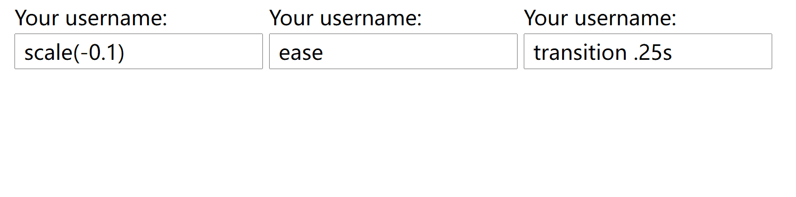
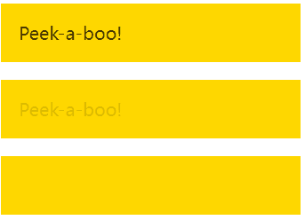
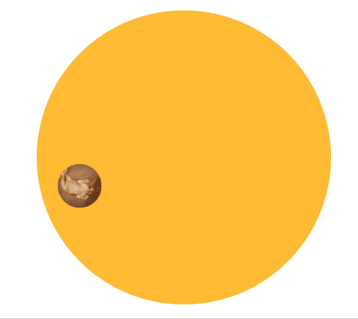

# 第8章：过渡与动画

<!-- @import "[TOC]" {cmd="toc" depthFrom=3 depthTo=6 orderedList=false} -->

<!-- code_chunk_output -->

- [贝塞尔曲线 cubic-bezier 实现缓动效果](#贝塞尔曲线-cubic-bezier-实现缓动效果)
- [弹性过渡实例：覆盖 transition-timing-function](#弹性过渡实例覆盖-transition-timing-function)
- [使用 steps 实现逐帧动画](#使用-steps-实现逐帧动画)
- [闪烁效果](#闪烁效果)
- [打字效果综合案例（长度单位 ch）](#打字效果综合案例长度单位-ch)
- [基于 animation-play-state 实现状态平滑动画](#基于-animation-play-state-实现状态平滑动画)
- [记录复杂案例：沿环形路径平移的动画](#记录复杂案例沿环形路径平移的动画)

<!-- /code_chunk_output -->

### 贝塞尔曲线 cubic-bezier 实现缓动效果

ease 也是三次贝塞尔曲线实现的。

举例如下：

```css
@keyframes bounce {
  60%, 80%, to {
    transform: translateY(400px);
    animation-timing-function: ease;
  }
  70% { transform: translateY(300px); }
  90% { transform: translateY(360px); }
}

.ball {
  width: 0; height: 0; padding: 1.5em;
  border-radius: 50%;
  margin: auto;
  background: red radial-gradient(at 30% 30%, #fdd, red);
  animation: bounce 2s cubic-bezier(.1,.25,1,.25) forwards;
}
```

调速函数如下，我之前以及用过了（做前端很难不知道这个网站）：
- https://cubic-bezier.com

### 弹性过渡实例：覆盖 transition-timing-function



如上，第一个的 callout 在 not focus 时，会进行 transition 中贝塞尔曲线的调速，这导致在从 scale(1) 变成 scala(0) 的过程中会出现 110% （超过1）的效果，导致出现 scale(-0.1) 。

这里可以使用 ease 覆盖这个贝塞尔曲线，或者因为这里的贝塞尔曲线在 50% 时间时对应效果 100% ，所以我们调速为一半时间就行。

```html
<label>
  Your username:
  <input value="scale(-0.1)"></input>
  <span class="callout">
    Only letters, numbers, underscores (_) and hyphens (-) allowed!
  </span>
</label>

<label>
  Your username:
  <input value="ease"></input>
  <span class="callout">
    Only letters, numbers, underscores (_) and hyphens (-) allowed!
  </span>
</label>

<label>
  Your username:
  <input value="transition .25s"></input>
  <span class="callout">
    Only letters, numbers, underscores (_) and hyphens (-) allowed!
  </span>
</label>
```

```css
label {
  display: inline-block;
}

label:nth-child(1) input:not(:focus)+.callout:not(:hover) {
  transform: scale(0);
}

label:nth-child(2) input:not(:focus)+.callout:not(:hover) {
  transform: scale(0);
  transition-timing-function: ease;
}

label:nth-child(3) input:not(:focus)+.callout:not(:hover) {
  transform: scale(0);
  transition: .25s transform;
}

.callout {
  transition: .5s cubic-bezier(.25, .1, .3, 1.5) transform;
  transform-origin: 1.4em -.4em;
}

/* Styling */
body {
  padding: 1.5em;
  font: 200%/1.6 Baskerville;
}

input {
  display: block;
  padding: 0 .4em;
  font: inherit;
}

.callout {
  position: absolute;
  max-width: 14em;
  padding: .6em .8em;
  border-radius: .3em;
  margin: .3em 0 0 -.2em;
  background: #fed;
  border: 1px solid rgba(0, 0, 0, .3);
  box-shadow: .05em .2em .6em rgba(0, 0, 0, .2);
  font-size: 75%;
}

.callout:before {
  content: "";
  position: absolute;
  top: -.4em;
  left: 1em;
  padding: .35em;
  background: inherit;
  border: inherit;
  border-right: 0;
  border-bottom: 0;
  transform: rotate(45deg);
}
```

### 使用 steps 实现逐帧动画

使用 steps 并不会创建补间。


```html
<div class="loader">Loading…</div>
```

```css
@keyframes loader {
  to {
    background-position: -800px 0;
  }
}

.loader {
  width: 100px;
  height: 100px;
  text-indent: 999px;
  overflow: hidden;
  /* Hide text */
  background: url(http://dabblet.com/img/loader.png) 0 0;
  animation: loader 1s infinite steps(8);
}
```

### 闪烁效果



```html
<p class="blink-smooth-1">Peek-a-boo!</p>
<p class="blink-smooth-2">Peek-a-boo!</p>
<p class="blink">Peek-a-boo!</p>
```

```css
@keyframes blink-1 {
  50% {  /* 注意这里应该是 50% 用于开头和结尾不突兀 */
    color: transparent
  }
}

@keyframes blink-2 {
  to {
    color: transparent
  }
}

p {
  padding: 1em;
  background: gold;
}

.blink-smooth-1 {
  animation: 1s blink-1 3;
}

.blink-smooth-2 {
  animation: .5s blink-2 6;
  animation-direction: alternate;  /* 这个无需 50% 的 keyframes 因为有 alternate */
}

.blink {
  animation: 1s blink-1 3 steps(1);  /* 这里是 steps 1 */
}
```

如果需要动态维护字符串长度，则引入 js ：

```javascript
document.querySelectorAll('h1').forEach(function(h1){
  var len = h1.textContent.length, s = h1.style;
  s.width = len + 'ch';
  s.animationTimingFunction = "step(" + len + "),step(1";
})
```

### 打字效果综合案例（长度单位 ch）


```html
<h1>CSS is awesome!</h1>
```

```css
@keyframes typing {
  from {
    width: 0
  }
}

@keyframes caret {
  50% {  /* 光标 */
    border-right-color: transparent;
  }
}

h1 {
  font: bold 200% Consolas, Monaco, monospace;
  /*width: 8.25em;*/
  width: 15ch;
  white-space: nowrap;
  overflow: hidden;
  border-right: .05em solid;
  animation: typing 8s steps(15),
    caret 1s steps(1) infinite;
}
```

### 基于 animation-play-state 实现状态平滑动画


```html
<div class="panoramic1"></div>
<div class="panoramic"></div>
```

```css
@keyframes panoramic {
  to {
    background-position: 100% 0;
  }
}

div {
  display: inline-block;
}

.panoramic1 {
  width: 150px;
  height: 150px;
  background: url('http://c3.staticflickr.com/3/2671/3904743709_74bc76d5ac_b.jpg');
  background-size: auto 100%;
}

.panoramic1:hover, .panoramic1:focus {
  animation: panoramic 10s linear infinite alternate;
}

.panoramic {
  width: 150px;
  height: 150px;
  background: url('http://c3.staticflickr.com/3/2671/3904743709_74bc76d5ac_b.jpg');
  background-size: auto 100%;
  animation: panoramic 10s linear infinite alternate;
  animation-play-state: paused;
}

.panoramic:hover, .panoramic:focus {
  animation-play-state: running;
}
```

如上使用 animation-play-state 是一个很聪明的办法。

### 记录复杂案例：沿环形路径平移的动画



难点在于保持小猫方向不改变。

如下是两层嵌套版本：

```html
<div class="path">
  <div class="avatar">
    
  </div>
</div>
```

```css
@keyframes spin {
  to {
    transform: rotate(1turn);
  }
}

.avatar {
  animation: spin 3s infinite linear;
  transform-origin: 50% 150px;
}

.avatar>img {
  animation: inherit;
  animation-direction: reverse;
}

/* Anything below this is just styling */

.avatar {
  width: 50px;
  margin: 0 auto;
  border-radius: 50%;
  overflow: hidden;
}

.avatar>img {
  display: block;
  width: inherit;
}

.path {
  width: 300px;
  height: 300px;
  padding: 20px;
  border-radius: 50%;
  background: #fb3;
}
```

还可以基于变化用一层嵌套：

```html
<div class="path">
  
</div>
```

```css
@keyframes spin {
  from {
    transform: rotate(0turn)
               translateY(-150px) translateY(50%)
               rotate(1turn)
  }
  to {
    transform: rotate(1turn)
               translateY(-150px) translateY(50%)
               rotate(0turn);
  }
}


.avatar {
  animation: spin 3s infinite linear;
}

/* Anything below this is just styling */

.avatar {
  display: block;
  width: 50px;
  margin: calc(50% - 25px) auto 0;
  border-radius: 50%;
  overflow: hidden;
}

.path {
  width: 300px; height: 300px;
  padding: 20px;
  margin: 100px auto;
  border-radius: 50%;
  background: #fb3;
}
```
