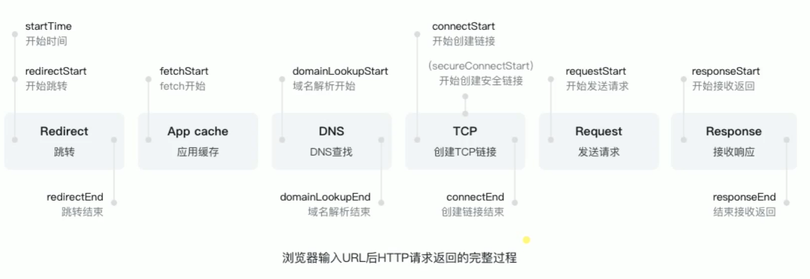

<!-- @import "[TOC]" {cmd="toc" depthFrom=1 depthTo=6 orderedList=false} -->

<!-- code_chunk_output -->

- [01HTTP协议基础及发展历史](#01http协议基础及发展历史)
- [02http各种特性总览](#02http各种特性总览)
- [Nginx代理以及面向未来的HTTP](#nginx代理以及面向未来的http)

<!-- /code_chunk_output -->

## 01HTTP协议基础及发展历史
[./drafts/01HTTP协议基础及发展历史.md](./drafts/01HTTP协议基础及发展历史.md)

- [5层网络模型介绍](./drafts/01HTTP协议基础及发展历史.md#5层网络模型介绍)
  - [低三层](./drafts/01HTTP协议基础及发展历史.md#低三层)
  - [传输层](./drafts/01HTTP协议基础及发展历史.md#传输层)
  - [应用层](./drafts/01HTTP协议基础及发展历史.md#应用层)
- [HTTP发展历史](./drafts/01HTTP协议基础及发展历史.md#http发展历史)
  - [HTTP/0.9](./drafts/01HTTP协议基础及发展历史.md#http09)
  - [HTTP/1.0](./drafts/01HTTP协议基础及发展历史.md#http10)
  - [HTTP/1.1](./drafts/01HTTP协议基础及发展历史.md#http11)
  - [HTTP/2](./drafts/01HTTP协议基础及发展历史.md#http2)
- [三次握手](./drafts/01HTTP协议基础及发展历史.md#三次握手)
  - [使用WireShark抓包](./drafts/01HTTP协议基础及发展历史.md#使用wireshark抓包)
- [URI-URL和URN](./drafts/01HTTP协议基础及发展历史.md#uri-url和urn)
  - [URI统一资源标志符](./drafts/01HTTP协议基础及发展历史.md#uri统一资源标志符)
  - [URL统一资源定位器](./drafts/01HTTP协议基础及发展历史.md#url统一资源定位器)
  - [URN永久统一资源定位符](./drafts/01HTTP协议基础及发展历史.md#urn永久统一资源定位符)
- [HTTP报文格式](./drafts/01HTTP协议基础及发展历史.md#http报文格式)
  - [HTTP方法](./drafts/01HTTP协议基础及发展历史.md#http方法)
  - [HTTP CODE](./drafts/01HTTP协议基础及发展历史.md#http-code)
- [创建一个最简单的web服务](./drafts/01HTTP协议基础及发展历史.md#创建一个最简单的web服务)

## 02http各种特性总览
[./drafts/02HTTP各种特性总览.md](./drafts/02HTTP各种特性总览.md)

- [使用浏览器查看 http 请求（从HTTP客户端角度）](./drafts/02HTTP各种特性总览.md#使用浏览器查看-http-请求从http客户端角度)
- [CORS跨域请求的限制与解决](./drafts/02HTTP各种特性总览.md#cors跨域请求的限制与解决)
  - [用浏览器的script的src](./drafts/02HTTP各种特性总览.md#用浏览器的script的src)
  - [JSONP](./drafts/02HTTP各种特性总览.md#jsonp)
- [CORS预请求](./drafts/02HTTP各种特性总览.md#cors预请求)
  - [跨域时默认允许的方法只有GET HEAD POST](./drafts/02HTTP各种特性总览.md#跨域时默认允许的方法只有get-head-post)
  - [默认允许的Content-Type只有三个](./drafts/02HTTP各种特性总览.md#默认允许的content-type只有三个)
  - [官方文档：fetch.spec.whatwg.org](./drafts/02HTTP各种特性总览.md#官方文档fetchspecwhatwgorg)
  - [设置Access-Control-Allow-?](./drafts/02HTTP各种特性总览.md#设置access-control-allow-)
- [缓存Cache-Control](./drafts/02HTTP各种特性总览.md#缓存cache-control)
  - [设置Cache-Control](./drafts/02HTTP各种特性总览.md#设置cache-control)
  - [如果max-age过大怎么办？](./drafts/02HTTP各种特性总览.md#如果max-age过大怎么办)
  - [Cache-Control参数的值用逗号分割](./drafts/02HTTP各种特性总览.md#cache-control参数的值用逗号分割)
- [缓存验证](./drafts/02HTTP各种特性总览.md#缓存验证)
  - [Last-Modified](./drafts/02HTTP各种特性总览.md#last-modified)
  - [Etag](./drafts/02HTTP各种特性总览.md#etag)
  - [程序操作缓存验证](./drafts/02HTTP各种特性总览.md#程序操作缓存验证)
- [Cookie](./drafts/02HTTP各种特性总览.md#cookie)
  - [代码实例](./drafts/02HTTP各种特性总览.md#代码实例)
  - [设置domain让二级域名能共享Cookie](./drafts/02HTTP各种特性总览.md#设置domain让二级域名能共享cookie)
  - [Session不一定要使用Cookie](./drafts/02HTTP各种特性总览.md#session不一定要使用cookie)
- [HTTP长连接](./drafts/02HTTP各种特性总览.md#http长连接)
  - [实验](./drafts/02HTTP各种特性总览.md#实验)
- [数据协商](./drafts/02HTTP各种特性总览.md#数据协商)
  - [Accept、Accept-Encoding、Accept-Language、User-Agent](./drafts/02HTTP各种特性总览.md#accept-accept-encoding-accept-language-user-agent)
  - [Content-Type、Content-Encoding和Content-Language](./drafts/02HTTP各种特性总览.md#content-type-content-encoding和content-language)
  - [数据协商实例](./drafts/02HTTP各种特性总览.md#数据协商实例)
- [Redirect](./drafts/02HTTP各种特性总览.md#redirect)
- [Content-Security-Policy, CSP](./drafts/02HTTP各种特性总览.md#content-security-policy-csp)
  - [禁止inline-js防止XSS攻击](./drafts/02HTTP各种特性总览.md#禁止inline-js防止xss攻击)
  - [只允许加载本域名提供脚本](./drafts/02HTTP各种特性总览.md#只允许加载本域名提供脚本)
  - [只能跳转本站（用form限制提交范围）](./drafts/02HTTP各种特性总览.md#只能跳转本站用form限制提交范围)
  - [推荐阅读：mdn.csp](./drafts/02HTTP各种特性总览.md#推荐阅读mdncsp)
  - [report-uri向服务端汇报内容](./drafts/02HTTP各种特性总览.md#report-uri向服务端汇报内容)
  - [在html里写在meta里也可](./drafts/02HTTP各种特性总览.md#在html里写在meta里也可)

## Nginx代理以及面向未来的HTTP
[./drafts/03Nginx代理以及面向未来的HTTP.md](./drafts/03Nginx代理以及面向未来的HTTP.md)

- [Nginx安装和基础代理配置](./drafts/03Nginx代理以及面向未来的HTTP.md#nginx安装和基础代理配置)
  - [代理我们自己的 node 服务](./drafts/03Nginx代理以及面向未来的HTTP.md#代理我们自己的-node-服务)
- [中间代理可以修改内容（http是明文传输）](./drafts/03Nginx代理以及面向未来的HTTP.md#中间代理可以修改内容http是明文传输)
- [Nginx代理配置和代理缓存的用处](./drafts/03Nginx代理以及面向未来的HTTP.md#nginx代理配置和代理缓存的用处)
  - [实验测试缓存](./drafts/03Nginx代理以及面向未来的HTTP.md#实验测试缓存)
- [HTTPS解析](./drafts/03Nginx代理以及面向未来的HTTP.md#https解析)
  - [HTTPS四次握手](./drafts/03Nginx代理以及面向未来的HTTP.md#https四次握手)
- [使用Nginx部署HTTPS服务](./drafts/03Nginx代理以及面向未来的HTTP.md#使用nginx部署https服务)
- [HTTP2的优势](./drafts/03Nginx代理以及面向未来的HTTP.md#http2的优势)
  - [http2实例](./drafts/03Nginx代理以及面向未来的HTTP.md#http2实例)
  - [Nginx配置HTTP2的简单使用](./drafts/03Nginx代理以及面向未来的HTTP.md#nginx配置http2的简单使用)
  - [网上关于http2的实例](./drafts/03Nginx代理以及面向未来的HTTP.md#网上关于http2的实例)
