# HTTP各种特性总览

<!-- @import "[TOC]" {cmd="toc" depthFrom=1 depthTo=6 orderedList=false} -->

<!-- code_chunk_output -->

- [HTTP各种特性总览](#http各种特性总览)
    - [使用浏览器查看 http 请求（从HTTP客户端角度）](#使用浏览器查看-http-请求从http客户端角度)
    - [CORS跨域请求的限制与解决](#cors跨域请求的限制与解决)
      - [用浏览器的script的src](#用浏览器的script的src)
      - [JSONP](#jsonp)
    - [CORS预请求](#cors预请求)
      - [跨域时默认允许的方法只有GET HEAD POST](#跨域时默认允许的方法只有get-head-post)
      - [默认允许的Content-Type只有三个](#默认允许的content-type只有三个)
      - [官方文档：fetch.spec.whatwg.org](#官方文档fetchspecwhatwgorg)
      - [设置Access-Control-Allow-?](#设置access-control-allow-)
    - [缓存Cache-Control](#缓存cache-control)
      - [设置Cache-Control](#设置cache-control)
      - [如果max-age过大怎么办？](#如果max-age过大怎么办)
      - [Cache-Control参数的值用逗号分割](#cache-control参数的值用逗号分割)
    - [缓存验证](#缓存验证)
      - [Last-Modified](#last-modified)
      - [Etag](#etag)
      - [程序操作缓存验证](#程序操作缓存验证)
    - [Cookie](#cookie)
      - [代码实例](#代码实例)
      - [设置domain让二级域名能共享Cookie](#设置domain让二级域名能共享cookie)
      - [Session不一定要使用Cookie](#session不一定要使用cookie)
    - [HTTP长连接](#http长连接)
      - [实验](#实验)
    - [数据协商](#数据协商)
      - [Accept、Accept-Encoding、Accept-Language、User-Agent](#accept-accept-encoding-accept-language-user-agent)
      - [Content-Type、Content-Encoding和Content-Language](#content-type-content-encoding和content-language)
      - [数据协商实例](#数据协商实例)
    - [Redirect](#redirect)
    - [Content-Security-Policy, CSP](#content-security-policy-csp)
      - [禁止inline-js防止XSS攻击](#禁止inline-js防止xss攻击)
      - [只允许加载本域名提供脚本](#只允许加载本域名提供脚本)
      - [只能跳转本站（用form限制提交范围）](#只能跳转本站用form限制提交范围)
      - [推荐阅读：mdn.csp](#推荐阅读mdncsp)
      - [report-uri向服务端汇报内容](#report-uri向服务端汇报内容)
      - [在html里写在meta里也可](#在html里写在meta里也可)

<!-- /code_chunk_output -->

### 使用浏览器查看 http 请求（从HTTP客户端角度）

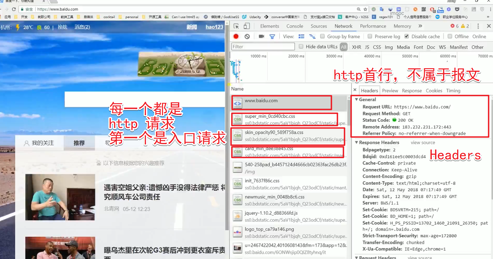

浏览器不但发送和接收了 http 请求（作为http客户端），还帮助处理了相关代码。

上图 Response 里是请求返回的内容，就是 `html` 内容。

```bash
$ curl baidu.com
  % Total    % Received % Xferd  Average Speed   Time    Time     Time  Current
                                 Dload  Upload   Total   Spent    Left  Speed
100    81  100    81    0     0    920      0 --:--:-- --:--:-- --:--:--   920<html>
<meta http-equiv="refresh" content="0;url=http://www.baidu.com/">
</html>
```

如上，我们请求 `baidu.com` ，就返回了一个 `<html><meta ...><html>`；这个 `<meta>` 告诉浏览器（浏览器解析内容时识别了`<meta>`），你给我刷新，并且重定向到 `http://www.baidu.com/` 。

如果我们 `curl http://www.baidu.com/` ，则会是一堆 `html` 等相关内容（浏览器可以据此渲染、请求依赖文件）。

### CORS跨域请求的限制与解决
模拟跨域场景，我们启动两个服务，如 [../codes/跨域/server8888](../codes/跨域/server8888) 和 [../codes/跨域/server8887](../codes/跨域/server8887) 。

```js
const http = require('http')
const fs = require('fs')

http.createServer(function (request, response) {
  console.log('request come', request.url)

  // 注意默认读取二进制的数，要设置 utf8
  const html = fs.readFileSync('test.html', 'utf8')
  response.witreHead(200, {
    // 如果写成 text/plain ，则浏览器当成字符，不解析 html
    'Content-Type': 'text/html'
  })
  response.end(html)

}).listen(8888)

console.log('server listening on 8888')
```

如果 'Content-Type' 写成 'text/plain' ，则浏览器当成字符，不解析 html 。

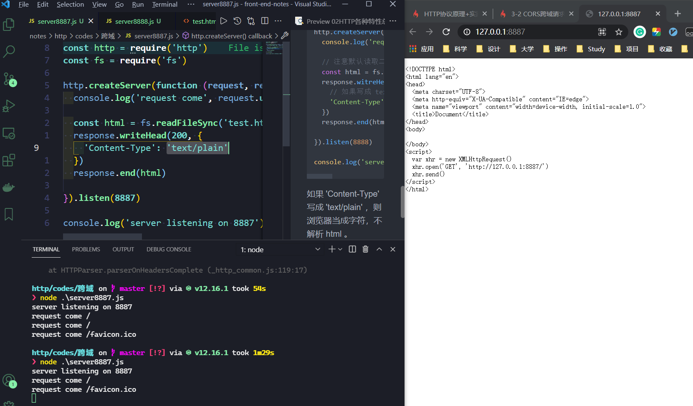

我们考虑一种情况，用 nodejs 跑 8888 服务，然后在 8888 的 `html` 里去请求 8887 。
```js
  var xhr = new XMLHttpRequest()
  xhr.open('GET', 'http://127.0.0.1:8887/')
  xhr.send()
```

浏览器将报错：`Access to XMLHttpRequest at 'http://127.0.0.1:8887/' from origin 'http://127.0.0.1:8888' has been blocked by CORS policy: No 'Access-Control-Allow-Origin' header is present on the requested resource.`因为我们服务端8887没有允许被跨域访问。

（这里注意：要同时打开 8887 和 8888 两个服务，后者提供 html 给客户端，客户端根据 html 的指令访问前者。）

咱们把8887端口的http头改一下：
```js
response.writeHead(200, {
  'Access-Control-Allow-Origin': '*'
})
response.end('123')
```


则如上，则可以请求到 8887 改一下。且收到了回复（Response）123。

要注意，即便没有设置头`'Access-Control-Allow-Origin': '*'`，我们8887的命令行也会打印 `request come /` ，这说明我们的服务端是对浏览器的请求做了回复的，只不过浏览器没有看到浏览器觉得回复头里 `'Access-Control-Allow-Origin'` 不合规定，于是帮我们拦截掉了请求，并且在浏览器控制台报错。

因此，跨域是浏览器有的限制。浏览器需要服务器同域的内容。

#### 用浏览器的script的src
我们把 8887 改回来：
```js
const http = require('http')

http.createServer(function (request, response) {
  console.log('request come', request.url)

  response.writeHead(200, {
    'Content-Type': 'text/html'
  })
  response.end('123')

}).listen(8887)

console.log('server listening on 8887')
```

然后我们的 html 请求方式改一下：
```html
<!-- <script>
  var xhr = new XMLHttpRequest()
  xhr.open('GET', 'http://127.0.0.1:8887/')
  xhr.send()
</script> -->
<script src="http://127.0.0.1:8887/"></script>
```

再用 html 访问 8887 则不报错，且 network 中可以收到 8887 来的 123。

浏览器允许 link 、 script 标签等跨域访问。

#### JSONP
> 来源：https://www.runoob.com/json/json-jsonp.html

本章节我们将向大家介绍 JSONP 的知识。

Jsonp(JSON with Padding) 是 json 的一种"使用模式"，可以让网页从别的域名（网站）那获取资料，即跨域读取数据。

为什么我们从不同的域（网站）访问数据需要一个特殊的技术( JSONP )呢？这是因为同源策略。

同源策略，它是由 Netscape 提出的一个著名的安全策略，现在所有支持 JavaScript 的浏览器都会使用这个策略。（应该就是不允许跨域）

如果没有跨域限制，那么8888就能通过它发给我们的html里的script肆意访问8887的数据了。

具体参考：为什么浏览器要限制跨域访问? - 林一二的回答 - 知乎 https://www.zhihu.com/question/26379635/answer/534866558

jsonp是一个好的解决方案，参考 https://www.cnblogs.com/dowinning/archive/2012/04/19/json-jsonp-jquery.html ：
- 1、一个众所周知的问题，Ajax直接请求普通文件存在跨域无权限访问的问题，甭管你是静态页面、动态网页、web服务、WCF，只要是跨域请求，一律不准；
- 2、不过我们又发现，Web页面上调用js文件时则不受是否跨域的影响（不仅如此，我们还发现凡是拥有"src"这个属性的标签都拥有跨域的能力，比如`<script>、、<iframe>`）；
- 3、于是可以判断，当前阶段如果想通过纯web端（ActiveX控件、服务端代理、属于未来的HTML5之Websocket等方式不算）跨域访问数据就只有一种可能，那就是在远程服务器上设法把数据装进js格式的文件里，供客户端调用和进一步处理；
- 4、恰巧我们已经知道有一种叫做JSON的纯字符数据格式可以简洁的描述复杂数据，更妙的是JSON还被js原生支持，所以在客户端几乎可以随心所欲的处理这种格式的数据；
- 5、这样子解决方案就呼之欲出了，web客户端通过与调用脚本一模一样的方式，来调用跨域服务器上动态生成的js格式文件（一般以JSON为后缀），显而易见，服务器之所以要动态生成JSON文件，目的就在于把客户端需要的数据装入进去。
- 6、客户端在对JSON文件调用成功之后，也就获得了自己所需的数据，剩下的就是按照自己需求进行处理和展现了，这种获取远程数据的方式看起来非常像AJAX，但其实并不一样。
- 7、为了便于客户端使用数据，逐渐形成了一种非正式传输协议，人们把它称作JSONP，该协议的一个要点就是允许用户传递一个callback参数给服务端，然后服务端返回数据时会将这个callback参数作为函数名来包裹住JSON数据，这样客户端就可以随意定制自己的函数来自动处理返回数据了。

### CORS预请求
CORS: Cross-origin resource sharing

现在我们获取 [../codes/跨域/server9999](../codes/跨域/server9999) 发来的 html（[../codes/跨域/test2.html](../codes/跨域/test2.html)），里面的请求是：
```js
  fetch('http://localhost:9998', {
    method: 'POST',
    headers: {
      'X-Test-Cors': '123'
    }
  })
```

9998 运行被跨域访问：`'Access-Control-Allow-Origin': '*'`

则浏览器也会报错：`Access to fetch at 'http://localhost:9998/' from origin 'http://127.0.0.1:9999' has been blocked by CORS policy: Request header field x-test-cors is not allowed by Access-Control-Allow-Headers in preflight response.`

什么意思？**我们自定义的头x-test-cors在跨域中不被允许。**

#### 跨域时默认允许的方法只有GET HEAD POST

其他方法，浏览器要有预请求去验证。

#### 默认允许的Content-Type只有三个
- text/plain
- multipart/form-data
- application/x-www-form-urlencoded

这三种是浏览器 form 表单可以设置的三种类型。

其他Content-Type也需要预请求去限制。

#### 官方文档：fetch.spec.whatwg.org

可以去这里看允许的请求头：
- https://fetch.spec.whatwg.org/#cors-safelisted-request-header

#### 设置Access-Control-Allow-?

我们可以设置被访问的客户端 9998 ：
```js
http.createServer(function (request, response) {
  console.log('request come', request.url)

  response.writeHead(200, {
    'Access-Control-Allow-Origin': '*',
    'Access-Control-Allow-Headers': 'X-Test-Cors',
    'Access-Control-Allow-Methods': 'POST, PUT, DELETE'
  })
  response.end('123')

}).listen(9998)
```

如上，我们分别允许自定义头 `'X-Test-Cors'` 以及方法 `'POST, PUT, DELETE'` 对 9998 的访问。

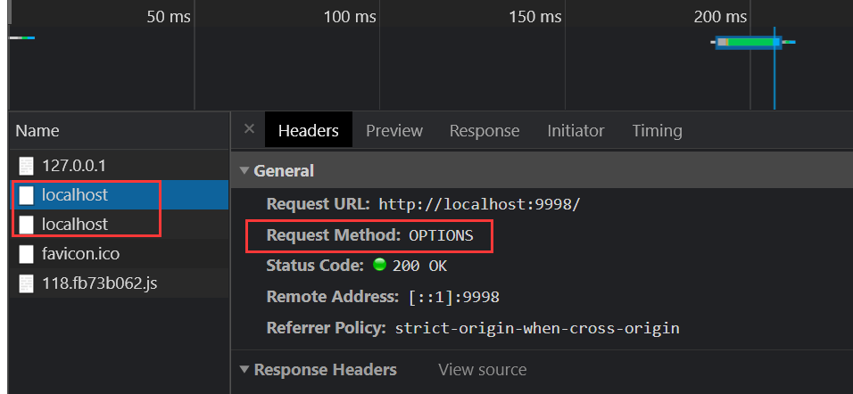

注意到我们在 fetch 前，多了一个请求，这个是预请求。

如果我们设置：`'Access-Control-Max-Age': '1000'`，则代表1000内有一次预请求就不需要再有预请求了。所以，当我们第二次访问呢 9998 时，确实没有预请求了。

### 缓存Cache-Control
可缓存性：
- public 经过的大家（代理服务器啥的）都可以缓存
- private 发起请求的服务器才可用缓存
- no-cache 谁都不可以缓存（可以在本地缓存，但是每次使用都需要在服务器端验证）

到期：
- `max-age=<seconds>`缓存多久才过期，浏览器才再发请求
- `s-maxage=<seconds>`代理服务器的`max-age`，如果没设置这个，用`max-age`的值
- `max-stale=<seconds>`发起请求方主动带的头，即便缓存过期，在`max-stale`内，仍可以使用过期缓存，在浏览器里用不到，一般在发起方用

重新验证：
- `must-revalidate`过期后，必须验证才知道是否可以接着用本地缓存
- `proxy-revalidate`缓存过期后，必须验证才知道是否可以接着用本地缓存

其他：
- `no-store`与`no-cache`不同，这个`no-store`根本就不让本地缓存
- `no-transform`用在代理服务器那边，不让代理服务器随意改动返回的内容

上述这些头只是限制性、声明性的，但是接收方完全可以不用这个做。

#### 设置Cache-Control
代码：[../codes/缓存/server.js](../codes/缓存/server.js)

```js
const http = require('http')
const fs = require('fs')

http.createServer(function (request, response) {
  console.log('request come', request.url)

  if (request.url === '/') {
    const html = fs.readFileSync('test.html', 'utf8')
    response.writeHead(200, {
      'Content-Type': 'text/html'
    })
    response.end(html)
  }

  if (request.url === '/script.js') {
    response.writeHead(200, {
      'Content-Type': 'text/javascript'
    })
    response.end('console.log("script loaded")')
  }

}).listen(8888)

console.log('server listening on 8888')
```

代码：[../codes/缓存/test.html](../codes/缓存/test.html)
```html
<script src="/script.js"></script>
```

如上，服务端对请求有判断：
- 如果我仅仅访问 `8888/` ，则给我 html ，让我去解析渲染
- 如果我访问 `8888/script.js` ，那给我一段 js ，内容是 `console.log("script loaded")`

我们的 html 会向服务器请求 `/script.js` ，则浏览器会渲染（执行代码，因为类型是 js） `/script.js` 返回的内容。

可以在浏览器的 network 中看到 `script.js` 这条请求，说明请求都是以 **网络传输** 形式进行的。

我们设置：
```js
  if (request.url === '/script.js') {
    response.writeHead(200, {
      'Content-Type': 'text/javascript',
      'Cache-Control': 'max-age=20'
    })
    response.end('console.log("script loaded")')
  }
```

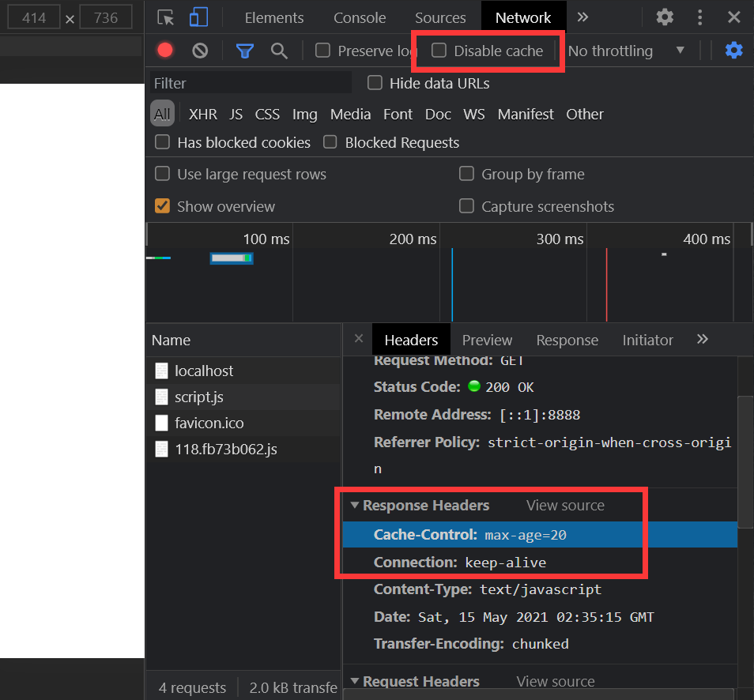

如上，我们有了 `max-age` ，此外，别忘了把 `Disable cache` 取消勾选，否在浏览器不从缓存读取。

我们刷新。

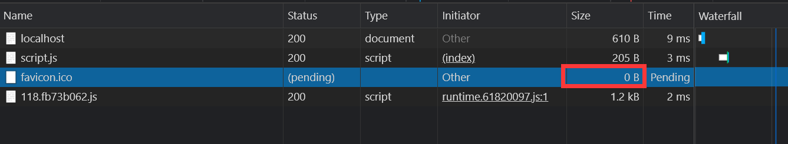

如上，大小和请求时间都为 0 ，说明我们没有经过网络传输，而是直接读取浏览器。

20s内，我们把返回内容改成：`console.log("huh huh huh")`，然后重启服务，发现浏览器控制台输出的还是 `script loaded` 。这说明我们的 `max-age=20` 生效，我们使用本地的内容，而非重新请求。

#### 如果max-age过大怎么办？
后端的 max-age 设置过大，前端给客户端更新了应用怎么办？

前端解决方案为：根据打包完成文件与其他静态文件生成哈希码，加到 url 上，因此如果静态文件变了，则 url 变了，需要重新发起请求，从而达到更新缓存的作用。

这也是为什么前端打包完成，要加上一段“奇怪的码”。这也是业界最通用的方案。

#### Cache-Control参数的值用逗号分割
`'Cache-Control': 'max-age=200, public'`。我还以为是分号呢。

### 缓存验证
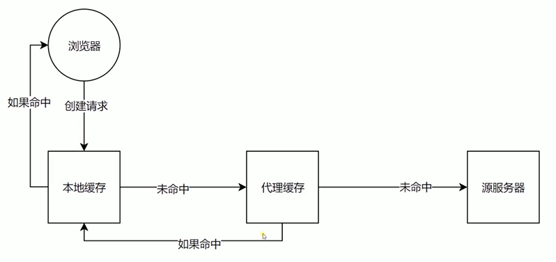

如上，缓存验证是一个很重要的步骤。那么如何进行验证？

#### Last-Modified

给资源设置上一次修改时，主要配合`If-Modified-Since`或者`If-Unmodified-Since`使用。

对比上次修改时间，来验证资源是否需要更新。

#### Etag

Etag 用数据签名标记资源。

配合`If-Match`或者`If-Non-Match`使用。

对比资源的签名判断是否使用缓存。

#### 程序操作缓存验证
```js
  if (request.url === '/script.js') {
    response.writeHead(200, {
      'Content-Type': 'text/javascript',
      'Cache-Control': 'max-age=200000, no-cache',
      'Last-Modified': '123',
      'Etag': '777'
    })
    response.end('console.log("script loaded")')
  }
```

启动服务，然后刷新两次，如下图。

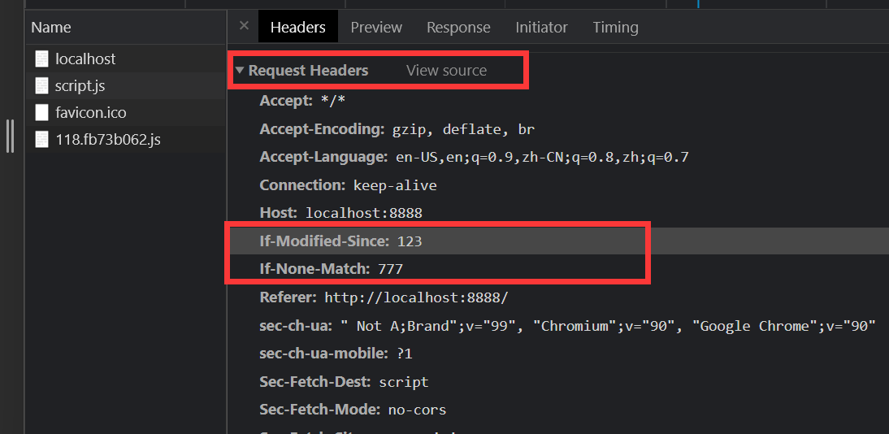

发现：
- 刷新后服务器还是会通过网络传输获取 script.js
- 第二次请求头里，有`If-Modified-Since`和`If-None-Match`
- 对应服务端的`Last-Modified`和`Etag`

因此，我们可以在服务端进行判断，并进行响应。

```js
  if (request.url === '/script.js') {

    const etag = request.headers['if-none-match']
    if (etag === '777') {
      response.writeHead(304, {
        'Content-Type': 'text/javascript',
        'Cache-Control': 'max-age=200000, no-cache',
        'Last-Modified': '123',
        'Etag': '777'
      })
      response.end('')
    } else {
      response.writeHead(200, {
        'Content-Type': 'text/javascript',
        'Cache-Control': 'max-age=200000, no-cache',
        'Last-Modified': '123',
        'Etag': '777'
      })
      response.end('console.log("script loaded")')
    }
  }
```

注意：
- request.headers 是一个对象
- 如果命中（`etag === '777'`），返回码变更了，为`304`，且 reponse 内容为空

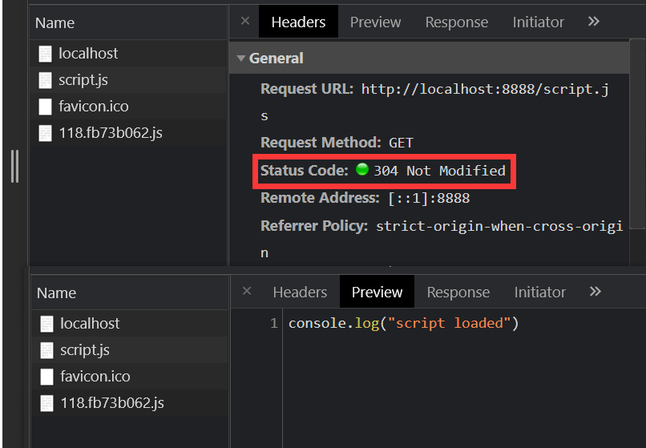

如上：
- 我们的状态码是 `304 Not Modified`
- 并且，还是有“返回的”内容（尽管 reponse 内容为空），这是因为 Chrome 里自动为我们显示命中 **（Chrome 从状态码304得知命中了）** 后，读取的缓存内容，而非服务端返回的内容

如果勾选了 Chrome 的 `Disable Cache` ，则 `Request Headers` 里的头不再带有 `'if-none-match'` 这种缓存相关的内容了

小tips：如何清理浏览器缓存？自定义及控制-更多工具-清理浏览数据。

此外：
- 上面的实验，如果不用 `no-cache` ，则都不发请求去验证了，直接在本地读
- 如果 `no-cache` 改为 `no-store` ，则每次都重新请求，不用缓存
- 这两个实验都需要清理缓存再做

### Cookie
Cookie 可以通过 `Set-Cookie` 设置，浏览器在保存了 Cookie 后，再进行同域的请求就会带上这个 Cookie ，在访问会话中就会通过 Cookie 传输的内容来保证“是这个用户”。

Cookie 可以用 max-age 和 expires 设置过期时间、 Secure 只在 https 的时候发送， HttpOnly 无法通过 document.cookie 访问。

#### 代码实例
代码：[../codes/cookie/server.js](../codes/cookie/server.js)

```js
const http = require('http')
const fs = require('fs')

http.createServer(function (request, response) {
  console.log('request come', request.url)

  if (request.url === '/') {
    const html = fs.readFileSync('test.html', 'utf8')
    response.writeHead(200, {
      'Content-Type': 'text/html',
      'Set-Cookie': 'id=123'
    })
    response.end(html)
  }

}).listen(8888)

console.log('server listening on 8888')
```

代码：[../codes/cookie/test.html](../codes/cookie/test.html)

```html
<!DOCTYPE html>
<html lang="en">
<head>
  <meta charset="UTF-8">
  <meta http-equiv="X-UA-Compatible" content="IE=edge">
  <meta name="viewport" content="width=device-width, initial-scale=1.0">
  <title>Document</title>
</head>
<body>
  <div>Content</div>
</body>
<script>
  console.log(document.cookie)
</script>
</html>
```

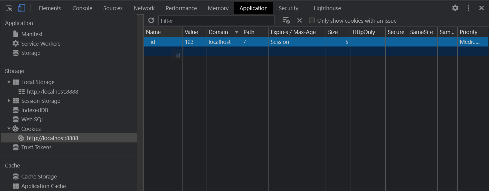

如上，在 Application 里看 Cookie 。

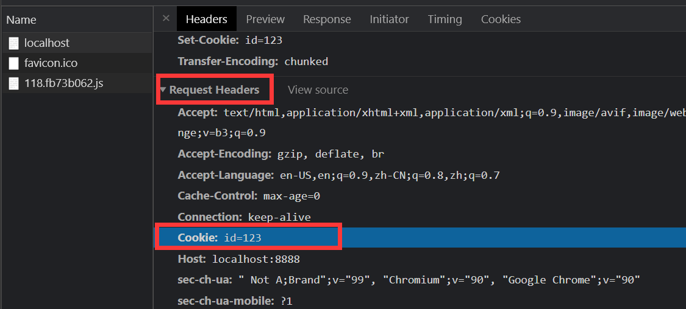

此外，我们浏览器有了 Cookie 后，下次访问也会自动带上 Cookie 。

Cookie 可以作为列表 `[]` 形式。

```js
response.writeHead(200, {
  'Content-Type': 'text/html',
  'Set-Cookie': ['id=123', 'abc=456']
})
```

如何设置过期时间呢？如何设置其他参数呢？**用分号分割。**

```js
response.writeHead(200, {
  'Content-Type': 'text/html',
  'Set-Cookie': ['id=123; max-age=10', 'abc=456; HttpOnly']
})
```

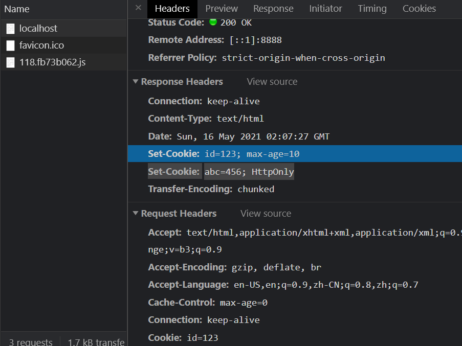

如上，我们收到的服务端的内容，则有两个 Set-Cookie 。

我们给我 `abc=456` 设置了 `HttpOnly` ，导致浏览器控制台只显示 `id=123` ，因为 `HttpOnly` 禁止 js 访问。

#### 设置domain让二级域名能共享Cookie

- 一级域名：test.com
- 二级域名：a.test.com

我们用 Chrome 插件 HostAdmin 映射域名来做实验。

```js
const http = require('http')
const fs = require('fs')

http.createServer(function (request, response) {
  console.log('request come', request.url)

  const host = request.headers.host

  if (request.url === '/') {
    const html = fs.readFileSync('test.html', 'utf8')
    if (host === 'test.com') {
      response.writeHead(200, {
        'Content-Type': 'text/html',
        'Set-Cookie': 'id=123; domain=test.com'
      })
    }
    response.end(html)
  }

}).listen(8888)

console.log('server listening on 8888')
```

如上，我们在访问一级域名 （request.headers.host === 'test.com'） 时，让其 Cookie 的 domain 是 `test.com` 。

#### Session不一定要使用Cookie

在网站中，我们常用 Cookie 实现 Session 。比如网站设计中，我们常把用户的 id 保存给 Cookie 。

### HTTP长连接

TCP连接有长连接和短连接之分。
- 长连接：一定时间内不关闭连接，好处是不用每次请求都重新创建新连接，损耗性能
- 短连接：用完就断

现在网站大部分都是长连接。

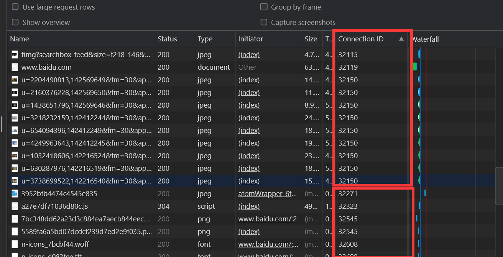

如上，访问百度：
- 我们在 Network 中调出 `Connection ID` 列（可以右键列头）
- 看到百度尝试复用连接，但还是创建了多个连接
- 这是因为 http 1.1 每个连接中请求是串行的，想提高效率（并发），只能创建多个连接；Chrome 允许最大并发 6 个连接

在头里，看到 `Connection: Keep-Alive` ，让浏览器创建长连接，默认就是长连接。还可用设置 `close` 来创建短链接。

在 http2 里，我们可以“信道复用”，串行加载数据。我们访问 Google （2021年5月16日），可以看到只创建了一个连接（同域的）。

#### 实验

在 [../codes/connection](../codes/connection) 里。

```js
const http = require('http')
const fs = require('fs')

http.createServer(function (request, response) {
  console.log('request come', request.url)

  const html = fs.readFileSync('test.html', 'utf8')
  const img = fs.readFileSync('test.jpg')
  if (request.url === '/') {
    response.writeHead(200, {
      'Content-Type': 'text/html',
    })
    response.end(html)
  } else {
    response.writeHead(200, {
      'Content-Type': 'image/jpg',
      'Connection': 'keep-alive' // or close
    })
    response.end(img)
  }

}).listen(8888)

console.log('server listening on 8888')
```

```html
<body>
  
  
  
  
  
  
  
  
  
  
  
  
  
  
  
  
  
  
  
  
  
</body>
```

如上，我们去访问网站的非 `/` 资源，我们的服务端会返回 `response.end(img)` 。

此外，别忘了修改为 `Fast 3G` 来模拟网络传输速度。

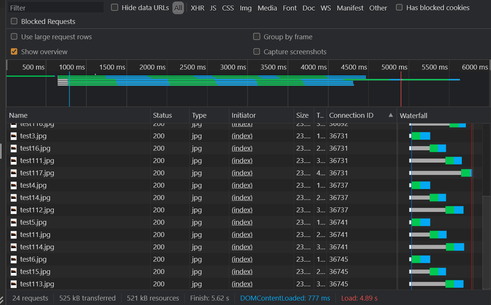

可以看到长连接时，我们创建了 6 个连接，并且复用。

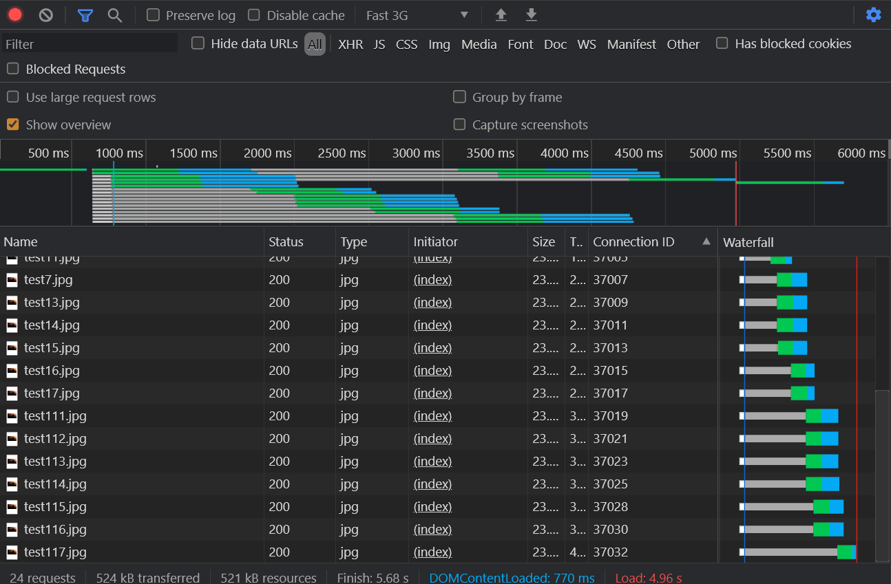

设置短连接 `'Connection': 'close'` ，可以看到创建了更多链接，没有复用。

### 数据协商

客户端给服务端做出“数据是什么样的”的请求。

分类：
- 请求，通过 Accept 来声明
- 返回，通过 Content 来返回

#### Accept、Accept-Encoding、Accept-Language、User-Agent
- Accept-Encoding 编码方式，用了什么压缩方式
- Accept-Language 不同的语言
- User-Agent 比如告诉服务端是什么机器，移动端、PC端？

#### Content-Type、Content-Encoding和Content-Language
这是在服务端定义的。

与 Accept 对应，但是没有 User-Agent 。

关于 Content-Type 有一点要说的：`X-Content-Type-Options`让浏览器不要随意预测内容的数据格式。防止被恶意插入脚本。

#### 数据协商实例
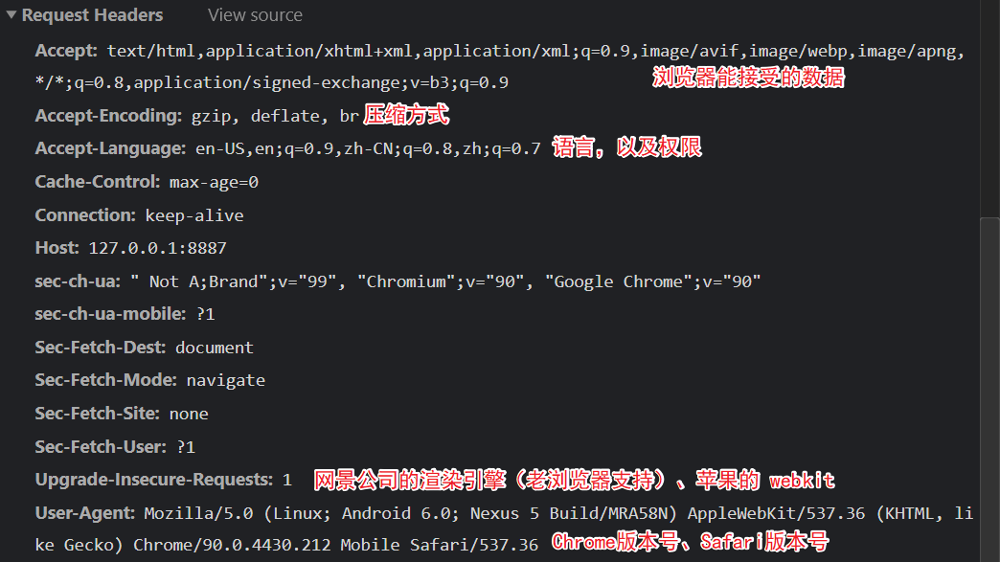


如上，上面的数字是实际传输大小（包含头信息等）；下面的是内容（body）大小。

用 node 的 zlib 做实验，代码：[../codes/数据协商/server](../codes/数据协商/server)

```js
const http = require('http')
const fs = require('fs')
const zlib = require('zlib')

http.createServer(function (request, response) {
  console.log('request come', request.url)

  const html = fs.readFileSync('test.html')
  response.writeHead(200, {
    'Content-Type': 'text/html',
    // 'X-Content-Options': 'nosniff'
    'Content-Encoding': 'gzip'
  })
  response.end(zlib.gzipSync(html))
}).listen(8888)

console.log('server listening on 8888')
```


可见，body大小，但是传输的大小变小了，因为 gzip 把 body 压缩了。一般来讲，压缩后的总大小小于body大小。

我们再测试一下请求的数据协商。

```html
<!DOCTYPE html>
<html lang="en">
<head>
  <meta charset="UTF-8">
  <meta name="viewport" content="width=device-width, initial-scale=1.0">
  <meta http-equiv="X-UA-Compatible" content="ie=edge">
  <title>Document</title>
</head>
<body>
  <form action="/form" id="form" enctype="multipart/form-data">
    <input type="text" name="name">
    <input type="password" name="password">
    <input type="file" name="file">
    <input type="submit">
  </form>
</body>
</html>
```

如上，我们定义表单的 `enctype` ，来规定表单发送请求的数据类型。

如果定义为 `multipart/form-data` 则是我们有多种类型（包含文件）。

form 会自动发送请求，但是，如果上传了文件，则在 `Chrome` 中看不到文件请求信息了。我们写 `ajax` 的方式（`script` 中的代码）来查看。

```html
  <script>
    var form = document.getElementById('form')
    form.addEventListener('submit', function (e) {
      e.preventDefault()
      var formData = new FormData(form)
      // 这时不需要主动声明 Content-Type
      // fetch 自动帮我们做了
      fetch('/form', {
        method: 'POST',
        body: formData
      })
    })
  </script>
```

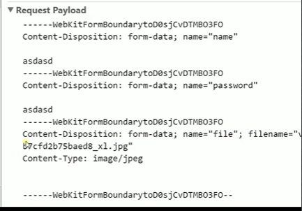

如上可以看到我们发送的数据。

### Redirect
我们开发服务器，指定资源位置；之后改变了资源位置，我们会告诉浏览器新的资源位置在哪里。

[../codes/重定向/server](../codes/重定向/server)

```js
const http = require('http')

http.createServer(function (request, response) {
  console.log('request come', request.url)

  if (request.url === '/') {
    response.writeHead(302, {  // or 301
      'Location': '/new'
    })
    response.end()
  }
  if (request.url === '/new') {
    response.writeHead(200, {
      'Content-Type': 'text/html',
    })
    response.end('<div>this is content</div>')
  }
}).listen(8888)

console.log('server listening on 8888')
```

要注意：
- 只有 `302`（临时跳转）、或者 `301`（永久跳转），才会执行跳转，就是跳转与 `'Location': '/new'` 相关的地址
- **301的设置要慎重。** 浏览器会把这个跳转信息缓存在浏览器中，即使我们服务端改变 `301` 的原地址返回的东西，在用户不清理缓存的情况下，浏览器还是会主动读取缓存，自动地跳转到原来 301 定向的那里。

### Content-Security-Policy, CSP
- 限制资源获取
- 报告资源获取越权

限制方式：
- default-src限制全局
- 特定的资源类型（connect-src、img-src、font-src、frame-src等等）

#### 禁止inline-js防止XSS攻击
我们在 html 里写 script 叫做 inline js 。

```js
reponse.writeHead(200, {
  'Content-Type': 'text/html',
  'Content-Security-Policy': 'default-src http: https:'
})
```

如上只允许外链方式加载。

#### 只允许加载本域名提供脚本
```js
'Content-Security-Policy': 'default-src \'self\''
```

注意要用引号引起来。

#### 只能跳转本站（用form限制提交范围）
```js
'Content-Security-Policy': 'default-src \'self\'; form-action \'self\''
```

#### 推荐阅读：mdn.csp
[https://developer.mozilla.org/zh-CN/docs/Web/HTTP/CSP](https://developer.mozilla.org/zh-CN/docs/Web/HTTP/CSP)
官方文档，内容安全策略很全。

#### report-uri向服务端汇报内容
```js
'Content-Security-Policy': 'default-src \'self\'; form-action \'self\'; report-uri /report'
```
设置 report-uri 后，浏览器遇到限制，向服务端主动发送汇报。

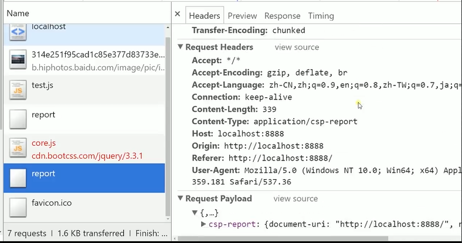

#### 在html里写在meta里也可

不在服务程序写 http 头，在 html 的 meta 里写效果也相同。

```html
<meta http-equiv="Content-Security-Policy" content="script-src 'self'; form-action 'self';">
```

注意，不需要对引号转义了。

此外，这里不可以设置 report-uri 。总的来说，还是推荐在 http 头里来设置 csp 。
