# Nginx代理以及面向未来的HTTP

<!-- @import "[TOC]" {cmd="toc" depthFrom=1 depthTo=6 orderedList=false} -->

<!-- code_chunk_output -->

- [Nginx代理以及面向未来的HTTP](#nginx代理以及面向未来的http)
    - [Nginx安装和基础代理配置](#nginx安装和基础代理配置)
      - [代理我们自己的 node 服务](#代理我们自己的-node-服务)
    - [中间代理可以修改内容（http是明文传输）](#中间代理可以修改内容http是明文传输)
    - [Nginx代理配置和代理缓存的用处](#nginx代理配置和代理缓存的用处)
      - [实验测试缓存](#实验测试缓存)
    - [HTTPS解析](#https解析)
      - [HTTPS四次握手](#https四次握手)
    - [使用Nginx部署HTTPS服务](#使用nginx部署https服务)
    - [HTTP2的优势](#http2的优势)
      - [http2实例](#http2实例)
      - [Nginx配置HTTP2的简单使用](#nginx配置http2的简单使用)
      - [网上关于http2的实例](#网上关于http2的实例)

<!-- /code_chunk_output -->

### Nginx安装和基础代理配置
Nginx 是个存粹的 http 代理。

我们在 [http://nginx.org/en/download.html](http://nginx.org/en/download.html) 下载 Nginx 。

在命令行直接 nginx.exe 就可以启动 nignx 。

关于 nginx ，重要的是：
- 其 http 代理功能
- 其缓存功能

#### 代理我们自己的 node 服务
```
D:.
├───conf
├───contrib
│   ├───unicode2nginx
│   └───vim
│       ├───ftdetect
│       ├───ftplugin
│       ├───indent
│       └───syntax
├───docs
├───html
├───logs
└───temp
    ├───client_body_temp
    ├───fastcgi_temp
    ├───proxy_temp
    ├───scgi_temp
    └───uwsgi_temp
```

如上是 nginx 的文件结构，在 conf 中有主配置文件 nginx.conf 。我们可以使用 `include servers/*.conf;` 来把希望 nginx 代理的服务写在 servers/*.conf 文件中。

新建文件夹 servers ，其中新建 test.conf ：

```
server {
  listen       80;  # 因为网络请求默认是80端口，也就是说请求一个域名不带端口，默认访问的就是80
  server_name  test.com;

  location / {
    proxy_pass http://127.0.0.1:8888;
  }
}
```

如上，我们启动 node 服务 8888 ，就可以通过 test.com 访问。（此外还需要配置 host ，否在 test.com 走外网）

Host：
```
127.0.0.1 test.com
```

### 中间代理可以修改内容（http是明文传输）
使用 Nginx 的变量，修改 host 。

```
location / {
  proxy_pass http://127.0.0.1:8888;
  proxy_set_header Host $host;
}
```

node 中：
```js
console.log('request come', request.headers.host);
```

node 的控制台变为了：
```
# 设置 proxy_set_header Host $host; 前
request come 127.0.0.1:8888
# 设置 proxy_set_header Host $host; 后
request come test.com
```

可见，拿到浏览器发请求带过来的 host 。Nginx 为我们修改了头。

### Nginx代理配置和代理缓存的用处
在 test.conf 中：
```
proxy_cache_path cache levels=1:2 keys_zone=my_cache:10m;
```

如上：
- 设置了缓存的相对路径 cache
- 设置了项目可以有2级目录 levels=1:2
- 设置了缓存在内存中最大占有10MB

#### 实验测试缓存
[../codes/nginx-cache/server](../codes/nginx-cache/server)


```html
<!DOCTYPE html>
<html lang="en">
<head>
  <meta charset="UTF-8">
  <meta name="viewport" content="width=device-width, initial-scale=1.0">
  <meta http-equiv="X-UA-Compatible" content="ie=edge">
  <title>Document</title>
</head>
<body>
  <div>This is content, and data is: <span id="data"></span></div>
  <button id="button">click me</button>
</body>
<script>
  var index = 0
  function doRequest () {
    var data = document.getElementById('data')
    data.innerText = ''
    fetch('/data', {
      headers: {
        'X-Test-Cache': index++
      }
    }).then(function (resp) {
      return resp.text()
    }).then(function (text) {
      data.innerText = text
    })
  }
  document.getElementById('button').addEventListener('click', doRequest)
</script>
</html>
```

```js
const http = require('http')
const fs = require('fs')

const wait = (seconds) => {
  return new Promise((resolve) => {
    setTimeout(resolve, seconds * 1000)
  })
}
http.createServer(function (request, response) {
  console.log('request come', request.url)

  if (request.url === '/') {
    const html = fs.readFileSync('test.html', 'utf8')
    response.writeHead(200, {
      'Content-Type': 'text/html'
    })
    response.end(html)
  }

  if (request.url === '/data') {
    response.writeHead(200, {
      'Cache-Control': 'max-age=2, s-maxage=20, private',
      'Vary': 'X-Test-Cache'
    })
    wait(2).then(() => response.end('success'))
  }
}).listen(8888)

console.log('server listening on 8888')
```

如上，为了模拟真实的数据传输，我们设置 `/data` 有2秒的延迟。

如果没有缓存（`'Cache-Control': 'max-age=2'`），则每次都要等待 2 秒接收数据。这是在用浏览器的缓存。

我们在启用别的浏览器。发现 data 不会等待 2 秒。

每一个新的请求都会经过代理。我们在代理服务器已经缓存过了，只要其他用户都会使用这个缓存。
- `s-maxage`是代理缓存专用内容。
- `private`是只有浏览器能缓存

我们的 Vary 参数是：
- 比如我们这里设置是 `X-Test-Cache`
- 表示，只有头信息 `X-Test-Cache` 的值与以前的相同，才会使用缓存
- 实践中，我们会用比如 UserAgent 做这个值

### HTTPS解析

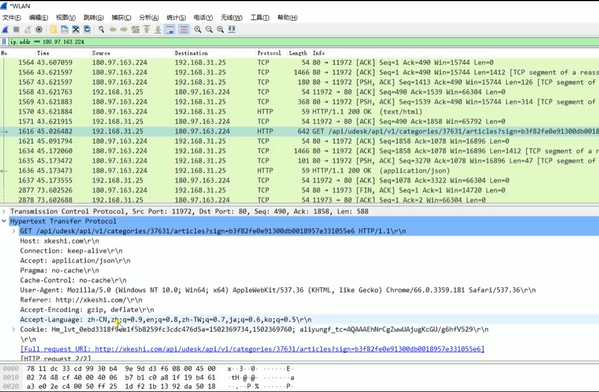

HTTP 不安全，是明文传输，如上，我们wireshark抓包甚至可以抓到 Cookie 。

#### HTTPS四次握手
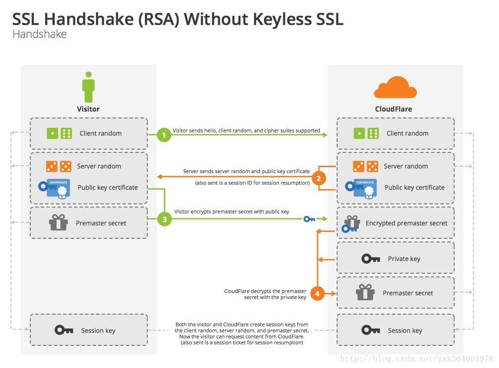

如上，参考自[feifei_1234](https://www.jianshu.com/p/daa17f50fd93)：
- 客户端请求建立SSL链接，并向服务端发送一个随机数 Client random 和客户端支持的加密方法，比如RSA公钥加密，此时是明文传输
- 服务端回复一种客户端支持的加密方法、一个随机数 Server random、授信的服务器证书和非对称加密的公钥（这个证书其实就是公钥，只是包含了很多信息，如证书的颁发机构，过期时间等）
- 客户端收到服务端的回复后利用服务端的公钥，加上新的随机数 Premaster secret 通过服务端下发的公钥及加密方法进行加密，发送给服务器
- 服务端收到客户端的回复，利用已知的加解密方式进行解密，同时利用 Client random、Server random和Premaster secret通过一定的算法生成HTTP链接数据传输的对称加密key：session key

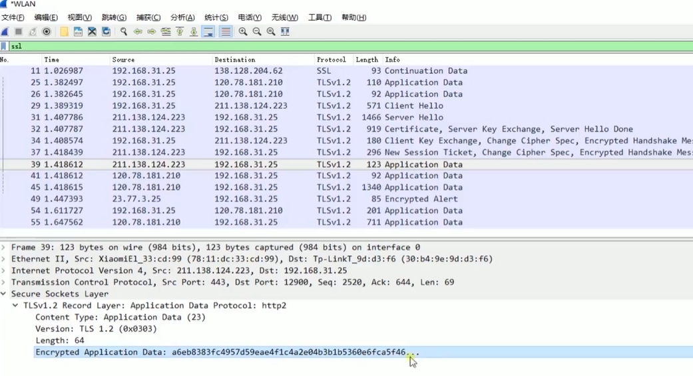

如上，没办法通过wireshark转包获取加密后的数据。

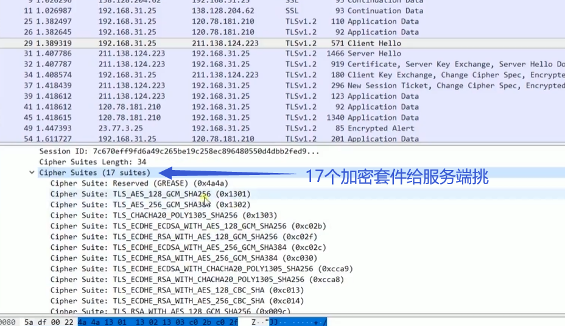

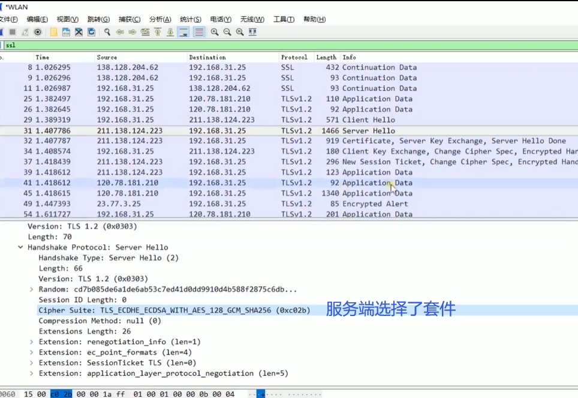

- CA 的证书提供商有许多个，有收费的有免费的，而 Let’s Encrypt 就是其中之一的免费提供商
- caddy 也可为网站开启 https 并自动申请证书

### 使用Nginx部署HTTPS服务

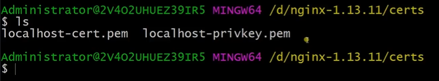

如上，首先生成公钥私钥，放在 nginx 的 certs 目录下。

如下配置 test.conf 。

```
proxy_cache_path cache levels=1:2 keys_zone=my_cache:10m;

server {
  ssl on;  # 启用 ssl ，以支持 https
  ssl_certificate_key  ../certs/localhost-privkey.pem;
  ssl_certificate      ../certs/localhost-cert.pem;

  location / {
    proxy_cache my_cache;
    proxy_pass http://127.0.0.1:8888;
    proxy_set_header Host $host;
  }
}
```

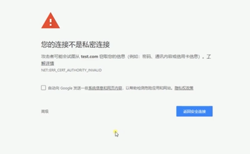

此时，如果访问 test.com ，会显示上图。因为谷歌浏览器要求证书由权威机构签发。

```
server {
  listen       80;
  listen       [::]:80 default_server;
  server_name  test.com;

  return 302 https://$server_name$request_uri;

  location / {
    proxy_cache my_cache;
    proxy_pass http://127.0.0.1:8888;
    proxy_set_header Host $host;
  }
}
```

如上，应用了具体的 nginx 参数进行配置。具体内容暂不讨论。

### HTTP2的优势
- 信道复用
- 分帧传输（根据帧信息拼接，不用按顺序发送信息）
- Server Push，服务端也可以主动发送信息

用户访问一个网站，可以只创建一个 TCP 连接。

#### http2实例
[http2/test.html](../codes/http2/test.html)

```html
<!DOCTYPE html>
<html lang="en">
<head>
  <meta charset="UTF-8">
  <meta name="viewport" content="width=device-width, initial-scale=1.0">
  <meta http-equiv="X-UA-Compatible" content="ie=edge">
  <title>Document</title>
</head>
<body>
  
</body>
</html>
```

[http2/server.js](../codes/http2/server.js)

```js
const http = require('http')
const fs = require('fs')

http.createServer(function (request, response) {
  console.log('request come', request.url)

  const html = fs.readFileSync('test.html', 'utf8')
  const img = fs.readFileSync('test.jpg')
  if (request.url === '/') {
    response.writeHead(200, {
      'Content-Type': 'text/html',
      'Connection': 'keep-alive',
      'Link': '</test.jpg>; as=image; rel=preload'
    })
    response.end(html)
  } else {
    response.writeHead(200, {
      'Content-Type': 'image/jpg',
      'Connection': 'keep-alive' // or close
    })
    response.end(img)
  }

}).listen(8888)

console.log('server listening on 8888')
```

如上：
- `Link` 是 http2 定义中指定推送哪些内容的头
- `rel=preload` 让服务端可以主动推送

#### Nginx配置HTTP2的简单使用

在 nginx 转成 http2 服务很简单，但是要在服务端改 nodejs 就稍微有些麻烦。因此我们演示时用 nginx 转。

```
proxy_cache_path cache levels=1:2 keys_zone=my_cache:10m;

server {
  listen       443 http2;
  server_name  test.com;

  http2_push_preload  on;

  ssl on;  # 启用 ssl ，以支持 https
  ssl_certificate_key  ../certs/localhost-privkey.pem;
  ssl_certificate      ../certs/localhost-cert.pem;

  location / {
    proxy_cache my_cache;
    proxy_pass http://127.0.0.1:8888;
    proxy_set_header Host $host;
  }
}
```

我们基于 https 才能启用 http2 （谷歌浏览器要求）。

`listen 443 http2`这一条命令就转成了 http2 服务。

`http2_push_preload on` 允许服务端主动推送。

在本机上，浏览器不信任这个连接，但是我们可以通过 `chrome://net-internals/` 查看是否有连接。

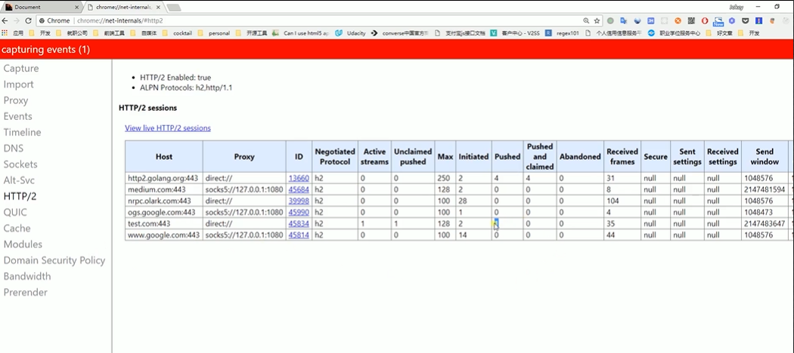

如上，对于 Host test.com:443 ，其 Pushed 值为 1 ，代表服务端推送了内容，但是 Pushed and claimed 为 0 ，说明我们禁止了接收。

Nginx默认会帮我们转换为 http1.1 如果不支持 http2 的话。

我们在命令行：
```bash
curl -v -k https://test.com
```

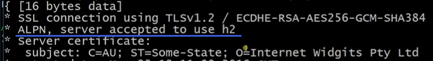

如上，使用了 http2 的服务。

我们还可以通过命令向 nginx 代理要 http1.1 的服务。

```bash
curl -v -k --http1.1 https://test.com
```

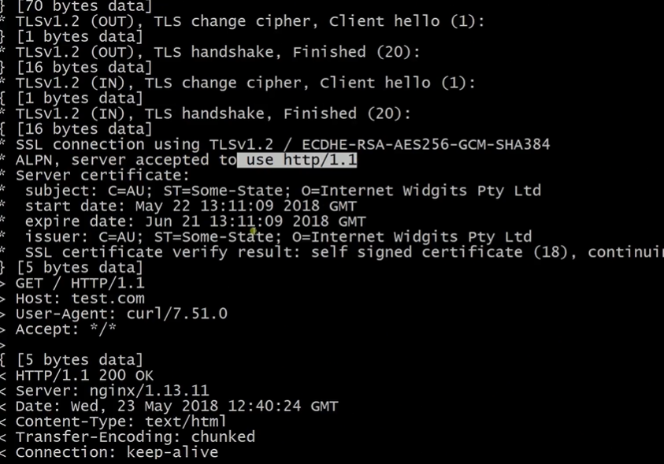

可以看到兼容了 http1.1 。

所以，使用 nginx 做 http2 好处：
- 自动兼容 http1.1
- 这样，我们在后端开发服务端，我们全部使用 http1.1 就行，不需要考虑客户端这边什么协议，因为 nginx 自动为我们转成 http1.1 协议

#### 网上关于http2的实例
[https://http2.akamai.com/](https://http2.akamai.com/)

具体的 demo 在 [https://http2.akamai.com/demo/http2-lab.html](https://http2.akamai.com/demo/http2-lab.html)。

这是测试 http2 性能的网站。

比如我们点开第一个 demo ：[对比 http 和 http2(https)的性能](http://http1.akamai.com/demo/index_http.html?h1)。

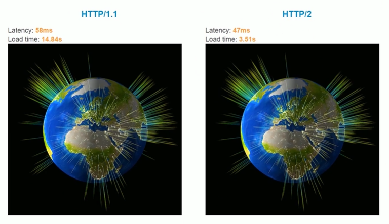

按理说，https 要有四次握手，建立传输成本更高，可是如图，其性能更好。说明 http2 很牛逼。

