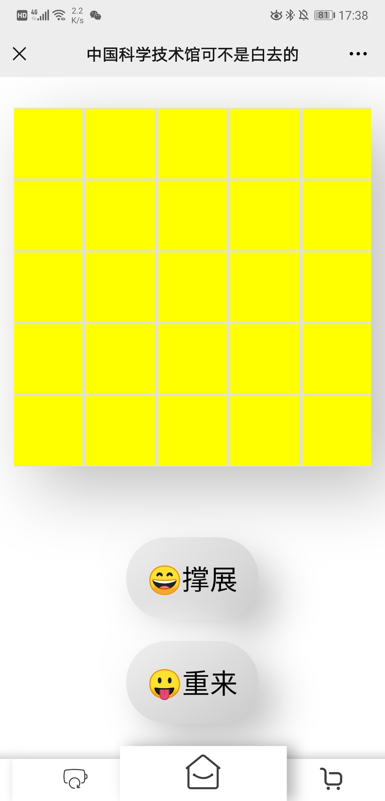

# 感觉到思维上有一些进步

按理说七月份应该把前端学习先放一放的。

但是昨天（7月15日）突然有了兴趣，想试一试把『拉灯』游戏写出来。于是今天就写出来了。




### 目录

<!-- @import "[TOC]" {cmd="toc" depthFrom=3 depthTo=6 orderedList=false} -->

<!-- code_chunk_output -->

- [目录](#目录)
- [关于函数的封装（很自然的联想）](#关于函数的封装很自然的联想)
- [更多debug经验](#更多debug经验)
- [小插曲：一天四门语言，感觉很累...](#小插曲一天四门语言感觉很累)

<!-- /code_chunk_output -->

### 关于函数的封装（很自然的联想）

我的项目放在了 [https://gitee.com/piperliu/playground-js/tree/master/vue3js](https://gitee.com/piperliu/playground-js/tree/master/vue3js) 的 [https://gitee.com/piperliu/playground-js/tree/master/vue3js/src/views/lamp](https://gitee.com/piperliu/playground-js/tree/master/vue3js/src/views/lamp) 中。

很自然地利用了 vue3 的 composition API ，我把 `setup` 外面的函数更多地视作一种 **`创建逻辑` 的 `链接`** 。

更多时候，我让其返回一个闭包。

```js
const getReInitLamp = (lamps) => {
  return () => {
    for (let i = 0; i < 5; i++) {
      lamps[i] = {}
      for (let j = 0; j < 5; j++) {
        lamps[i][j] = Math.random() < 0.5 ? 0 : 1
      }
    }
  }
}

...

export default {
  setup () {
    // init lamps
    const lamps = initLamp()
    const reInitLamp = getReInitLamp(lamps)
    const check = getCheck(lamps)
    ...
  }
}
```

这样的好处有很多：
- 在 `template` 调用时，不必是 `@click="() => func(变量)" 而直接 `@click=func` 就行
- 逻辑也更加清晰
- `setup` 内部书写也更清新简洁了

我并非刻意这么设计，而是自然而然想到的如此设计（我在想，如何才能让代码更加舒适呢？于是很自然地想到了这种）。刚学完一遍 `vue3` 时，我是想不到的。这可能要归功于我第二次学习 `vue3` 。

我感觉到我的进步了。

### 更多debug经验

其实可以很快开发完毕。时间都在索引上浪费了。

几个 debug 经验：
- 没有东西渲染出来时，首先看浏览器控制台，有没有什么提示信息，大部分时候是与 `undefined` 有关（这也是为什么 ts 比 js 牛逼）
- `v-for` 是 `值 in dict` ，而 js 中是 `键 in dict`

### 小插曲：一天四门语言，感觉很累...

- 学 AC 算法用 C++ （很费脑子）
- 科研用 Python 3
- 项目用 Scala （Spark）
- 学前端用 JavaScript / TypeScript

有点累...这几天甚至有点晕。

不说了，运动去。前端也要适当放一放。
