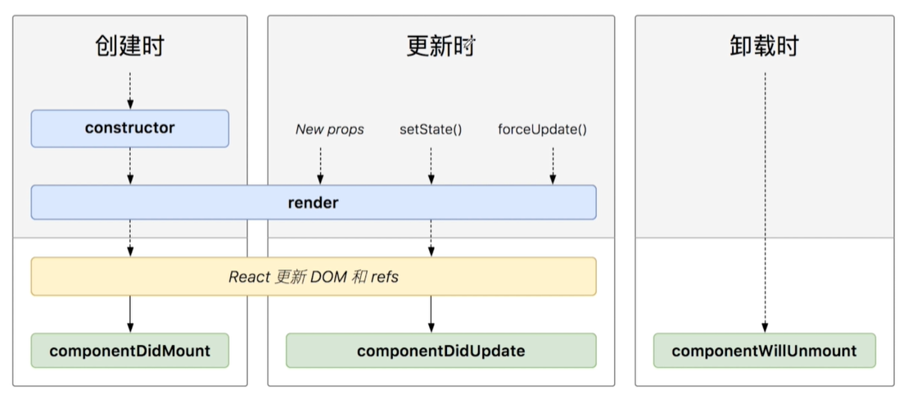
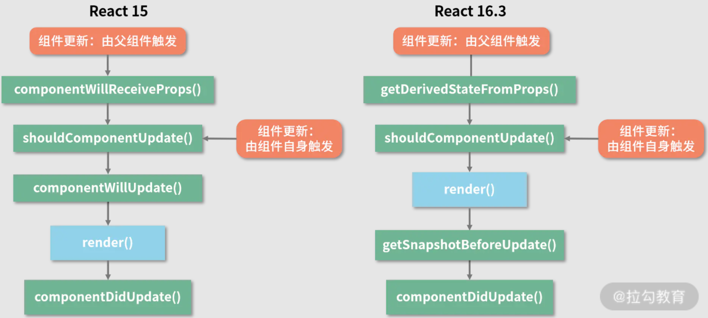
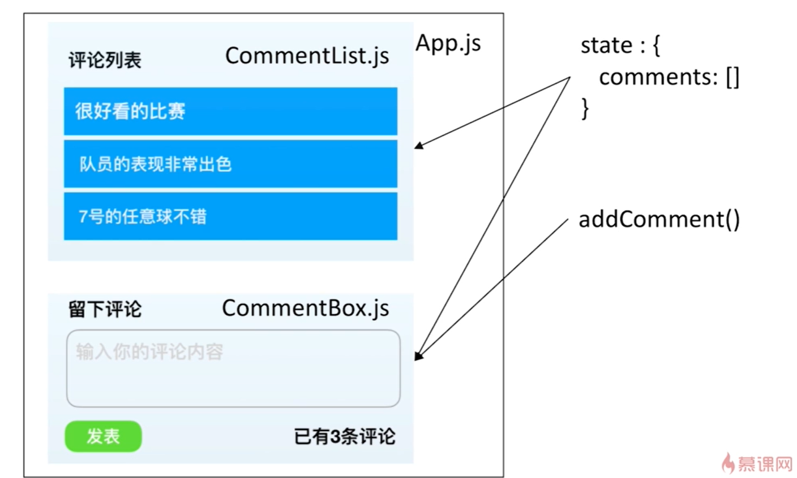

# 快速上手

参考 [React16, 张轩, 2018.9](https://www.imooc.com/learn/1045) 。


<!-- @import "[TOC]" {cmd="toc" depthFrom=3 depthTo=6 orderedList=false} -->

<!-- code_chunk_output -->

- [create-react-app](#create-react-app)
- [my - project 组件示例](#my-project-组件示例)
- [JSX](#jsx)
- [Props](#props)
- [函数式v.s.类式](#函数式vs类式)
  - [pure function](#pure-function)
- [State](#state)
  - [关于函数的this](#关于函数的this)
- [React生命周期](#react生命周期)
  - [一个时钟的小例子（老版本生命周期）](#一个时钟的小例子老版本生命周期)
- [Forms](#forms)
  - [受控组件（Controlled Components）与留言实例](#受控组件controlled-components与留言实例)
  - [非受控组件（数据保存在DOM中）与留言实例](#非受控组件数据保存在dom中与留言实例)
- [综合实例：留言本](#综合实例留言本)
  - [状态提升（Lifting State Up）](#状态提升lifting-state-up)
  - [留言本实例](#留言本实例)
- [Context](#context)
  - [Context使用示例：样式选择器](#context使用示例样式选择器)

<!-- /code_chunk_output -->

### create-react-app

```bash
npm install create-react-app -g

create-react-app my-project

cd my-project
npm start
```

### my - project 组件示例

其意自现：
```js
// index.js
import React from 'react';
import ReactDOM from 'react-dom';
import './index.css';
import App from './App';
import Welcome from './Welcome';
import reportWebVitals from './reportWebVitals';

ReactDOM.render(
  <React.StrictMode>
    <App />
  </React.StrictMode>,
  document.getElementById('root')
);

ReactDOM.render(
  <React.StrictMode>
    <Welcome />
  </React.StrictMode>,
  document.getElementById('component')
);

// If you want to start measuring performance in your app, pass a function
// to log results (for example: reportWebVitals(console.log))
// or send to an analytics endpoint. Learn more: https://bit.ly/CRA-vitals
reportWebVitals();

// App.js
import logo from './logo.svg';
import './App.css';

function App() {
  return (
    <div className="App">
      <header className="App-header">
        
        <p>
          Edit <code>src/App.js</code> and save to reload.
        </p>
        <a
          className="App-link"
          href="https://reactjs.org"
          target="_blank"
          rel="noopener noreferrer"
        >
          Learn React
        </a>
      </header>
    </div>
  );
}

export default App;

// Welcome
import React from 'react'

class Welcome extends React.Component {
  render () {
    const todoList = ['Learn React', 'Learn Redux']
    return (
      <div>
        <h1>Hello React</h1>
        <p>{ todoList }</p>
        <ul>
          {
            todoList.map(item => {
              return <li>{item}</li>
            })
          }
        </ul>
      </div>
    )
  }
}

export default Welcome
```

上面是两个组件。


### JSX

如上组件示例，可以在花括号`{}` 中添加 JavaScript 表达式，这就是 JSX 。

如果是列表，直接渲染出列表元素。

JSX 注意要用 `className` 和 `htmlFor` 代替原生 html 里面的 `class` 和 `for` 。

JSX 被编译成什么？[在线 babel](https://babeljs.io/)

这些 JSX 实际上是 `React.createElement()` 语法糖，编译为 `ReactElement` 对象。

### Props

组件像一个函数一样，接受特定的输入（`props`），产出特定的输出（`React elements`）。有 `V = f(props)` 。

```js
// components/NameCard
import React from 'react'

class NameCard extends React.Component {
  render() {
    const { name, number, isHuman, tags } = this.props
    return (
      <div>
        <h4> {name} </h4>
        <ul>
          <li>电话：{number}</li>
          <li>{ isHuman ? '人类' : '非人类' }</li>
          <hr />
          <p>
            {
              tags.map((tag, index) => {
                <span key = {index}> {tag} </span>
              })
            }
          </p>
        </ul>
      </div>
    )
  }
}

export default NameCard

// App
...
import NameCard from './components/NameCard';
const tags = ['恐龙', '足球小子']
class App extends Component {
  render() {
    return (
      <div className="App">
        <header className="App-header">
          
          <h1 className="App-title">Welcome to React</h1>
        </header>
        <NameCard name="King" number={13968185047}> isHuman tags={tags} />
      </div>
    )
  }
}
```

### 函数式v.s.类式

当一个组件没有生命周期，也没有 state 时，可以写成函数式。

可以把上面的组件写成函数式：
```js
const NameCard = (props) => {
  const { name, number, isHuman, tags } = props
  return (
    <div>
      <h4> {name} </h4>
      <ul>
        <li>电话：{number}</li>
        <li>{ isHuman ? '人类' : '非人类' }</li>
        <hr />
        <p>
          {
            tags.map((tag, index) => {
              <span key = {index}> {tag} </span>
            })
          }
        </p>
      </ul>
    </div>
  )
}
```

**React 要求：所有的函数组件，必须像纯函数（pure function）那样使用其 props。**

#### pure function

```js
// pure
function sum(a, b) {
  return a + b
}

// 不是纯函数
function sum2(a, b) {
  a = a + b
  return a
}
```

### State

组件内部的数据，可以动态改变；`this.setState()` 是更新 `state` 的唯一途径。

```js
import React from 'react'

class LikesButton extends React.Component {
  constructor (props) {
    super (props)
    this.state = {
      likes: 0
    }
  }
  increaseLikes() {
    this.setState({
      likes: ++this.state.likes
    })
  }
  render() {
    return (
      <div>
        <button
          onClick={() => { this.increaseLikes() }}
        >
          👍 {this.state.likes}
        </button>
      </div>
    )
  }
}
```

#### 关于函数的this

上述代码中：
```js
increaseLikes() {
  console.log(this)  // undefined
}
... onClick={this.increaseLikes}
```

函数 `increaseLikes` 中的 `this` 默认是 `undefined` 。

因此我们有两种方法赋予其 `this` 。

方法一：
```js
this.increaseLikes = this.increaseLikes.bind(this)
increaseLikes() {
  console.log(this)
}
... onClick={this.increaseLikes}
```

方法二（应用ES6的箭头函数，更常用）：
```js
increaseLikes() {
  console.log(this)
}
... onClick={() => { this.increaseLikes() }}
```

### React生命周期



注意这是老版本的生命周期。



[React 的生命周期](https://www.jianshu.com/p/c6e7207cbf88)：React 团队出于性能的考虑，在 `v16` 时引入了 Fiber 架构，Fiber 架构下， `react` 渲染程序会将一个大的更新任务拆解为许多个小任务。每当执行完一个小任务时，渲染线程都会把主线程交回去，看看有没有优先级更高的工作要处理，确保不会出现其他任务被“饿死”的情况，进而避免同步渲染带来的卡顿。在这个过程中，渲染线程不再“一去不回头”，而是可以被打断的，这就是所谓的“异步渲染”。在 Fiber 机制下， `render` 阶段是允许暂停、终止和重启的。废弃的生命周期钩子函数，它们都处于 `render` 阶段，都可能被重复执行。

#### 一个时钟的小例子（老版本生命周期）

```js
import React from 'react'

class DigitalClock extends React.Component {
  constructor(props) {
    super(props)
    this.state = {
      date: new Data()
    }
  }
  componentDidMount() {
    this.timer = setInterval(() => {
      this.setState({
        date: new Date()
      })
    }, 1000)
  }
  componentDidUpdate(currentProps, currentState) {
    console.log(currentState)
  }
  // 别忘了卸载
  componentWillUnmount() {
    clearInterval(this.timer)
  }
  render() {
    return (
      <div className="digital-clock-component jumbotron">
        <h1>{this.state.date.toLocaleTimeString()}</h1>
      </div>
    )
  }
}

export default DigitalClock
```

### Forms

#### 受控组件（Controlled Components）与留言实例

```js
import React from 'react'

class CommentBox extends React.Component {
  constructor(props) {
    super(props)
    this.state = {
      value: ''
    }
    this.handleChange = this.handleChange.bind(this)
    this.handleSubmit = this.handleSubmit.bind(this)
  }
  handleChange(event) {
    this.setState({
      value: event.target.value
    })
  }
  handleSubmit(event) {
    alert(this.state.value)
    event.preventDefault()
  }
  render() {
    return (
      <form className="p-5" coSubmit={this.handleSubmit}>
        <div className="form-group">
          <label>留言内容</label>
          <input
            type="text"
            className="form-control"
            placeholder="请输入内容"
            onChange={this.handleChange}
            value={this.state.value}
          />
        </div>
        <button type="submit" className="btn btn-primary">
          留言
        </button>
      </form>
    )
  }
}

export default CommentBox
```

#### 非受控组件（数据保存在DOM中）与留言实例

用到了 `ref` 。

```js
import React from 'react'

class CommentBox extends React.Component {
  constructor(props) {
    super(props)
    this.handleSubmit = this.handleSubmit.bind(this)
  }
  handleSubmit(event) {
    alert(this.textInput.value)
    event.preventDefault()
  }
  render() {
    return (
      <form className="p-5" coSubmit={this.handleSubmit}>
        <div className="form-group">
          <label>留言内容</label>
          <input
            type="text"
            className="form-control"
            placeholder="请输入内容"
            ref={(textInput) => (this.textInput = textInput)}
          />
        </div>
        <button type="submit" className="btn btn-primary">
          留言
        </button>
      </form>
    )
  }
}

export default CommentBox
```

非受控组件将数据保存在 DOM 中，快速而随性，因此还是推荐受控组件。

### 综合实例：留言本

#### 状态提升（Lifting State Up）

状态提示：把多个组件共用数据放到父组件中管理。



如上，如果需要修改数据，则通过回调的方式。数据流是单向的。

#### 留言本实例

```js
// components/CommentList.js
import React from 'react'

const CommentList = ({ comments }) => {
  return (
    <div className="comment-list-component">
      <label>评论列表</label>
      <ul className="list-group mb-3">
        {
          comments.map((comment, index) => 
            <li key={index} className="list-group-item">
              {comment}
            </li>
          )
        }
      </ul>
    </div>
  )
}

export default CommentList

// components/CommentBox.js
import React from 'react'

class CommentBox extends React.Component {
  constructor(props) {
    super(props)
    this.handleSubmit = this.handleSubmit.bind(this)
  }
  handleSubmit(event) {
    this.props.onAddComment(this.textInput.value)
    // 通过回调把数据传到外部
    event.preventDefault()
  }
  render() {
    return (
      <form className="p-5" coSubmit={this.handleSubmit}>
        <div className="form-group">
          <label>留言内容</label>
          <input
            type="text"
            className="form-control"
            placeholder="请输入内容"
            ref={(textInput) => (this.textInput = textInput)}
          />
        </div>
        <button type="submit" className="btn btn-primary">
          留言
        </button>
        <p>已有{this.props.commentsLength}条评论</p>
      </form>
    )
  }
}

export default CommentBox

// App.js
import React, { Component } from 'react'
...
import CommentBox from './components/CommentBox'
import CommentList from './components/CommentList'

class App extends Component {
  constructor(props) {
    super(props)
    this.state = {
      comments: []
    }
    this.addComment = this.addComment.bind(this)
  }
  addComment(comment) {
    this.setState({
      comments: [ ...this.state.comments, comment]
    })
  }
  render() {
    const { comments } = this.state
    return (
      <CommentList comments={comments} />
      <CommentBox
        commentsLength={comments.Length}
        onAddComment={this.addComment}
      />
    )
  }
}

export default App
```

### Context

是在 v16.3 中提出的。

设计的目的是共享那些对于组件来说是全局的的数据，不要仅仅为了避免在几个层级下的组件传递 props 而是用 context 。

#### Context使用示例：样式选择器

```js
// theme-context.js
import React from 'react'

const ThemeContext = React.createContext()

export default ThemeContext

// components/ThemeBar.js
import React from 'react'
import ThemeContext from '../theme-context'

const ThemeBar = () => {
  return (
    <ThemeContext.Consumer>
      {
        theme => {
          return (
            <div
              className="alert mt-5"
              style={
                {backgroundColor: theme.bgColor,
                color: theme.color}
              }
            >
            样式区域
            <button className={theme.classnames}>
              样式按钮
            </button>
            </div>
          )
        }
      }
    </ThemeContext.Consumer>
  )
}

// App.js
import React, { Compinent } from 'react'
...
import ThemeContext from './theme-context'
const themes = {
  light: {
    classnames: 'btn btn-primary',
    bgColor: '#eeeeee',
    color: '#000'
  },
  dark: {
    classnames: 'btn btn-light',
    bgColor: '#222222',
    color: '#fff'
  },
}

class App extends Component {
  constructor(props) {
    super(props)
    this.state = {
      theme: 'light'
    }
    this.changeTheme = this.changeTheme.bind(this)
  }
  changeTheme(theme) {
    this.setState({
      theme,
    })
  }
  render() {
    return (
      <ThemeContext.Provider>
        ...
        <a href="#theme-switcher"
          className="btn btn-light"
          onClick={() => {this.changeTheme('light')}}
        >
        浅色主题
        </a>
        <a href="#theme-switcher"
          className="btn btn-secondary"
          onClick={() => {this.changeTheme('dark')}}
        >
        深色主题
        </a>
      </ThemeContext.Provider>
    )
  }
}

export default App
```
