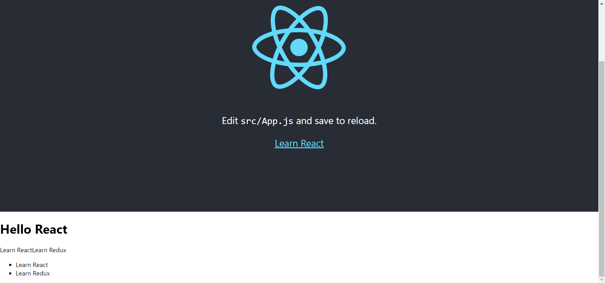

# 快速上手

参考 [React16, 张轩, 2018.9](https://www.imooc.com/learn/1045) 。


<!-- @import "[TOC]" {cmd="toc" depthFrom=3 depthTo=6 orderedList=false} -->

<!-- code_chunk_output -->

- [create-react-app](#create-react-app)
- [my - project 组件示例](#my-project-组件示例)
- [JSX](#jsx)
- [Props](#props)
- [函数式v.s.类式](#函数式vs类式)
  - [pure function](#pure-function)
- [State](#state)
  - [关于函数的this](#关于函数的this)

<!-- /code_chunk_output -->

### create-react-app

```bash
npm install create-react-app -g

create-react-app my-project

cd my-project
npm start
```

### my - project 组件示例

其意自现：
```js
// index.js
import React from 'react';
import ReactDOM from 'react-dom';
import './index.css';
import App from './App';
import Welcome from './Welcome';
import reportWebVitals from './reportWebVitals';

ReactDOM.render(
  <React.StrictMode>
    <App />
  </React.StrictMode>,
  document.getElementById('root')
);

ReactDOM.render(
  <React.StrictMode>
    <Welcome />
  </React.StrictMode>,
  document.getElementById('component')
);

// If you want to start measuring performance in your app, pass a function
// to log results (for example: reportWebVitals(console.log))
// or send to an analytics endpoint. Learn more: https://bit.ly/CRA-vitals
reportWebVitals();

// App.js
import logo from './logo.svg';
import './App.css';

function App() {
  return (
    <div className="App">
      <header className="App-header">
        
        <p>
          Edit <code>src/App.js</code> and save to reload.
        </p>
        <a
          className="App-link"
          href="https://reactjs.org"
          target="_blank"
          rel="noopener noreferrer"
        >
          Learn React
        </a>
      </header>
    </div>
  );
}

export default App;

// Welcome
import React from 'react'

class Welcome extends React.Component {
  render () {
    const todoList = ['Learn React', 'Learn Redux']
    return (
      <div>
        <h1>Hello React</h1>
        <p>{ todoList }</p>
        <ul>
          {
            todoList.map(item => {
              return <li>{item}</li>
            })
          }
        </ul>
      </div>
    )
  }
}

export default Welcome
```

上面是两个组件。



### JSX

如上组件示例，可以在花括号`{}` 中添加 JavaScript 表达式，这就是 JSX 。

如果是列表，直接渲染出列表元素。

JSX 注意要用 `className` 和 `htmlFor` 代替原生 html 里面的 `class` 和 `for` 。

JSX 被编译成什么？[在线 babel](https://babeljs.io/)

这些 JSX 实际上是 `React.createElement()` 语法糖，编译为 `ReactElement` 对象。

### Props

组件像一个函数一样，接受特定的输入（`props`），产出特定的输出（`React elements`）。有 `V = f(props)` 。

```js
// components/NameCard
import React from 'react'

class NameCard extends React.Component {
  render() {
    const { name, number, isHuman, tags } = this.props
    return (
      <div>
        <h4> {name} </h4>
        <ul>
          <li>电话：{number}</li>
          <li>{ isHuman ? '人类' : '非人类' }</li>
          <hr />
          <p>
            {
              tags.map((tag, index) => {
                <span key = {index}> {tag} </span>
              })
            }
          </p>
        </ul>
      </div>
    )
  }
}

export default NameCard

// App
...
import NameCard from './components/NameCard';
const tags = ['恐龙', '足球小子']
class App extends Component {
  render() {
    return (
      <div className="App">
        <header className="App-header">
          
          <h1 className="App-title">Welcome to React</h1>
        </header>
        <NameCard name="King" number={13968185047}> isHuman tags={tags} />
      </div>
    )
  }
}
```

### 函数式v.s.类式

可以把上面的组件写成函数式：
```js
const NameCard = (props) => {
  const { name, number, isHuman, tags } = props
  return (
    <div>
      <h4> {name} </h4>
      <ul>
        <li>电话：{number}</li>
        <li>{ isHuman ? '人类' : '非人类' }</li>
        <hr />
        <p>
          {
            tags.map((tag, index) => {
              <span key = {index}> {tag} </span>
            })
          }
        </p>
      </ul>
    </div>
  )
}
```

**React 要求：所有的函数组件，必须像纯函数（pure function）那样使用其 props。**

#### pure function

```js
// pure
function sum(a, b) {
  return a + b
}

// 不是纯函数
function sum2(a, b) {
  a = a + b
  return a
}
```

### State

组件内部的数据，可以动态改变；`this.setState()` 是更新 `state` 的唯一途径。

```js
import React from 'react'

class LikesButton extends React.Component {
  constructor (props) {
    super (props)
    this.state = {
      likes: 0
    }
  }
  increaseLikes() {
    this.setState({
      likes: ++this.state.likes
    })
  }
  render() {
    return (
      <div>
        <button
          onClick={() => { this.increaseLikes() }}
        >
          👍 {this.state.likes}
        </button>
      </div>
    )
  }
}
```

#### 关于函数的this

上述代码中：
```js
increaseLikes() {
  console.log(this)  // undefined
}
... onClick={this.increaseLikes}
```

函数 `increaseLikes` 中的 `this` 默认是 `undefined` 。

因此我们有两种方法赋予其 `this` 。

方法一：
```js
this.increaseLikes = this.increaseLikes.bind(this)
increaseLikes() {
  console.log(this)
}
... onClick={this.increaseLikes}
```

方法二（应用ES6的箭头函数，更常用）：
```js
increaseLikes() {
  console.log(this)
}
... onClick={() => { this.increaseLikes() }}
```
