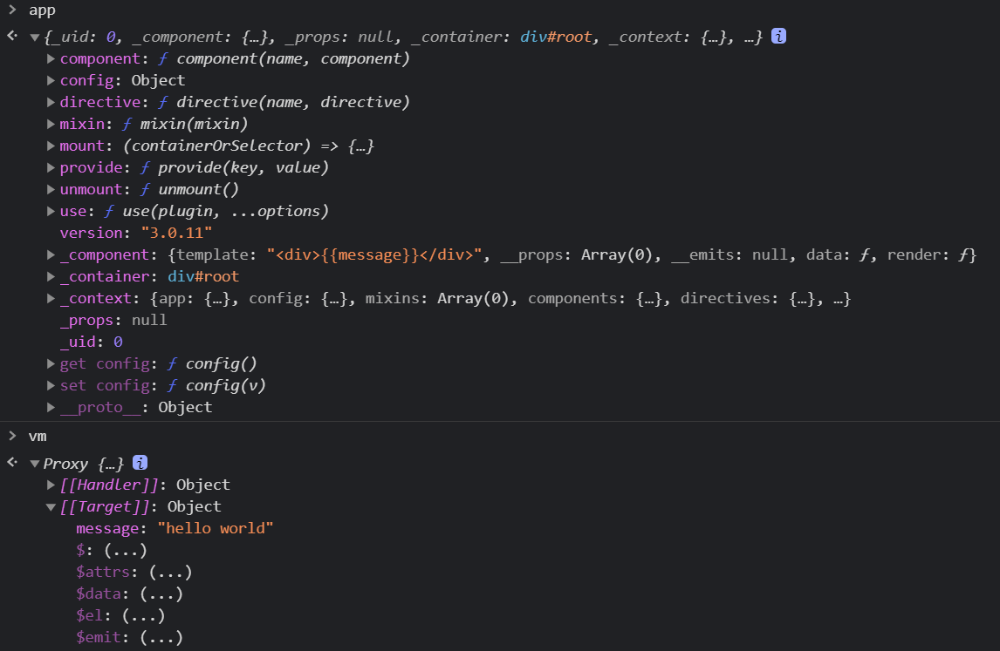

# VUE基础操作
> 『目前，我们先不考虑 vue 生命周期等背后原理，仅从一个新手视角去理解语法语义。』

<!-- @import "[TOC]" {cmd="toc" depthFrom=1 depthTo=6 orderedList=false} -->

<!-- code_chunk_output -->

- [VUE基础操作](#vue基础操作)
    - [轻度使用：cdn](#轻度使用cdn)
    - [v-if](#v-if)
    - [v-on](#v-on)
    - [v-for](#v-for)
    - [v-model](#v-model)
    - [v-bind 与 组件的props](#v-bind-与-组件的props)
    - [MVVM简单理解](#mvvm简单理解)

<!-- /code_chunk_output -->


### 轻度使用：cdn

vue是渐进式框架，我们这里轻度使用一下，仅仅在 `<head>` 里引用：
```html
<!-- 这样获取的 vue 或许永远是最新版的？ -->
<script src="https://unpkg.com/vue@next"></script>
```

### v-if

目前，我们先不考虑 vue 生命周期等背后原理，仅从一个新手视角去理解语法语义。我将 `v-if` 理解为：
- 为 `true` 时，浏览器才渲染
- （或许是某型情况下渲染了，然后被隐藏？以此防止性能受损）

```html
<div id="lesson2a"></div>

<script>
  Vue.createApp({
    data() {
      return {
        content: 'hello world',
        btnContent: '显示',
        show: true
      }
    },

    methods : {
      handleBtnClick() {
        this.btnContent = (this.btnContent == '显示') ? '隐藏' : '显示';

        this.show = !this.show;
      }
    },

    // {{}} 语法学名叫 插值表达式

    template: `
      <div>
        <span v-if="show">{{content}}</span>
        <button v-on:click="handleBtnClick">{{btnContent}}</button>
      </div>
    `
  }).mount('#lesson2a')
</script>
```

### v-on

`v-on` 或者 `@` 绑定事件对应的方法。

### v-for

`v-for` 注意后面的语法很有趣：`(item, index) of list`， `list` 是来自 `data()` 的变量。

```html
<script>
    Vue.createApp({
      data() {
        return {
            inputValue: '',  // v-model 是双向绑定的，这意味着可以删除变量清空 input 框
            list: []
        }
      },

      methods: {
        handleAddItem() {
          this.list.push(this.inputValue);
          this.inputValue = '';
        }
      },

      template: `
      <div>
          <input v-model="inputValue" />
          <button
              v-on:click="handleAddItem"
              title="增加一条"
          >
              增加
          </button>
          <ul>
              <li v-for="(item, index) of list">{{item}}</li>
          </ul>
      </div>
      `
  }).mount('#to-do-list')
</script>
```

### v-model

`v-model` 是双向绑定的。目前将其理解为，用于与 `<input />` 这类表单元素内的数据 **双向绑定** 。

什么意思？我们使用 `<input />` 时，将其内数据改变，vue对象内的变量也会变化。

### v-bind 与 组件的props

`v-bind:property` 同简写 `:property` 。

```html
<body>
  <div id="root"></div>
</body>
<script>
  // mvvm , vue 实例，vue 组件
  const app = Vue.createApp({
    data() {
      return {
        inputValue: '',
        list: []
      }
    },
    methods: {
      handleAddItem() {
        this.list.push(this.inputValue);
        this.inputValue = '';
      }
    },
    template: `
      <div>
        <input v-model="inputValue" />
        <button
          v-on:click="handleAddItem"
          v-bind:title="inputValue"
        >
          增加
        </button>
        <ul>
          <todo-item
            v-for="(item, index) of list"
            v-bind:content="item"
            v-bind:index="index"
          />
        </ul>
      </div>
    `
  });

  // 不可以先挂载，再注册组件
  // 把 app.mount('#root'); 放在注册后

  app.component('todo-item', {
    props: ['content', 'index'],  // 接收外部给这个组件的属性值
    template: '<li>{{index}} -- {{content}}</li>'
  });

  app.mount('#root');

</script>
```

对于已有的组件，比如自带的 `<button>` ，我们希望其属性 `title` 与 vue 中的变量绑定，则要对 `title` 处理：`v-bind:title="变量名"`。

对于自己注册的组件，比如上述例子中的 `todo-item`， 应注意：
- 要在其父组件 `mount` 前注册（`component`）
- 作为组件被调用时，其可以通过`属性`接收变量信息，前提是这些`属性` 要在 `props` 中被声明

### MVVM简单理解

```html
<body>
  <div id="root"></div>
</body>
<script>
  // createApp 表示创建一个 Vue 应用, 存储到 app 变量中
  // 传入的参数表示，这个应用最外层的组件，应该如何展示
  // MVVM 设计模式，M -> Model 数据， V -> View 视图， VM -> ViewModel 视图数据连接层
  const app = Vue.createApp({
    data() {
      return {
        message: 'hello world'
      }
    },
    template: "<div>{{message}}</div>"
  });
  // vm 代表的就是 Vue 应用的根组件
  const vm = app.mount('#root');
  // vm.$data.message = 'bye'，会重新渲染出 bye
</script>
```
渲染后，vm 里有比如 `$data, $el, $router` 等内置属性与内置方法。

vm 作为根组件。


