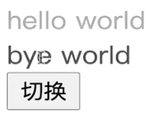

# VUE组件和元素切换动画的实现

<!-- @import "[TOC]" {cmd="toc" depthFrom=1 depthTo=6 orderedList=false} -->

<!-- code_chunk_output -->

- [VUE组件和元素切换动画的实现](#vue组件和元素切换动画的实现)
    - [多个单元素标签之间的切换](#多个单元素标签之间的切换)
      - [mode="in-out"](#modein-out)
      - [appear](#appear)
    - [多个单组件之间的切换](#多个单组件之间的切换)
      - [:is动态组件](#is动态组件)

<!-- /code_chunk_output -->

### 多个单元素标签之间的切换
```html
<head>
  <meta charset="UTF-8">
  <meta name="viewport" content="width=device-width, initial-scale=1.0">
  <title>lesson 24</title>
  <style>
    .v-leave-to,
    .v-enter-from {
      opacity: 0;
    }
    .v-leave-active,
    .v-enter-active {
      transition: opacity 3s ease-in;
    }
    .v-leave-from,
    .v-enter-to {
      opacity: 1;
    }
    
  </style>
  <script src="https://unpkg.com/vue@next"></script>
</head>
<body>
  <div id="root"></div>
</body>
<script>
  const app = Vue.createApp({
    data() {
      return {
        show: false
      }
    },
    methods: {
      handleClick() {
        this.show = !this.show;
      }
    },
    template: `
      <div>
        <transition>
          <div v-if="show">hello world</div>
          <div v-else="show">bye world</div>
        </transition>
        <button @click="handleClick">切换</button>
      </div>
    `
  });

  const vm = app.mount('#root');
</script>
```

单元素切换根单元素操作一样。

但是这将导致两个组件同时出现，如下图。



#### mode="in-out"

因此用 `mode="in-out"` ，或者 `mode="out-in"` 也可。

```js
template: `
  <div>
    <transition mode="in-out">
      <div v-if="show">hello world</div>
      <div v-else="show">bye world</div>
    </transition>
    <button @click="handleClick">切换</button>
  </div>
`
```

#### appear
如果希望网页加载时，就有动画，则应用 `appear` 。

```js
template: `
  <div>
    <transition mode="in-out" appear>
      <div v-if="show">hello world</div>
      <div v-else="show">bye world</div>
    </transition>
    <button @click="handleClick">切换</button>
  </div>
`
```

### 多个单组件之间的切换
```js
const ComponentA = {
  template: '<div>hello world</div>'
}
const ComponentB = {
  template: '<div>bye world</div>'
}

const app = Vue.createApp({
  data() {
    return {
      show: false
    }
  },
  methods: {
    handleClick() {
      this.show = !this.show;
    }
  },
  components: {
    'component-a': ComponentA,
    'component-a': ComponentB,
  },
  template: `
    <div>
      <transition mode="out-in" appear>
        <component-a v-if="show" />
        <component-b v-else="show" />
      </transition>
      <button @click="handleClick">切换</button>
    </div>
  `
});

const vm = app.mount('#root');
```

如上，可以使用 `transition` 如切换标签一样来做。也可以使用`动态组件`方法。

#### :is动态组件

```js
data() {
  return { component: 'component-a' }
},
methods: {
  handleClick() {
    if(this.component === 'component-a') {
      this.component = 'component-b';
    } else {
      this.component = 'component-a';
    }
  }
}
template: `
  <div>
    <transition mode="out-in" appear>
      <component-a :is="component" />
    </transition>
    <button @click="handleClick">切换</button>
  </div>
`
```

如上，使用 `:is` 也可以实现组件之间的切换。
