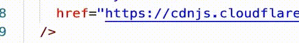

# VUE列表动画

<!-- @import "[TOC]" {cmd="toc" depthFrom=1 depthTo=6 orderedList=false} -->

<!-- code_chunk_output -->

- [VUE列表动画](#vue列表动画)
    - [transition-group](#transition-group)
    - [v-move](#v-move)

<!-- /code_chunk_output -->

### transition-group
```html
  <style>
    .v-enter-from {
      opacity: 0;
      transform: translateY(30px);
    }
    .v-enter-active {
      transition: all .5s ease-in;
    }
    .v-enter-to {
      opacity: 1;
      transform: translateY(0);
    }
    .v-move {
      transition: all .5s ease-in;
    }
    .list-item {
      display: inline-block;  /* 对于列表，display:inline实现不了动画 */
      margin-right: 10px;
    }
  </style>
  <script src="https://unpkg.com/vue@next"></script>
</head>
<body>
  <div id="root"></div>
</body>
<script>
  // 列表动画的实现
  const app = Vue.createApp({
    data() {
      return { list: [1, 2, 3] }
    },
    methods: {
      handleClick() {
        this.list.unshift(this.list.length + 1);
      },
    },
    template: `
      <div>
        <transition-group>
          <span class="list-item" v-for="item in list" :key="item">{{item}}</span>
        </transition-group>
        <button @click="handleClick">增加</button>
      </div>
    `
  });

  const vm = app.mount('#root');
</script>
```

注意如列表，用 `transition-group` 。



此时面临一个问题，如上图：新增的元素有动画，列表移动没有动画。

### v-move

新增一个 css class `v-move`，设置其 `transition` 即可。
