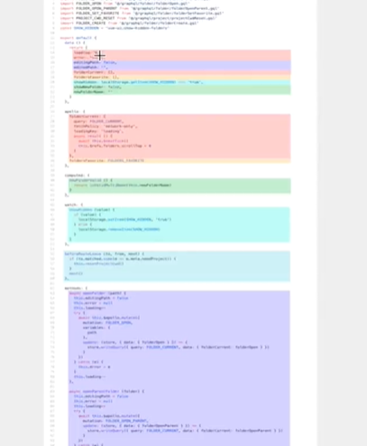

# Setup函数的使用

<!-- @import "[TOC]" {cmd="toc" depthFrom=1 depthTo=6 orderedList=false} -->

<!-- code_chunk_output -->

- [Setup函数的使用](#setup函数的使用)
    - [为什么会有CompositionAPI](#为什么会有compositionapi)
    - [setup](#setup)

<!-- /code_chunk_output -->

### 为什么会有CompositionAPI


如上，颜色相同的是相关逻辑。

我们发现，对于一个逻辑，总是需要跳着写。

于是 vue3 提出 Compostion API 。

### setup
```js
const app = Vue.createApp({
  template: `
    <div @click="handleClick">{{name}}</div>
  `,
  methods: {
    test() {
      console.log(this.$options.setup());
    }
  },
  mounted() {
    this.test();
  },
  // created 实例被完全初始化之前
  setup(props, context) {
    this.test();  // 会报错
    return {
      name: 'dell',
      handleClick: () => {
        alert(123)
      }
    }
  }
});
const vm = app.mount('#root');
```

如上，我们可以把逻辑都放到 setup 里：
- setup 是在 created 时创建的
- 因此 `this.test();` 会报错（此时没有`test()`）
- 在 setup 中，不要用 `this` ，用之后的 `Compostion API` 相关的方法
