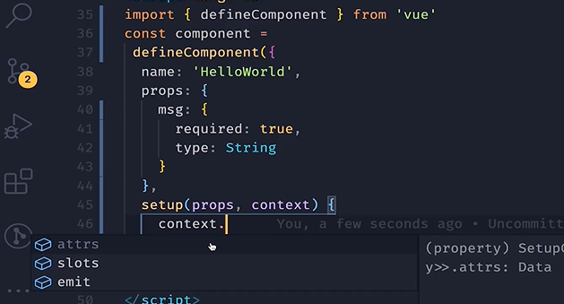

# typescript对vue3的加持

<!-- @import "[TOC]" {cmd="toc" depthFrom=1 depthTo=6 orderedList=false} -->

<!-- code_chunk_output -->

- [typescript对vue3的加持](#typescript对vue3的加持)
    - [使用defineComponent](#使用definecomponent)
    - [setup的参数如props，context](#setup的参数如propscontext)

<!-- /code_chunk_output -->

### 使用defineComponent
```ts
import { defineComponet } from 'vue'
const component = defineComponet({
  name: 'HelloWorld',
  props: {
    msg: String,
  },
  setup () {
  }
})

export default component
```

如上，`defineComponet`的作用就是，让 componet 对象成为 ts 对象，可以获得类型提示。

### setup的参数如props，context



ts 会提示我们， `setup` 中的参数，以及参数的各个属性。

值得注意的是，比如 `props` ，其也是响应式的。
