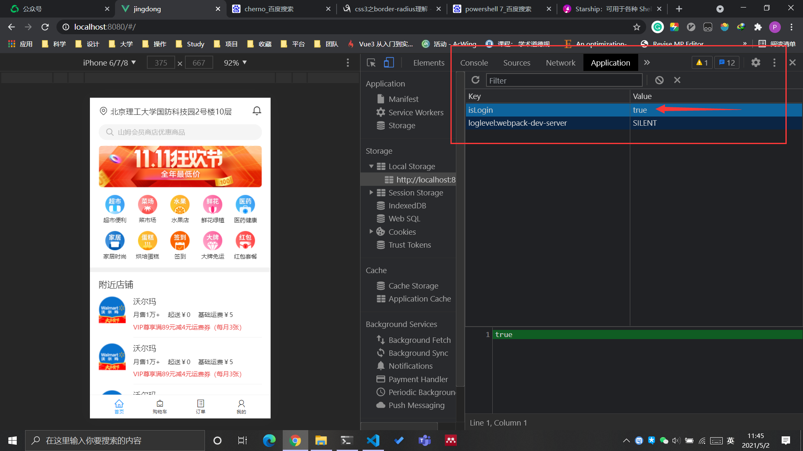

# VUE制作京东到家前端

<!-- @import "[TOC]" {cmd="toc" depthFrom=1 depthTo=6 orderedList=false} -->

<!-- code_chunk_output -->

- [VUE制作京东到家前端](#vue制作京东到家前端)
    - [项目设计](#项目设计)
    - [项目初始化](#项目初始化)
    - [基础样式](#基础样式)
      - [normalize.css](#normalizecss)
      - [设置 rem](#设置-rem)
    - [开发布局](#开发布局)
      - [BEM的CSS命名规则](#bem的css命名规则)
      - [iconfont](#iconfont)
      - [浏览器最小显示12px，所以用transform](#浏览器最小显示12px所以用transform)
      - [css优先级](#css优先级)
      - [防止网速慢造成抖动](#防止网速慢造成抖动)
    - [首页组件的合理拆分](#首页组件的合理拆分)
      - [拆分成多个组件](#拆分成多个组件)
      - [用v-for, v-html精简页面](#用v-for-v-html精简页面)
      - [使用scoped约束css作用域](#使用scoped约束css作用域)
      - [为什么要在组件里写name？Chrome的vue-devtools](#为什么要在组件里写namechrome的vue-devtools)
    - [路由守卫（登录了才跳转首页）](#路由守卫登录了才跳转首页)
      - [router的beforeEnter和beforeEach(to, from, next)](#router的beforeenter和beforeeachto-from-next)
      - [Chrome::Application::LocalStorage](#chromeapplicationlocalstorage)

<!-- /code_chunk_output -->

### 项目设计
所有的项目标注设计图，见
- [../../../courses/code-for-project/设计标注/设计标注/index.html](../../../courses/code-for-project/设计标注/设计标注/index.html)

### 项目初始化
```sh
vue create jingdong
```

```sh
Vue CLI v4.5.12
? Please pick a preset: Manually select features
? Check the features needed for your project:
 (*) Choose Vue version
 (*) Babel
 ( ) TypeScript
 ( ) Progressive Web App (PWA) Support
 (*) Router
 (*) Vuex
>(*) CSS Pre-processors
 (*) Linter / Formatter
 ( ) Unit Testing
 ( ) E2E Testing
```

```sh
Vue CLI v4.5.12
? Please pick a preset: Manually select features
? Check the features needed for your project: Choose Vue version, Babel, Rou
ter, Vuex, CSS Pre-processors, Linter
? Choose a version of Vue.js that you want to start the project with 3.x (Pr
eview)
? Use history mode for router? (Requires proper server setup for index fallb
ack in production) No
? Pick a CSS pre-processor (PostCSS, Autoprefixer and CSS Modules are suppor
ted by default): Sass/SCSS (with dart-sass)
? Pick a linter / formatter config: Standard
? Pick additional lint features: Lint on save
? Where do you prefer placing config for Babel, ESLint, etc.? In dedicated c
onfig files
? Save this as a preset for future projects? (y/N)
```

### 基础样式
#### normalize.css

```sh
npm install normalize.css --save
```

不同移动端浏览器，对于标签展示是不一致的，因此用 `normalize.css` 抹平不同浏览器中的差异。

在 `main.js` 中引入

```js
import 'normalize.css'
```

#### 设置 rem

在 `style/base.scss` 中设定 `html { font-size: 100px }` 。

```css
html {
    font-size: 100px;
}
```

这样我们就设定了基础的 `1 rem` 为 `100px` 。同样别忘了在 `main.js` 中引入。

### 开发布局

底部 `div.docker` ：
- 使用了 flex 布局
- 长宽大小都基于 `rem` 为单位的
- scss 中妙用 `&__item`
- 整理到一个 `index.scss` 中，在 `main.js` 中方便引入

底部之外，用 `div.wrapper` 包裹：
- 用 `overflow-y: auto` 搞定上下滚动

```css
@import './base.scss';
@import './iconfont.css';
```

#### BEM的CSS命名规则

[http://getbem.com/](http://getbem.com/)

```css
.block{}
.block__element{}
.block--modifier{}
```

#### iconfont
https://www.iconfont.cn/ 新建了一个项目。

#### 浏览器最小显示12px，所以用transform
```css
.docker__title {
  font-size: .2rem;
  transform: scale(.5, .5);
  transform-origin: center top;
}
```

#### css优先级
注意下面两个优先级不同：
```css
.position {
  padding: .16rem 0;
  line-height: .22rem;
  font-size: .16rem;
  &__icon {
    margin-right: .08rem;
    font-size: .2rem;
  }
}
/* 编译后是 .position__icon */

.position {
  padding: .16rem 0;
  line-height: .22rem;
  font-size: .16rem;
  .position__icon {
    margin-right: .08rem;
    font-size: .2rem;
  }
}
/* 编译后是 .position .position__icon */
```

后者优先级更高。

#### 防止网速慢造成抖动


如上，用 3G 网络，加载图片前后，图片元素会发生抖动（被图片挤到下面去）。

- 查看图片实际大小：388*1528
- 388 / 1528 约等于 25.4%

```css
.banner {
  height: 0;
  overflow: hidden;
  padding-bottom: 25.4%;
  &__img {
    width: 100%;
  }
}
```

### 首页组件的合理拆分
#### 拆分成多个组件
把首页拆成多个组件，让代码维护性变好。

在 view 中新建 `home` 文件夹，之下设立：
- Home.vue，把之前 App.vue 的东西放到 Home.vue 里
- 开始拆 Home.vue
  - StaticPart.vue
  - Nearby.vue
  - Docker.vue

拆分后的 Home 为：
```html
<template>
  <div class="wrapper">
    <StaticPart />
    <Nearby />
  </div>
  <Docker />
</template>
```

#### 用v-for, v-html精简页面
比如将 `docker__item` 精简到 `v-for` 中。

注意使用 `v-html` 方式 icon 字体被转义。

```html
<div class="iconfont" v-html="item.icon" />
```

#### 使用scoped约束css作用域
```html
<style lang="scss" scoped>
</style>
```

#### 为什么要在组件里写name？Chrome的vue-devtools
Vue.js devtools

Chrome and Firefox DevTools extension for debugging Vue.js applications.

### 路由守卫（登录了才跳转首页）
实现功能：
- 没登陆，跳转登陆页面
- 登陆了，从登陆页面跳到主页
- 登陆了，其他页面不受干扰

#### router的beforeEnter和beforeEach(to, from, next)

router/index.js

```js
import { createRouter, createWebHashHistory } from 'vue-router'
import Home from '../views/home/Home.vue'
import Login from '../views/login/Login.vue'

const routes = [
  {
    path: '/',
    name: 'Home',
    component: Home
  },
  {
    path: '/login',
    name: 'Login',
    component: Login,
    beforeEnters (to, from, next) {
      // console.log(to, from)
      // {fullPath: "/", hash: "", query: {…}, name: "Home", path: "/",…}
      // {fullPath: "/login", hash: "", query: {…}, name: "Login", path: "/login",…}
      // next()  // 调用 next 逻辑才会继续执行
      const isLogin = localStorage.isLogin
      if (isLogin) {
        next({ name: 'Home' })
      } else {
        next()
      }
    }
  }
  // {
  //   path: '/',
  //   name: 'Home',
  //   component: Home
  // },
  // {
  //   path: '/about',
  //   name: 'About',
  //   // route level code-splitting
  //   // this generates a separate chunk (about.[hash].js) for this route
  //   // which is lazy-loaded when the route is visited.
  //   component: () => import(/* webpackChunkName: "about" */ '../views/About.vue')
  // }
]

const router = createRouter({
  history: createWebHashHistory(),
  routes
})

router.beforeEach((to, from, next) => {
  // 在 Chrome 里的 Application 里看 local Storage
  const isLogin = localStorage.isLogin
  if (isLogin || to.name === 'Login') {
    next()
  } else {
    next({ name: 'Login' })
  }
  // console.log(to, from)
  next()
})

export default router
```

#### Chrome::Application::LocalStorage
操作缓存，看是否登录。



```html
<template>
  <div class="wrapper">
    
    <div class="wrapper__input">
      <input class="wrapper__input__content" placeholder="请输入手机号">
    </div>
    <div class="wrapper__input">
      <input class="wrapper__input__content" placeholder="请输入密码">
    </div>
    <div class="wrapper__login-button" @click="handleLogin">登录</div>
    <div class="wrapper__login-link">立即注册</div>
  </div>
</template>

<script>
import { useRouter } from 'vue-router'
export default {
  name: 'Login',
  setup () {
    const router = useRouter()
    const handleLogin = () => {
      localStorage.isLogin = true
      router.push({ name: 'Home' })
    }
    return { handleLogin }
  }
}
</script>
```

