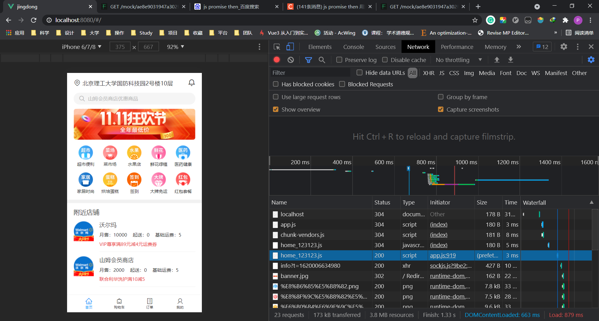

# VUE制作京东到家前端

<!-- @import "[TOC]" {cmd="toc" depthFrom=1 depthTo=6 orderedList=false} -->

<!-- code_chunk_output -->

- [VUE制作京东到家前端](#vue制作京东到家前端)
    - [项目设计](#项目设计)
    - [项目初始化](#项目初始化)
    - [基础样式](#基础样式)
      - [normalize.css](#normalizecss)
      - [设置 rem](#设置-rem)
    - [开发布局](#开发布局)
      - [BEM的CSS命名规则](#bem的css命名规则)
      - [iconfont](#iconfont)
      - [浏览器最小显示12px，所以用transform](#浏览器最小显示12px所以用transform)
      - [css优先级](#css优先级)
      - [防止网速慢造成抖动](#防止网速慢造成抖动)
    - [首页组件的合理拆分](#首页组件的合理拆分)
      - [拆分成多个组件](#拆分成多个组件)
      - [用v-for, v-html精简页面](#用v-for-v-html精简页面)
      - [使用scoped约束css作用域](#使用scoped约束css作用域)
      - [为什么要在组件里写name？Chrome的vue-devtools](#为什么要在组件里写namechrome的vue-devtools)
    - [路由守卫（登录了才跳转首页）](#路由守卫登录了才跳转首页)
      - [router的beforeEnter和beforeEach(to, from, next)](#router的beforeenter和beforeeachto-from-next)
      - [Chrome::Application::LocalStorage](#chromeapplicationlocalstorage)
    - [使用axios发送登录Mock请求](#使用axios发送登录mock请求)
      - [npm install axios --save](#npm-install-axios-save)
      - [在utils/request.js中封装](#在utilsrequestjs中封装)
      - [js中oc语法?.](#js中oc语法)
    - [setup与代码拆分逻辑性、可维护性性](#setup与代码拆分逻辑性-可维护性性)
      - [关于Toast的代码被分散在了Login.vue各处](#关于toast的代码被分散在了loginvue各处)
      - [setup的职责就是核心逻辑](#setup的职责就是核心逻辑)
    - [将下列路由改为动态路由](#将下列路由改为动态路由)
    - [路由参数的传递](#路由参数的传递)
    - [裂图的隐藏](#裂图的隐藏)
    - [watchEffect的妙用：监听变化自动发送请求](#watcheffect的妙用监听变化自动发送请求)
    - [购物车数据用VueX](#购物车数据用vuex)
      - [用LocalStorage做持久存储（切换页面不丢失）](#用localstorage做持久存储切换页面不丢失)
    - [路由包裹后，去掉下划线（修改a标签）](#路由包裹后去掉下划线修改a标签)
    - [代码上线](#代码上线)
    - [课程收获](#课程收获)
      - [让我前端工程入门](#让我前端工程入门)
      - [还需要巩固的知识](#还需要巩固的知识)
      - [前端的下一步学习计划](#前端的下一步学习计划)

<!-- /code_chunk_output -->

### 项目设计
所有的项目标注设计图，见
- [../../../courses/code-for-project/设计标注/设计标注/index.html](../../../courses/code-for-project/设计标注/设计标注/index.html)

### 项目初始化
```sh
vue create jingdong
```

```sh
Vue CLI v4.5.12
? Please pick a preset: Manually select features
? Check the features needed for your project:
 (*) Choose Vue version
 (*) Babel
 ( ) TypeScript
 ( ) Progressive Web App (PWA) Support
 (*) Router
 (*) Vuex
>(*) CSS Pre-processors
 (*) Linter / Formatter
 ( ) Unit Testing
 ( ) E2E Testing
```

```sh
Vue CLI v4.5.12
? Please pick a preset: Manually select features
? Check the features needed for your project: Choose Vue version, Babel, Rou
ter, Vuex, CSS Pre-processors, Linter
? Choose a version of Vue.js that you want to start the project with 3.x (Pr
eview)
? Use history mode for router? (Requires proper server setup for index fallb
ack in production) No
? Pick a CSS pre-processor (PostCSS, Autoprefixer and CSS Modules are suppor
ted by default): Sass/SCSS (with dart-sass)
? Pick a linter / formatter config: Standard
? Pick additional lint features: Lint on save
? Where do you prefer placing config for Babel, ESLint, etc.? In dedicated c
onfig files
? Save this as a preset for future projects? (y/N)
```

### 基础样式
#### normalize.css

```sh
npm install normalize.css --save
```

不同移动端浏览器，对于标签展示是不一致的，因此用 `normalize.css` 抹平不同浏览器中的差异。

在 `main.js` 中引入

```js
import 'normalize.css'
```

#### 设置 rem

在 `style/base.scss` 中设定 `html { font-size: 100px }` 。

```css
html {
    font-size: 100px;
}
```

这样我们就设定了基础的 `1 rem` 为 `100px` 。同样别忘了在 `main.js` 中引入。

### 开发布局

底部 `div.docker` ：
- 使用了 flex 布局
- 长宽大小都基于 `rem` 为单位的
- scss 中妙用 `&__item`
- 整理到一个 `index.scss` 中，在 `main.js` 中方便引入

底部之外，用 `div.wrapper` 包裹：
- 用 `overflow-y: auto` 搞定上下滚动

```css
@import './base.scss';
@import './iconfont.css';
```

#### BEM的CSS命名规则

[http://getbem.com/](http://getbem.com/)

```css
.block{}
.block__element{}
.block--modifier{}
```

#### iconfont
https://www.iconfont.cn/ 新建了一个项目。

#### 浏览器最小显示12px，所以用transform
```css
.docker__title {
  font-size: .2rem;
  transform: scale(.5, .5);
  transform-origin: center top;
}
```

#### css优先级
注意下面两个优先级不同：
```css
.position {
  padding: .16rem 0;
  line-height: .22rem;
  font-size: .16rem;
  &__icon {
    margin-right: .08rem;
    font-size: .2rem;
  }
}
/* 编译后是 .position__icon */

.position {
  padding: .16rem 0;
  line-height: .22rem;
  font-size: .16rem;
  .position__icon {
    margin-right: .08rem;
    font-size: .2rem;
  }
}
/* 编译后是 .position .position__icon */
```

后者优先级更高。

#### 防止网速慢造成抖动


如上，用 3G 网络，加载图片前后，图片元素会发生抖动（被图片挤到下面去）。

- 查看图片实际大小：388*1528
- 388 / 1528 约等于 25.4%

```css
.banner {
  height: 0;
  overflow: hidden;
  padding-bottom: 25.4%;
  &__img {
    width: 100%;
  }
}
```

### 首页组件的合理拆分
#### 拆分成多个组件
把首页拆成多个组件，让代码维护性变好。

在 view 中新建 `home` 文件夹，之下设立：
- Home.vue，把之前 App.vue 的东西放到 Home.vue 里
- 开始拆 Home.vue
  - StaticPart.vue
  - Nearby.vue
  - Docker.vue

拆分后的 Home 为：
```html
<template>
  <div class="wrapper">
    <StaticPart />
    <Nearby />
  </div>
  <Docker />
</template>
```

#### 用v-for, v-html精简页面
比如将 `docker__item` 精简到 `v-for` 中。

注意使用 `v-html` 方式 icon 字体被转义。

```html
<div class="iconfont" v-html="item.icon" />
```

#### 使用scoped约束css作用域
```html
<style lang="scss" scoped>
</style>
```

#### 为什么要在组件里写name？Chrome的vue-devtools
Vue.js devtools

Chrome and Firefox DevTools extension for debugging Vue.js applications.

### 路由守卫（登录了才跳转首页）
实现功能：
- 没登陆，跳转登陆页面
- 登陆了，从登陆页面跳到主页
- 登陆了，其他页面不受干扰

#### router的beforeEnter和beforeEach(to, from, next)

router/index.js

```js
import { createRouter, createWebHashHistory } from 'vue-router'
import Home from '../views/home/Home.vue'
import Login from '../views/login/Login.vue'

const routes = [
  {
    path: '/',
    name: 'Home',
    component: Home
  },
  {
    path: '/login',
    name: 'Login',
    component: Login,
    beforeEnters (to, from, next) {
      // console.log(to, from)
      // {fullPath: "/", hash: "", query: {…}, name: "Home", path: "/",…}
      // {fullPath: "/login", hash: "", query: {…}, name: "Login", path: "/login",…}
      // next()  // 调用 next 逻辑才会继续执行
      const isLogin = localStorage.isLogin
      if (isLogin) {
        next({ name: 'Home' })
      } else {
        next()
      }
    }
  }
  // {
  //   path: '/',
  //   name: 'Home',
  //   component: Home
  // },
  // {
  //   path: '/about',
  //   name: 'About',
  //   // route level code-splitting
  //   // this generates a separate chunk (about.[hash].js) for this route
  //   // which is lazy-loaded when the route is visited.
  //   component: () => import(/* webpackChunkName: "about" */ '../views/About.vue')
  // }
]

const router = createRouter({
  history: createWebHashHistory(),
  routes
})

router.beforeEach((to, from, next) => {
  // 在 Chrome 里的 Application 里看 local Storage
  const isLogin = localStorage.isLogin
  if (isLogin || to.name === 'Login') {
    next()
  } else {
    next({ name: 'Login' })
  }
  // console.log(to, from)
  next()
})

export default router
```

#### Chrome::Application::LocalStorage
操作缓存，看是否登录。


```html
<template>
  <div class="wrapper">
    
    <div class="wrapper__input">
      <input class="wrapper__input__content" placeholder="请输入手机号">
    </div>
    <div class="wrapper__input">
      <input class="wrapper__input__content" placeholder="请输入密码">
    </div>
    <div class="wrapper__login-button" @click="handleLogin">登录</div>
    <div class="wrapper__login-link">立即注册</div>
  </div>
</template>

<script>
import { useRouter } from 'vue-router'
export default {
  name: 'Login',
  setup () {
    const router = useRouter()
    const handleLogin = () => {
      localStorage.isLogin = true
      router.push({ name: 'Home' })
    }
    return { handleLogin }
  }
}
</script>
```

### 使用axios发送登录Mock请求

我们用 fastmock 模拟后端同学给我们提供的后端接口平台。

####  npm install axios --save

具体什么内容， json 键值对、用什么命令去看后端提供的文档。

```js
axios.defaults.headers.post['Content-Type'] = 'application/json'
```

如上，在 GitHub 上找到修改 Content-Type 方法

#### 在utils/request.js中封装
```js
import axios from 'axios'

export const post = (url, data = {}) => {
  return new Promise((resolve, reject) => {
    axios.post(url, data, {
      baseURL: 'https://www.fastmock.site/mock/ae8e9031947a302fed5f92425995aa19/jd',
      header: {
        'Content-Type': 'application/json'
      }
    }).then((response) => {
      resolve(response)
    }, err => {
      reject(err)
    })
  })
}
```

#### js中oc语法?.
```js
	   	 let res = obj?.data?.list
<=等价=> let res = obj && obj.data && obj.data.list
```

### setup与代码拆分逻辑性、可维护性性
- 第一步：以Login.vue为例，系统级别的import放在顶部
- 
#### 关于Toast的代码被分散在了Login.vue各处
```js
import { useRouter } from 'vue-router'
import { reactive } from 'vue'
import { post } from '../../utils/request'
import Toast from '../../components/Toast'

export default {
  name: 'Login',
  components: { Toast },
  setup () {
    const data = reactive({
      username: '',
      password: '',
      showToast: false,
      toastMessage: ''
    })
    const router = useRouter()

    const showToast = (message) => {
      data.showToast = true
      data.toastMessage = message
      setTimeout(() => {
        data.showToast = false
        data.toastMessage = message
      }, 2000)
    }

    const handleLogin = async () => {
      try {
        const result = await post('1/api/user/login', {
          username: data.username,
          pastword: data.password
        })
        // console.log(result)
        if (result?.data?.errno === 0) {
          localStorage.isLogin = true
          router.push({ name: 'Home' })
        } else {
          showToast('登录失败')
        }
      } catch (e) {
        showToast('请求失败')
      }
    //  .then(() => {
    //     localStorage.isLogin = true
    //     router.push({ name: 'Home' })
    //     alert('发送成功')
    //   }).catch(() => {
    //     alert('发送失败')
    //   })
    }
    const handleRegisterClick = () => {
      router.push({ name: 'Register' })
    }
    return { handleLogin, handleRegisterClick, data }
  }
}
```

可以改进为：
```js
import { useRouter } from 'vue-router'
import { reactive } from 'vue'
import { post } from '../../utils/request'
import Toast from '../../components/Toast'

const useToastEffect = () => {
  const toastData = reactive({
    showToast: false,
    toastMessage: ''
  })
  const showToast = (message) => {
    toastData.showToast = true
    toastData.toastMessage = message
    setTimeout(() => {
      toastData.showToast = false
      toastData.toastMessage = ''
    }, 2000)
  }
  return { toastData, showToast }
}

export default {
  name: 'Login',
  components: { Toast },
  setup () {
    const router = useRouter()
    const data = reactive({ username: '', password: '' })
    const { toastData, showToast } = useToastEffect()

    const handleLogin = async () => {
      try {
        const result = await post('1/api/user/login', {
          username: data.username,
          pastword: data.password
        })
        // console.log(result)
        if (result?.data?.errno === 0) {
          localStorage.isLogin = true
          router.push({ name: 'Home' })
        } else {
          showToast('登录失败')
        }
      } catch (e) {
        showToast('请求失败')
      }
    }
    const handleRegisterClick = () => {
      router.push({ name: 'Register' })
    }
    return { handleLogin, handleRegisterClick, data, toastData }
  }
}
```

其实上面这部分 `useToastEffect` ，可以放在 Toast.vue 里面去。

```js
import { reactive } from 'vue'

export default {
  props: ['message']
}
export const useToastEffect = () => {
  const toastData = reactive({
    showToast: false,
    toastMessage: ''
  })
  const showToast = (message) => {
    toastData.showToast = true
    toastData.toastMessage = message
    setTimeout(() => {
      toastData.showToast = false
      toastData.toastMessage = ''
    }, 2000)
  }
  return { toastData, showToast }
}
</script>

<style lang="scss" scoped>
.toast {
  position: fixed;
  left: 50%;
  top: 50%;
  transform: translate(-50%, -50%);
  padding: .1rem;
  background: rgba(0, 0, 0, .35);
  border-radius: .05rem;
  color: #fff;
}
```

此外，还可用把 data 用 `toRefs` 写得更简单。
```js
import { useRouter } from 'vue-router'
import { reactive, toRefs } from 'vue'
import { post } from '../../utils/request'
import Toast, { useToastEffect } from '../../components/Toast'

const useLoginEffect = (showToast) => {
  const router = useRouter()
  const data = reactive({ username: '', password: '' })
  const handleLogin = async () => {
    try {
      const result = await post('/api/user/login', {
        username: data.username,
        pastword: data.password
      })
      // console.log(result)
      if (result?.data?.errno === 0) {
        localStorage.isLogin = true
        router.push({ name: 'Home' })
      } else {
        showToast('登录失败')
        console.log('?')
      }
    } catch (e) {
      showToast('请求失败')
    }
  }

  const { username, password } = toRefs(data)
  return { username, password, handleLogin }
}

const useRegisterEffect = () => {
  const router = useRouter()
  const handleRegisterClick = () => {
    router.push({ name: 'Register' })
  }
  return { handleRegisterClick }
}

export default {
  name: 'Login',
  components: { Toast },
  setup () {
    const { show, toastMessage, showToast } = useToastEffect()
    const { username, password, handleLogin } = useLoginEffect(showToast)
    const { handleRegisterClick } = useRegisterEffect()

    return {
      username,
      password,
      show,
      toastMessage,
      handleLogin,
      handleRegisterClick
    }
  }
}
```

#### setup的职责就是核心逻辑
此外，老师还认为：Register和Login存在大量逻辑重复，实际项目中，可以放到一起写。

### 将下列路由改为动态路由
```js
import { createRouter, createWebHashHistory } from 'vue-router'
import Home from '../views/home/Home.vue'
import Shop from '../views/shop/Shop'
import Register from '../views/register/Register.vue'
import Login from '../views/login/Login.vue'

const routes = [
  {
    path: '/',
    name: 'Home',
    component: Home,
  }, {
    path: '/shop',
    name: 'Shop',
    component: Shop
  },
  {
    path: '/register',
    name: 'Register',
    component: Register,
    beforeEnter (to, from, next) {
      const { isLogin } = localStorage
      isLogin ? next({ name: 'Home' }) : next()
    }
  },
  {
    path: '/login',
    name: 'Login',
    component: Login,
    beforeEnter (to, from, next) {
      const { isLogin } = localStorage
      isLogin ? next({ name: 'Home' }) : next()
    }
  }
]

const router = createRouter({
  history: createWebHashHistory(),
  routes
})

router.beforeEach((to, from, next) => {
  const { isLogin } = localStorage
  const { name } = to
  const isLoginOrRegister = (name === 'Login' || name === 'Register');
  (isLogin || isLoginOrRegister) ? next() : next({ name: 'Login' })
})

export default router
```

防止路由加载没用的页面，可以改为如下逻辑：
```js
import { createRouter, createWebHashHistory } from 'vue-router'
import Register from '../views/register/Register.vue'
import Login from '../views/login/Login.vue'

const routes = [
  {
    path: '/',
    name: 'Home',
    component: () => import(/* webpackChunkName: "home_123123" */ '../views/home/Home')
  }, {
    path: '/shop',
    name: 'Shop',
    component: () => import(/* webpackChunkName: "shop_123123" */ '../views/shop/Shop')
  },
  {
    path: '/register',
    name: 'Register',
    component: () => import(/* webpackChunkName: "register" */ '../views/register/Register'),
    beforeEnter (to, from, next) {
      const { isLogin } = localStorage
      isLogin ? next({ name: 'Home' }) : next()
    }
  },
  {
    path: '/login',
    name: 'Login',
    component: () => import(/* webpackChunkName: "login" */ '../views/login/Login'),
    beforeEnter (to, from, next) {
      const { isLogin } = localStorage
      isLogin ? next({ name: 'Home' }) : next()
    }
  }
]

const router = createRouter({
  history: createWebHashHistory(),
  routes
})

router.beforeEach((to, from, next) => {
  const { isLogin } = localStorage
  const { name } = to
  const isLoginOrRegister = (name === 'Login' || name === 'Register');
  (isLogin || isLoginOrRegister) ? next() : next({ name: 'Login' })
})

export default router
```

如上：
- 去掉了开头的 import
- 组件 `() => import('...')`



如上，我们访问主页时，只加载了 `home_123123` 。

### 路由参数的传递
router/index.js 中我们定义了跳转的`id`：
```js
  }, {
    path: '/shop/:id',
    name: 'Shop',
    component: () => import(/* webpackChunkName: "shop" */ '../views/shop/Shop')
  },
```

view/home/Nearby.vue 中我们定义 `router-link` 的 `to` ：
```html
<template>
  <div class='nearby'>
    <h3 class='nearby__title'>附近店铺</h3>
    <router-link
      v-for="item in nearbyList"
      :key='item._id'
      :to="`/shop/${item._id}`"
    >
      <ShopInfo :item="item" />
    </router-link>
  </div>
</template>
```

其中 `${item._id}` 给路由的 `id` 赋了值。

view/shop/Shop.vue 中我们调用路由方法：
```js
// 获取当前商铺信息
const useShopInfoEffect = () => {
  const route = useRoute()
  const data = reactive({ item: {} })
  const getItemdata = async () => {
    const result = await get(`/api/shop/${route.params.id}`)
    if (result?.errno === 0 && result?.data) {
      data.item = result.data
    }
  }
  const { item } = toRefs(data)
  return { item, getItemdata }
}

// 点击回退逻辑
const useBackRouterEffect = () => {
  const router = useRouter()
  const handleBackClick = () => {
    router.back()
  }
  return { handleBackClick }
}
```

- router 是一个全局控制器
- route 是一个局部对象

### 裂图的隐藏

加载时，容易出现裂图，因此，我们在 `imgUrl` 获取之前，不显示组件。

```html
<ShopInfo :item="item" :hideBorder="true" v-show="item.imgUrl" />
```

### watchEffect的妙用：监听变化自动发送请求

我们希望在自动调用get请求相关的函数。

view/shop/Content.vue 中：
```js
// 和 Tab 切换相关的逻辑
const useTabEffect = () => {
  const currentTab = ref(categories[0].tab)
  const handleTabClick = (tab) => {
    currentTab.value = tab
  }
  return { currentTab, handleTabClick }
}

// 列表内容相关的逻辑
const useCurrentListEffect = (currentTab) => {
  const route = useRoute()
  const shopId = route.params.id
  const content = reactive({ list: [] })

  const getContentData = async () => {
    const result = await get(`/api/shop/${shopId}/products`, {
      tab: currentTab.value
    })
    if (result?.errno === 0 && result?.data?.length) {
      content.list = result.data
    }
  }

  watchEffect(() => { getContentData() })

  const { list } = toRefs(content)
  return { list }
}

export default {
  name: 'Content',
  setup () {
    const { currentTab, handleTabClick } = useTabEffect()
    const { list } = useCurrentListEffect(currentTab)

    return { list, categories, currentTab, handleTabClick }
  }
}
```

如上，`watchEffect(() => { getContentData() })`会检测到 `getContentData` 依赖 `currentTab` ，因此 `currentTab` 变化时，会调用 `watchEffect` 中的方法。

### 购物车数据用VueX

涉及到 `Cart.vue` ， `Content.vue` 以及 `store/index.js` 。

#### 用LocalStorage做持久存储（切换页面不丢失）
store/index.js

```js
import { createStore } from 'vuex'

const setLocalCartList = (state) => {
  const { cartList } = state
  const cartListString = JSON.stringify(cartList)
  localStorage.cartList = cartListString
}

const getLocalCartList = () => {
  // 这里应该写成文档：{ shopId: {shopName: '', productList: { productId: {} } } }
  return JSON.parse(localStorage.cartList) || {}
}

export default createStore({
  state: {
    cartList: getLocalCartList()
  },
  mutations: {
    changeCartItemInfo (state, payload) {
      ...
      setLocalCartList(state)
    },
    changeShopName (state, payload) {
      ...
      setLocalCartList(state)
    },
    changeCartItemChecked (state, payload) {
      ...
      setLocalCartList(state)
    },
    cleanCartProducts (state, payload) {
      ...
      setLocalCartList(state)
    },
    setCartItemsChecked (state, payload) {
      ...
      setLocalCartList(state)
    }
  },
})

```

### 路由包裹后，去掉下划线（修改a标签）

```html
      <div class="check__btn">
        <router-link :to="{name: 'Home'}">
          去结算
        </router-link>
      </div>
```

如上，“去结算”将有下划线并且变为蓝色。如何修改？

```css
  &__btn {
    width: 0.98rem;
    line-height: 0.49rem;
    background-color: #4fb0f9;
    text-align: center;
    color: $bgColor;
    font-size: 0.14rem;
    a {
      color: $bgColor;
      text-decoration: none;
    }
  }
```

如上，修改 `a` 的 `text-decoration` 和 `color` 。

### 代码上线
- 创建 vue.config.js （容易出问题，要注意）

```js
module.exports = {
  publicPath: './jingdong'
}  // 这是 CommonJS 的写法

export const publicPath = './jingdong' // 这是 es6 的写法
```
如上，如果你把你的项目发布在 `xxx.com/jingdong` 则当然要 `publicPath = ./jingdong` ，此时你的依赖文件会被打包成 `*/jingdong/css/home.bba65666.css` 。

具体可以查看 `index.html` 的网页源代码。

之后的步骤：
- `num run build` 打包代码
- 把代码给后端
- 后端把前端代码放入后端的工程
- 后端重启后端服务

### 课程收获
#### 让我前端工程入门

如何从 0 构建一个项目？html、css、逻辑开发，提升尤为明显的是 css （包括BEM等）。

#### 还需要巩固的知识
- css 技巧与规范
- 计算机网络结合 js 异步
- js 核心，如代理 Proxy 等

#### 前端的下一步学习计划
- 自己开一个项目，挂在 gitee 静态页面上
- 再学一个项目
- ts
- react
- 适当阅读源码
