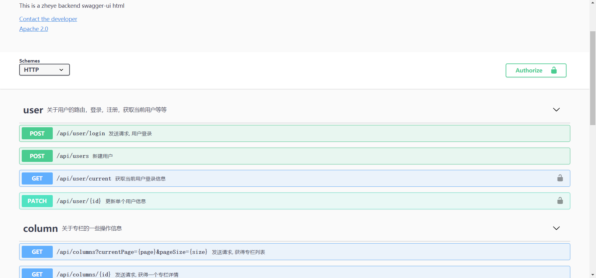

# VUE3 + ts 的（知乎）者也

<!-- @import "[TOC]" {cmd="toc" depthFrom=3 depthTo=6 orderedList=false} -->

<!-- code_chunk_output -->

- [项目资源](#项目资源)
- [项目初始化](#项目初始化)
  - [安装bootstrap](#安装bootstrap)
- [想要给构造函数Array断言类型（使用vue的PropType）](#想要给构造函数array断言类型使用vue的proptype)
- [让vetur自动补全<template>](#让vetur自动补全template)
  - [parser: "vue-eslint-parser"](#parser-vue-eslint-parser)
- [渐进式设计dropdown](#渐进式设计dropdown)
  - [保证 html 语义化](#保证-html-语义化)
  - [点击外部元素表单关闭](#点击外部元素表单关闭)
  - [抽取逻辑到hooks](#抽取逻辑到hooks)
- [设计validate-input](#设计validate-input)
  - [vue3的v-model是一个breaking change](#vue3的v-model是一个breaking-change)
  - [使用 $attrs 支持默认属性](#使用-attrs-支持默认属性)
- [表单中的父子组件通讯（mitt）](#表单中的父子组件通讯mitt)
  - [不要忘了在onUnmounted时off掉响应](#不要忘了在onunmounted时off掉响应)
  - [把every替换成map防止验证提前退出](#把every替换成map防止验证提前退出)
- [初步使用vue-router](#初步使用vue-router)
  - [SPA（Single Page Application）](#spasingle-page-application)
  - [安装vue-router并且插到项目中](#安装vue-router并且插到项目中)
  - [url结构与为路由添加参数（`<pre>`可以代替`console.log`）](#url结构与为路由添加参数pre可以代替consolelog)
  - [添加路由守卫：使用元信息完成权限管理](#添加路由守卫使用元信息完成权限管理)
- [初步使用vuex](#初步使用vuex)
  - [安装状态管理工具vuex](#安装状态管理工具vuex)
  - [简单的状态管理示例](#简单的状态管理示例)
  - [钩子函数（一般配合计算属性）与小知识（`...`对象展开运算符）](#钩子函数一般配合计算属性与小知识对象展开运算符)
  - [vuex的'计算属性'getter](#vuex的计算属性getter)
- [把项目整理了，很棘手的问题exports is not defined](#把项目整理了很棘手的问题exports-is-not-defined)
- [接入后端](#接入后端)
  - [RESTful API](#restful-api)
  - [使用 swagger 在线文档查看接口详情](#使用-swagger-在线文档查看接口详情)
  - [使用axios拦截器interceptors添加loading效果](#使用axios拦截器interceptors添加loading效果)
- [实现登录](#实现登录)
  - [JWT的运行机制](#jwt的运行机制)
  - [持久化登录状态](#持久化登录状态)
- [store中全局错误机制](#store中全局错误机制)
  - [axios.interceptors和Promise.reject](#axiosinterceptors和promisereject)
  - [把Message组件改进为函数调用形式](#把message组件改进为函数调用形式)

<!-- /code_chunk_output -->

### 项目资源
* **项目演示站点：[http://zhihu.vikingship.xyz/](http://zhihu.vikingship.xyz/)**
* 在线后端API 查询和使用站点：[http://api.vikingship.xyz/](http://api.vikingship.xyz/)
* 项目在线文档：[http://docs.vikingship.xyz/](http://docs.vikingship.xyz/)
* 完成的组件库展示：[http://showcase.vikingship.xyz/](http://showcase.vikingship.xyz/)
* 流程图和原型图
* 购买后直接可以接入使用的真实后端API
* **如果您想学习本课程，请支持正版，谢谢！ [https://coding.imooc.com/class/449.html](https://coding.imooc.com/class/449.html)**

### 项目初始化

版本：
```bash
$node --version
v14.17.0
$vue --version
@vue/cli 4.5.12
```

创建：
```bash
$vue create zheye

? Please pick a preset: Manually select features
? Check the features needed for your project: Choose Vue version, Babel, TS, Linter
? Choose a version of Vue.js that you want to start the project with 3.x (Preview)
? Use class-style component syntax? No
? Use Babel alongside TypeScript (required for modern mode, auto-detected polyfills, transpiling JSX)? No
? Pick a linter / formatter config: Standard
? Pick additional lint features: Lint on save
? Where do you prefer placing config for Babel, ESLint, etc.? In dedicated config files
? Save this as a preset for future projects? No
```

#### 安装bootstrap

```bash
$npm install bootstrap@next --save
```

### 想要给构造函数Array断言类型（使用vue的PropType）

```ts
import { defineComponent, PropType } from 'vue'

export interface ColumnProps {
  id: number;
  title: string;
  avatar: string;
  descrption: string;
}

export default defineComponent({
  name: 'ColumnList',
  props: {
    list: {
      type: Array as ColumnProps[],  // 不行，Array是构造函数
      type: Array as PropType<ColumnProps[]>,  // 这个
      requried: true
    }
  }
})
```

### 让vetur自动补全<template>
在 `settings.json` 中：
```
"vetur.experimental.templateInterpolationService": true
```

#### parser: "vue-eslint-parser"
此外，加入 `parser: "vue-eslint-parser"` 在 `.eslintrc.js` 中。

否者会报一些很低级的语法错误（实际上没有错误）。

### 渐进式设计dropdown

第一个版本的 `dropdown` ：
```html
<template>
<div class="dropdown">
  <a href="#" class="btn btn-outline-light my-2 dropdown-toggle" @click.prevent="toggleOpen">
    {{title}}
  </a>
  <ul class="dropdown-menu" :style="{display: 'block'}" v-if="isOpen">
    <li class="dropdown-item">
      <a href="#">新建文章</a>
    </li>
    <li class="dropdown-item">
      <a href="#">编辑资料</a>
    </li>
  </ul>
</div>
</template>

<script lang="ts">
import { defineComponent, ref } from 'vue'
export default defineComponent({
  name: 'Dropdown',
  props: {
    title: {
      type: String,
      required: true
    }
  },
  setup () {
    const isOpen = ref(false)
    const toggleOpen = () => {
      isOpen.value = !isOpen.value
    }
    return {
      isOpen,
      toggleOpen
    }
  }
})
</script>
```

问题：
- 点击其他区域，菜单栏不自动取消
- 点击文章后，除了跳转，没法添加其他行为

**没有关系，我们先实现基础的，之后再改进。**

#### 保证 html 语义化

方案一：
```html
const dropdownItems = [
  {'text': 'option one'},
  {'text': 'option two'}
]
<dropdown :title="" :items="dropdownItems" />
```

方案二：
```html
<dropdown :title="">
  <dropdown-item>
    option one
  </dropdown-item>
  <dropdown-item>
    option two
  </dropdown-item>
</dropdown>
```

如上，更推荐使用方案二，因为方案二更加语义化。

所以新建组件 `dropdown-item` ：
```html
<template>
  <li
    class="dropdown-option"
    :class="{'is-disabled': disabled}"
  >
    <slot></slot>
  </li>
</template>

<script lang="ts">
import { defineComponent } from 'vue'
export default defineComponent({
  props: {
    disabled: {
      type: Boolean,
      default: false
    }
  }
})
</script>

<style>
.dropdown-option.is-disabled * {
  color: #6c757d;
  pointer-events: none;
  background-color: transparent;
}
</style>
```

第二个版本的 `dropdown` ：
```html
<template>
<div class="dropdown">
  <a href="#" class="btn btn-outline-light my-2 dropdown-toggle" @click.prevent="toggleOpen">
    {{title}}
  </a>
  <ul class="dropdown-menu" :style="{display: 'block'}" v-if="isOpen">
    <slot></slot>
  </ul>
</div>
</template>

<script lang="ts">
import { defineComponent, ref } from 'vue'
export default defineComponent({
  name: 'Dropdown',
  props: {
    title: {
      type: String,
      required: true
    }
  },
  setup () {
    const isOpen = ref(false)
    const toggleOpen = () => {
      isOpen.value = !isOpen.value
    }
    return {
      isOpen,
      toggleOpen
    }
  }
})
</script>
```

#### 点击外部元素表单关闭
要完成的任务：
- 在 `mounted` 时添加 `click` 事件，在 `unmounted` 的时候将事件删除
- 拿到 `Dropdown` 的 DOM 元素从而判断，点击的内容是否被这个元素包含

为什么要删除？
> 老师的回答：同学你好 因为事件监听器在监听的同时，需要在合适的时机删除，要不它会一直存在，影响之后网页的运行。对于一个组件来说，在组件卸载的时候将事件监听删除是常规做法。

在 `const dropdownRef = ref<null | HTMLElement>(null)` 后，在 `setup` 中返回出去，在模板中 `ref="dropdownRef"`，则 vue 自动把 `dropdownRef` 绑定到 DOM 上。

第三个版本的 `dropdown` ：
```html
<template>
<div class="dropdown" ref="dropdownRef">
  <a href="#" class="btn btn-outline-light my-2 dropdown-toggle" @click.prevent="toggleOpen">
    {{title}}
  </a>
  <ul class="dropdown-menu" :style="{display: 'block'}" v-if="isOpen">
    <slot></slot>
  </ul>
</div>
</template>

<script lang="ts">
import { defineComponent, ref, onMounted, onUnmounted } from 'vue'
export default defineComponent({
  name: 'Dropdown',
  props: {
    title: {
      type: String,
      required: true
    }
  },
  setup () {
    const isOpen = ref(false)
    const dropdownRef = ref<null | HTMLElement>(null)
    const toggleOpen = () => {
      isOpen.value = !isOpen.value
    }
    const handler = (e: MouseEvent) => {
      if (dropdownRef.value) {
        if (!dropdownRef.value.contains(e.target as HTMLElement) && isOpen.value) {
          isOpen.value = false
        }
      }
    }
    onMounted(() => {
      document.addEventListener('click', handler)
    })
    onUnmounted(() => {
      document.removeEventListener('click', handler)
    })
    return {
      isOpen,
      toggleOpen,
      dropdownRef
    }
  }
})
</script>
```

如上，我们其实没有用到元素本身的特性。我们可以把逻辑抽取出来。

#### 抽取逻辑到hooks
在 `scr/hook` 中新建 `useClickOutside.ts` ：
```ts
import { ref, onMounted, onUnmounted, Ref } from 'vue'

const useClickOutside = (elementRef: Ref<null | HTMLElement>) => {
  const isClickOutside = ref(false)
  const handler = (e: MouseEvent) => {
    if (elementRef.value) {
      if (elementRef.value?.contains(e.target as HTMLElement)) {
        isClickOutside.value = false
      } else {
        isClickOutside.value = true
      }
    }
  }
  onMounted(() => {
    document.addEventListener('click', handler)
  })
  onUnmounted(() => {
    document.removeEventListener('click', handler)
  })
  return isClickOutside
}

export default useClickOutside
```

于是第四个版本的 `dropdown` ：
```html
<template>
<div class="dropdown" ref="dropdownRef">
  <a href="#" class="btn btn-outline-light my-2 dropdown-toggle" @click.prevent="toggleOpen">
    {{title}}
  </a>
  <ul class="dropdown-menu" :style="{display: 'block'}" v-if="isOpen">
    <slot></slot>
  </ul>
</div>
</template>

<script lang="ts">
import { defineComponent, ref, watch } from 'vue'
import useClickOutside from '../hooks/useClickOutside'
export default defineComponent({
  name: 'Dropdown',
  props: {
    title: {
      type: String,
      required: true
    }
  },
  setup () {
    const isOpen = ref(false)
    const dropdownRef = ref<null | HTMLElement>(null)
    const toggleOpen = () => {
      isOpen.value = !isOpen.value
    }

    const isClickOutside = useClickOutside(dropdownRef)
    watch(isClickOutside, () => {
      if (isOpen.value && isClickOutside.value) {
        isOpen.value = false
      }
    })
    return {
      isOpen,
      toggleOpen,
      dropdownRef
    }
  }
})
</script>
```

### 设计validate-input

```ts
<validate-input :rules="" />

interface RuleProp {
  type: 'required' | 'email' | 'range' | ... ;
  message: string;
}

export type RulesProp = RuleProp[]
```

如上，我们可以设计一个可扩展的、可选类型的验证输入。

#### vue3的v-model是一个breaking change

https://v3.vuejs.org/guide/migration/v-model.html#migration-strategy

#### 使用 $attrs 支持默认属性

参考[./0204Non-Props属性.md](./0204Non-Props属性.md)。

### 表单中的父子组件通讯（mitt）

用`mitt`取代被废弃的`this.$on`。
```bash
npm install --save mitt
```

希望父组件 `ValidateForm` 有 `@click="submitForm"` ，此时希望自动验证子组件 `ValidateForm` 中的规则，对子组件中的数据校验。

逻辑是这样的：
- 父组件中创建监听实例 `export const emitter = mitt()` ，并且在 `onMounted` 时就监听 `form-item-created` 事件，将监听得到的对象传给函数 `callback(监听得到的对象)` 并执行： `emitter.on('form-item-created', callback)`
- `callback` 中，把传进来的对象（或者说验证函数）保存在 `funcArr: ValidateFunc[]` 里面，等待提交表单时逐个验证
- 父组件中，如果点击提交 `@click.prevent="submitForm"` ，在 `submitForm` 中，进行表单验证，就是把 `funcArr` 里面保存的验证函数都运行一遍；此外，还将触发自己的父组件事件 `form-submit` ，并将验证结果传递： `context.emit('form-submit', result)` ，以实现其他逻辑
- 子组件中引入监听实例，并且 `import { emitter } from './ValidateForm.vue'` ，将对象（是一个函数）传递给事件 `form-item-created` ： `emitter.emit('form-item-created', validateInput)`
- 而这个 `validateInput` 实际上并非一个纯逻辑，其带有自己的数据的，注意到函数的定义中有 `props.rules` ，实际上，不同的子组件 `ValidateInput.vue` 带有的 `props.rules` 是不同的，因此 `validateInput` 对于每个组件实例是不同的

ValidateForm.vue
```ts
import { defineComponent, onUnmounted } from 'vue'
import mitt from 'mitt'
type ValidateFunc = () => boolean
export const emitter = mitt()
export default defineComponent({
  emits: ['form-submit'],
  setup (props, context) {
    let funcArr: ValidateFunc[] = []
    const submitForm = () => {
      const result = funcArr.map(func => func()).every(result => result)
      context.emit('form-submit', result)
    }
    const callback = (func?: ValidateFunc) => {
      if (func) {
        funcArr.push(func)
      }
    }
    emitter.on('form-item-created', callback)
    onUnmounted(() => {
      emitter.off('form-item-created', callback)
      funcArr = []
    })
    return {
      submitForm
    }
  }
})
```

ValidateInput.vue
```ts
import { emitter } from './ValidateForm.vue'
...
export default defineComponent({
  props: {
    rules: Array as PropType<RulesProp> ...
  },
  setup (props, context) {
    ...
    const validateInput = () => {
      if (props.rules) {
        const allPassed = props.rules.every(rule => {
          ...
          return passed
        })
        inputRef.error = !allPassed
      }
    }

    onMounted(() => {
      emitter.emit('form-item-created', validateInput)
    })

    return {
      validateInput,
      ...
    }
  }
})
```

App.vue
```html
<template>
  <validate-form @form-submit="onFormSubmit">
      <validate-input></validate-input>
      <validate-input></validate-input>
  </validate-form>
</template>

<script lang="ts">
...
export default defineComponent({
  name: 'App',
  components: {
    ValidateInput,
    ValidateForm
  },
  setup () {
    ...

    const onFormSubmit = () => {
      console.log(emailVal.value)
      console.log(passwordVal.value)
    }

    return {
      onFormSubmit,
      ...
    }
  }
})
</script>
```

#### 不要忘了在onUnmounted时off掉响应

别忘了，我们要在 `onUnmounted()` 阶段清理掉响应。

```ts
setup(props, context) {
  emitter.on('form-item-created', callback)
  onUnmounted(() => {
    emitter.off('form-item-created', callback)
  })
}
```

#### 把every替换成map防止验证提前退出

```ts
const result = funcArr.every(func => func())
// 如果有一个 func() 返回 false ，之后的逻辑就不执行
// 因此改为 map ，因为这样才与产品需求相符合
const result = funcArr.map(func => func()).every(result => result)
```
### 初步使用vue-router

#### SPA（Single Page Application）

[百度百科：SPA （单页富应用程序）](https://baike.baidu.com/item/SPA/17536313?fr=aladdin)

详细内容可以参考[MDN的History API](https://developer.mozilla.org/zh-CN/docs/Web/API/History_API)

```js
const handleChange = (url, content) => {
  // go to url
  window.history.pushState(null, "hello, there", url);

  // new data
  document.getElementById("app").innerHTML = `
    <h1>${content}</h1>
  `;
};

document.getElementById("change").addEventListener("click", (e) => {
  e.preventDefault();
  handleChange("create.html", "create");
});
```

如上，我们通过 `window.history` 相关接口，实现了单页面应用。不重现跳转到其他页面，而是动态变换 URL 和 一些内容。

实现上述 SPA 的工具，就是 `router` 。

#### 安装vue-router并且插到项目中

```bash
npm install vue-router --save
```

注意这里我们使用 4.0.0 以上的版本。

在 `main.ts` 中：
```ts
import router from './router'

const app = createApp(App)
app.use(router)
app.mount('#app')
```

在 `router.ts` 中：
```ts
import { createRouter, createWebHistory } from 'vue-router'
const routerHistory = createWebHistory()
const router = createRouter({
  history: routerHistory,  // 决定了哪种路由
  routes: [
    {},
  ]
```

路由有两种：
- `url`哈希方式：比如`url#login`唯一的优点就是支持旧版浏览器，适配`h5`以下版本
- `history`方式：这里我们选择这种方式

#### url结构与为路由添加参数（`<pre>`可以代替`console.log`）

在 `node` 官网可以查看 [url结构](https://nodejs.org/api/url.html) ：
```
┌────────────────────────────────────────────────────────────────────────────────────────────────┐
│                                              href                                              │
├──────────┬──┬─────────────────────┬────────────────────────┬───────────────────────────┬───────┤
│ protocol │  │        auth         │          host          │           path            │ hash  │
│          │  │                     ├─────────────────┬──────┼──────────┬────────────────┤       │
│          │  │                     │    hostname     │ port │ pathname │     search     │       │
│          │  │                     │                 │      │          ├─┬──────────────┤       │
│          │  │                     │                 │      │          │ │    query     │       │
"  https:   //    user   :   pass   @ sub.example.com : 8080   /p/a/t/h  ?  query=string   #hash "
│          │  │          │          │    hostname     │ port │          │                │       │
│          │  │          │          ├─────────────────┴──────┤          │                │       │
│ protocol │  │ username │ password │          host          │          │                │       │
├──────────┴──┼──────────┴──────────┼────────────────────────┤          │                │       │
│   origin    │                     │         origin         │ pathname │     search     │ hash  │
├─────────────┴─────────────────────┴────────────────────────┴──────────┴────────────────┴───────┤
│                                              href                                              │
└────────────────────────────────────────────────────────────────────────────────────────────────┘
(All spaces in the "" line should be ignored. They are purely for formatting.)
```

有个小知识点：`<pre>`可以代替`console.log`。打印在页面上。

```ts
import { useRoute, useRouter } from 'vue-router'

// useRoute() 实例保存者路由信息
// 包括跳转到的页面 name ，动态路由的 id 等等
const route = useRoute()

// useRouter
// router.push 和 router-link 的 to 是一个作用
const router = useRouter()
router.push({name: 'colunm', params: {id: 1}})
```

#### 添加路由守卫：使用元信息完成权限管理

```ts
const routerHistory = createWebHistory()
const router = createRouter({
  history: routerHistory,
  routes: [
    {
      path: '/login',
      name: 'login',
      component: Login,
      meta: { redirectAlreadyLogin: true }
    },
    {
      path: '/create',
      name: 'create',
      component: CreatePost,
      meta: { requiredLogin: true }
    }
  ]
})

router.beforeEach((to, from, next) => {
  if (to.meta.requiredLogin && !store.state.user.isLogin) {
    next({ name: 'login' })
  } else if (to.meta.redirectAlreadyLogin && store.state.user.isLogin) {
    next('/')
  } else {
    next()
  }
})
```

### 初步使用vuex

#### 安装状态管理工具vuex

```bash
npm install vuex@next --save
```

注意这里我们使用 4.0.0 以上的版本。

```json
"dependencies": {
  "bootstrap": "^5.0.0-beta3",
  "mitt": "^2.1.0",
  "vue": "^3.0.0",
  "vue-router": "^4.0.0",
  "vuex": "^4.0.2"
}
```

vuex：
- 状态存储是响应式的
- 不能直接改变 store 中的状态，唯一途径就是显示地提交（commit）mutation

Dan Abramov, creator of Redux: Flux 架构就像眼睛：您自会知道什么时候需要它。

#### 简单的状态管理示例

```ts
import { createStore } from 'vuex'

const store = createStore({
  state: {
    count: 0
  },
  mutations: {
    add (state) {
      state.count ++
    }
  }
})
console.log('store', store.state.count)
store.commit('add')
console.log('store', store.state.count)
```

#### 钩子函数（一般配合计算属性）与小知识（`...`对象展开运算符）

因为vuex是响应式的，一般使用计算属性封装一下。

```ts
import { useStore } from 'vuex'

const store = useStore<GlobalDataProps>()
const list = computed(() => store.state.columns)
```

以下妙用了`...`对象展开运算符（解包）：
```ts
const store = createStore<GlobalDataProps>({
  state: {
    user: { isLogin: false }
  },
  mutation: {
    login(state) {
      state.user = { ...state.user, isLogin: true, name: 'viking' }
    }
  }
})
```

#### vuex的'计算属性'getter

在 store.ts 中：
```ts
const store = createStore<GlobalDataProps>({
  getters: {
    biggerColumnsLen(state) {
      return state.columns.filter(c => c.id > 2).length
    },
    getColumnById: (state) => (id: number) => {
      return state.columns.find(c => c.id === id)
    }
    getPostsByCid: (state) => (cid: number) => {
      return state.posts.filter(post => post.columnId === cid)
    }
  }
})
```

使用：
```ts
const biggerColumnLen = computed(() => store.getters.biggerColumnsLen)
const column = computed(() => store.getters.getColumnById(currentId))
const list = computed(() => store.getters.getPostsByCid(currentId))
```

### 把项目整理了，很棘手的问题exports is not defined

可以编译成功，但是浏览器空白，报错：
```
Uncaught ReferenceError: exports is not defined
```

怀疑是 babel 的问题，把 `babel.config.js` 复制到 src 下也不好用。应该是还没安装 babel 。

### 接入后端

过去前后端不分离时，前端的工作大多比较简单，前端被称为“切图仔”或“页面崽”。

而现在，SPA尤其适合前后端分离。

#### RESTful API

```
// endpoints
htts://api.example.com/teams

// verbs
GET /teams: 列出所有球队
POST /teams: 新建一个球队
GET /teams/ID: 获取某个球队的信息
PUT /teams/ID: 更新某个球队的信息（需要提供球队全部信息）
PATCH /teams/ID: 更新某个球队的信息（需要提供球队部分信息）
```

#### 使用 swagger 在线文档查看接口详情


如上，如果维护文档，则很烦。

因此使用 swagger 的方式。本课程的 swagger 平台在 [http://api.vikingship.xyz/public/swagger/index.html](http://api.vikingship.xyz/public/swagger/index.html) 。



> 同学你好欧 后端是 egg.js 写的，swagger 是插件集成上去的，其实 swagger 就是一个配置文件而已，可以适用各种后端系统，它配置文件的格式称之为 OpenAPI， 你想了解更多的话 看文档会非常舒服：https://editor.swagger.io/

#### 使用axios拦截器interceptors添加loading效果

```ts
axios.interceptors.request.use(config => {
  store.commit('setLoading', true)
  store.commit('setError', { status: false, message: '' })
  // get 请求，添加到 url 中
  config.params = { ...config.params, icode: '34708A3A36A53FC5' }
  // 其他请求，添加到 body 中
  // 如果是上传文件，添加到 FormData 中
  if (config.data instanceof FormData) {
    config.data.append('icode', '34708A3A36A53FC5')
  } else {
    // 普通的 body 对象，添加到 data 中
    config.data = { ...config.data, icode: '34708A3A36A53FC5' }
  }
  return config
})

axios.interceptors.response.use(config => {
  setTimeout(() => {
    store.commit('setLoading', false)
  }, 1000)
  return config
}, e => {
  const { error } = e.response.data
  store.commit('setError', { status: true, message: error })
  store.commit('setLoading', false)
  return Promise.reject(e.response.data)
})
```

### 实现登录

#### JWT的运行机制


如上，使用 cookie + session 形式，需要在服务器端也保存相应的验证信息，如果服务器是个集群，则需要额外的技术。


如上，使用 json web token ，只需要在客户端保存服务器给予的 token 即可。


`token`由三部分组成：头、数据和签名，可以在 [https://jwt.io/](https://jwt.io/) 查看。

#### 持久化登录状态

有三种解决方案：
- cookie 不支持跨域，不考虑
- localStorage 存在本地
- sessionStorage 会话结束后，就消失

### store中全局错误机制

#### axios.interceptors和Promise.reject

同样，使用 `axois` 拦截器 `interceptors` 。

在 `main.ts` 中：
```ts
axios.interceptors.response.use(config => {
  setTimeout(() => {
    store.commit('setLoading', false)
  }, 1000)
  return config
}, e => {
  const { error } = e.response.data
  store.commit('setError', { status: true, message: error })
  store.commit('setLoading', false)
  return Promise.reject(e.response.data)  // 这里的 e.response.data 会交给 catch
})
```

#### 把Message组件改进为函数调用形式

如何用函数的形式创建组件？

在 `createMessage.ts` 中，使用了 `createApp` 思想。别忘了 `unmount()` 后还需要 `document.body.removeChild` 。

```ts
import { createApp } from 'vue'
import Message from './Message.vue'
export type MessageType = 'success' | 'error' | 'default'

const createMessage = (message: string, type: MessageType, timeout = 2000) => {
  const messageInstance = createApp(Message, {
    message,
    type
  })
  const mountNode = document.createElement('div')
  document.body.appendChild(mountNode)
  messageInstance.mount(mountNode)
  setTimeout(() => {
    messageInstance.unmount()
    document.body.removeChild(mountNode)
  }, timeout)
}

export default createMessage
```

