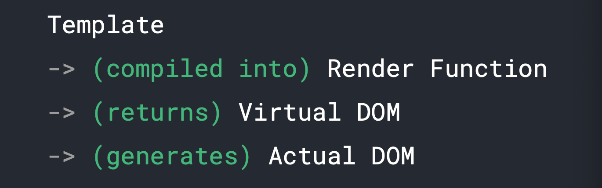
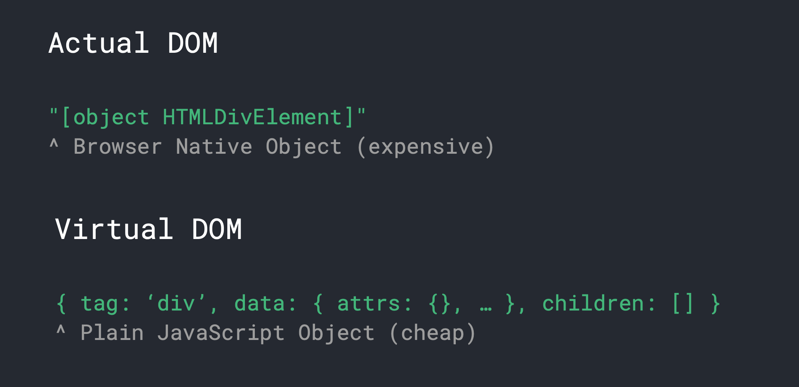
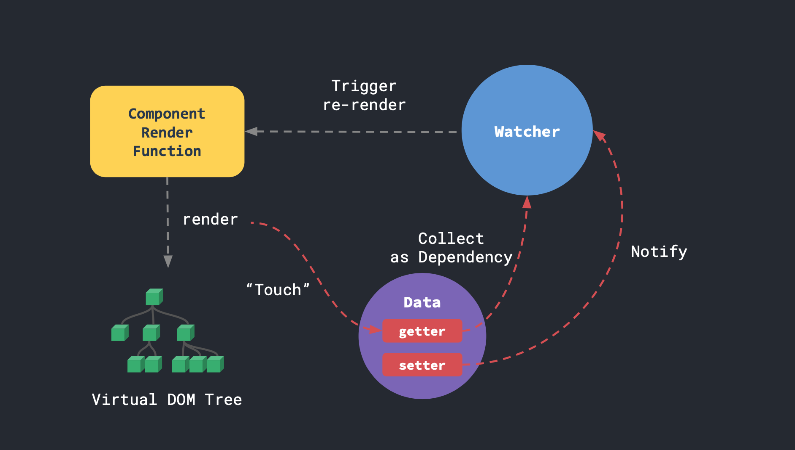
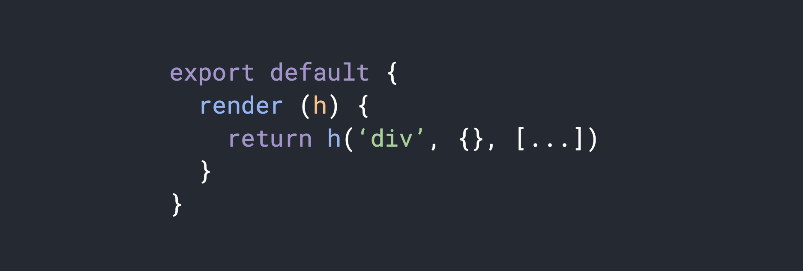
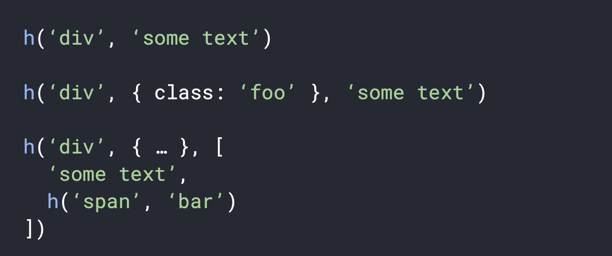
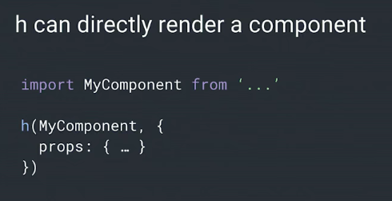
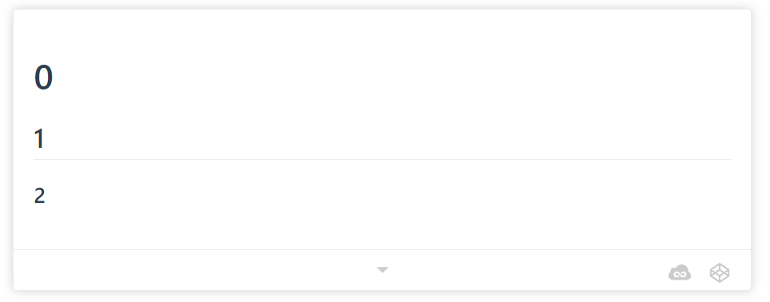
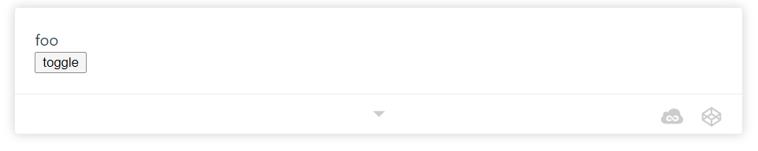

# 响应性

> 本文引用、修改自[https://vue-course-doc.vercel.app/](https://vue-course-doc.vercel.app/)

<!-- @import "[TOC]" {cmd="toc" depthFrom=3 depthTo=6 orderedList=false} -->

<!-- code_chunk_output -->

- [虚拟DOM](#虚拟dom)
- [Vue的V-DOM学习资源：template-explorer](#vue的v-dom学习资源template-explorer)
- [整合渲染函数和响应系统](#整合渲染函数和响应系统)
- [template和jsx对比](#template和jsx对比)
- [Render Function API](#render-function-api)
- [动态渲染标签](#动态渲染标签)
- [动态渲染组件](#动态渲染组件)
- [函数组件](#函数组件)
- [高阶函数 higher-order component](#高阶函数-higher-order-component)

<!-- /code_chunk_output -->



**Vue编译第一阶段：**

在 Vue 中，渲染系统是组成响应系统的另外一半， Vue 的`templates`实际上是通过渲染函数渲染出来的，如果你把模版直接传入 Vue 实例那 Vue 会执行完整的编译，把传入的`template`编译为浏览器可运行的 DOM 。

如果使用 Vue CLI 构建项目，会用到 webpack 和 vue-loader ，实际上 vue-loader 会在构建阶段实现预编译，把模版代码编译为浏览器可直接解析的DOM代码。另外， Vue 还提供了用于编译的渲染函数，它类似 angular 的 ALT 编译模式，那应用就可以运行未编译版本。

两种编译模式，一种会把编译器打包进去，一个直接把代码预先编译，包含编译器版本经过 gzip 压缩大概 30KB ，不包含编译器版本大概 20KB ，所以预先编译会更好。

**Vue编译第二阶段：**

经过第一阶段编译为 render 函数后， render 函数实际上是返回虚拟 DOM ，接着 Vue 基于虚拟 DOM 生成真实 DOM 。

**虚拟 DOM 更新机制：**

回顾之前讲的 autorun 函数，其实我们可以把生成虚拟 DOM 的代码放在 autorun 函数里面，因为渲染函数与所有 data 属性有依赖关系，当属性发生变化那就触发 autorun 函数然后重新生成新的虚拟 DOM ，新的虚拟 DOM 和旧的虚拟 DOM 进行比较，更新差异的节点再生成真实 DOM 完成视图更新。

### 虚拟DOM



**真实DOM：** 大家都知道 DOM API ，例如调用`documnt.createElement`创建一个真实`div`节点插入到 DOM 文档流中，这个原生 API 实际上是通过使用 C++ 编写的浏览器引擎实现的，我们不需要了解 C++ 是如何实现的，只需要调用`javascript api`就可以创建真实 DOM 。你可以通过在浏览器打印 DOM 节点，会发现它包含很多属性。

**虚拟DOM：** 在 Vue 中的虚拟 DOM 会在每个实例通过 `this.$createElement` 返回一个虚拟节点，这个虚拟节点也表示一个 div 但他是一个纯 javascript 对象，他和真实 DOM 差异是非常大的。看到上图虚拟 DOM 它除了包含当前节点名字和属性，还有 children 表示节点的子元素，这就构成了一个虚拟 DOM 树。

虚拟 DOM 和真实 DOM 的差异：

**1、 资源消耗问题**

使用 javascript 操作真实 DOM 是非常消耗资源的，虽然很多浏览器做了优化但是效果不大。虚拟 DOM 是一个纯 javascript 对象。假设你有 1000 个节点，那会相应创建 1000 个节点，那也是非常节省资源的，但是如果创建 1000 个 DOM 节点就不同了。

**2、执行效率问题**

如果你要修改一个真实 DOM ，一般调用 `innerHTML` 方法，那浏览器会把旧的节点移除再添加新的节点，但是在虚拟 DOM 中，只需要修改一个对象的属性，再把虚拟 DOM 渲染到真实 DOM 上。很多人会误解虚拟 DOM 比真实 DOM 速度快，其实虚拟 DOM 只是把 DOM 变更的逻辑提取出来，使用 javascript 计算差异，减少了操作真实 DOM 的次数，只在最后一次才操作真实 DOM ，所以如果你的应用有复杂的 DOM 变更操作，虚拟 DOM 会比较快。

**3、虚拟DOM还有其他好处**

其实虚拟 DOM 还可以应用在其他地方，因为他们只是抽象节点，可以把它编译成其他平台，例如 android 、 ios 。市面上利用形同架构模式的应用有 React Native ， Weeks ， Native script ，就是利用虚拟 DOM 的特点实现的。

### Vue的V-DOM学习资源：template-explorer

使用 Vue Template Explorer 可以查看 Vue 是如何转换虚拟 DOM 的。

访问地址：[https://template-explorer.vuejs.org/](https://template-explorer.vuejs.org/)

举例：Vue Template Explorer (Vue version: 2.6.14)

```html
<div id="app">
  {{ msg }}
  <template v-if="2===3">
    <div v-for="i in [1,2,3]" :key="i">
      <h3>Okay, this is {{i}}</h3>
    </div>
  </template>
</div>
```

```js
function render() {
  with(this) {
    return _c('div', {
      attrs: {
        "id": "app"
      }
    }, [_v("\n  " + _s(msg) + "\n  "), (2 === 3) ? _l(([1, 2, 3]),
      function (i) {
        return _c('div', {
          key: i
        }, [_c('h3', [_v("Okay, this is " + _s(i))])])
      }) : _e()], 2)
  }
}

// Server Render
function anonymous() {
  with(this) {
    return _c('div', {
      attrs: {
        "id": "app"
      }
    }, [_ssrNode(_ssrEscape("\n  " + _s(msg) + "\n  ") + ((2 === 3) ? ((
      _ssrList(([1, 2, 3]), function (i) {
        return ("<div><h3>" + _ssrEscape("Okay, this is " + _s(
          i)) + "</h3></div>")
      }))) : "<!---->"))])
  }
}

// Strip with
function render() {
  var _vm = this;
  var _h = _vm.$createElement;
  var _c = _vm._self._c || _h;
  return _c('div', {
    attrs: {
      "id": "app"
    }
  }, [_vm._v("\n  " + _vm._s(_vm.msg) + "\n  "), (2 === 3) ? _vm._l(([1, 2,
    3
  ]), function (i) {
    return _c('div', {
      key: i
    }, [_c('h3', [_vm._v("Okay, this is " + _vm._s(i))])])
  }) : _vm._e()], 2)
}

// Server Render & Strip with
function anonymous() {
  var _vm = this;
  var _h = _vm.$createElement;
  var _c = _vm._self._c || _h;
  return _c('div', {
    attrs: {
      "id": "app"
    }
  }, [_vm._ssrNode(_vm._ssrEscape("\n  " + _vm._s(_vm.msg) + "\n  ") + ((2 ===
    3) ? ((_vm._ssrList(([1, 2, 3]), function (i) {
    return ("<div><h3>" + _vm._ssrEscape("Okay, this is " + _vm
      ._s(i)) + "</h3></div>")
  }))) : "<!---->"))])
}
```

### 整合渲染函数和响应系统



上图是Vue的响应性系统和渲染系统的运行流程，可以看到每个组件有自己的渲染函数，这个渲染函数实际上是运行在我们之前封装的`autorun`函数中的，组件开始渲染时会把属性收集到依赖项中，当调用属性的`setter`方法，会触发`watcher`执行重新渲染，因为渲染函数放在`autorun`函数中，所以每当`data`数据发生变化，就会重新渲染。

每个组件都有自己独立的循环渲染系统，组件只负责自己的依赖项，这一特性对于你拥有大型组件树时是一个优势，你的数据可以在任何地方改变，因为系统知道数据与组件的对应关系，不会造成过度渲染问题，这一架构优势可以让我们摆脱一些优化工作。

### template和jsx对比

前端社区谈论关于 JSX 渲染与模板的问题，喜欢模板的人讨厌 JSX ，喜欢 JSX 的人讨厌模板；其实我认为他们并没有什么区别，他们的本质都是声明 DOM 与状态的关系。

**模版的优势：** 模版是一种更静态更具有约束的表现形态，它可以避免发明新语法，任何可以解析 HTML 的引擎都可以使用它，迁移成本更低；另外最重要的是静态模版可以在编译进行比较多的优化，而动态语言就没法实现了。

**jsx 的优势：** 更灵活，任何的 js 代码都可以放在 jsx 中执行实现你想要的效果，但是也由于他的灵活性导致在编译阶段优化比较困难，只能通过开发者自己优化。

Vue 吸收了两者的优点，提供了两种渲染模式， Vue 把 template 作为默认的编译模式，如果你需要构建更灵活的应用，完全可以使用 `render function` 实现。

### Render Function API



上图是调用一个渲染函数例子，render 函数接收一个参数 `h` ， `h` 只是一种约定的简写表示超脚本（`HyperScript`），他没有什么特殊意义，只是就像超文本我们叫 HTML 一样，只是方便书写的表示形式而已。

`h` 函数接受三个参数，第一个是元素类型；第二是参数对象例如表示元素的 attr 属性， DOM 属性之类的；第三个属性表示一些子节点，你可以调用 `h` 函数生成更多子节点。



例如上图，第二个参数是可以省略的，第三参数很灵活可以是数组或者单纯的文本。

例一表示创建一个只包含 some text 文本的 `div` ；例二表示创建一个具有 `class=foo` 的 `div` ；例三表示包含一个子节点 `span` 。



其实你也可以把组件作为参数传入给 `h` 函数进行渲染。

### 动态渲染标签

这里对应[代码作业(PiperLiu/vue-advanced-workshop)]((https://github.com/PiperLiu/vue-advanced-workshop))的 3.1 。

我需要编写一个组件，组件根据`tags`属性在页面上输入相应的 HTML 标签，如果使用模板技术实现，会让代码变得臃肿，需要通过 `if` 语句判断不同标签。所以这里可以利用渲染函数来实现，下面是具体实现代码。

```html
<script src="../node_modules/vue/dist/vue.js"></script>

<div id="app">
  <example :tags="['h1', 'h2', 'h3']"></example>
</div>

<script>
Vue.component('example', {
  props: ['tags'],
  // 还应注意，不可以用箭头函数 render: () => {}
  // 因为箭头函数中 this 并不指向 render 所在作用域
  // 应该使用 function 定义方法 render: function (h) {}
  // 简写后就是 render (h) {}
  render (h) {
    // Note that the second argument (data object) can be omitted, and the
    // children argument can accept strings or numbers instead of Array of vnodes
    return h('div', this.tags.map((tag, i) => h(tag, i)))
  }
})

new Vue({ el: '#app' })
</script>
```

运行效果：



### 动态渲染组件

这里对应[代码作业(PiperLiu/vue-advanced-workshop)]((https://github.com/PiperLiu/vue-advanced-workshop))的 3.2 。

渲染函数除了可以渲染普通标签外，还可以渲染组件，下面代码有`Foo`和`Bar`组件，点击`toggle`按钮的时候，切换两组件的显示状态。

```html
<script src="../node_modules/vue/dist/vue.js"></script>

<div id="app">
  <example :ok="ok"></example>
  <button @click="ok = !ok">toggle</button>
</div>

<script>
const Foo = {
  render (h) {
    return h('div', 'foo')
  }
}

const Bar = {
  render (h) {
    return h('div', 'bar')
  }
}

Vue.component('example', {
  props: ['ok'],
  render (h) {
    return h(this.ok ? Foo : Bar)
  }
})

new Vue({
  el: '#app',
  data: { ok: true }
})
</script>
```

运行效果：




### 函数组件

函数组件就是不包含`state`和`props`的组件，就像它的名字一样，你可以理解为他就是一个函数，在 Vue 中声明一个函数组件代码如下：

```
const foo = {
  functional: true,
  render: h => h('div', 'foo')
}
```

函数组件特点：
- 组件不支持实例化。
- 优化更优，因为在 Vue 中它的渲染函数比父级组件更早被调用，但是他并不会占用很多资源，因为它没有保存数据和属性，所以它常用于优化一个有很多节点的组件。
- 容易扩展，如果你的组件只是用来接收 prop 然后显示数据，或者一个没有状态的按钮，建议使用函数组件。
- 函数组件没有`this`，获取 prop 可以通过 `render` 函数的第二参数得到`render(h, context)`

使用函数组件改在 3.2 案例：

```js
Vue.component('example', {
    functional: true, // 声明是函数组件
    // 因为函数组件没有this,可以通过render第二参数获取相关信息
    render(h, { props: { tags } }) {
        // context.slots() 通过slots方法获取子节点
        // context.children 获取子组件
        // context.parent 父组件，因为函数组件实挂载到根节点上，也就是<div id="app"></div>
        // context.props 组件属性，这里得到tags属性
        // return h('div', this.tags.map((tag, i) => h(tag, i)))
        // 通过函数组件实现标签动态渲染
        return h('div', tags.map((tag, i) => h(tag, i)))
    }
})
```

### 高阶函数 higher-order component

这里对应[代码作业(PiperLiu/vue-advanced-workshop)]((https://github.com/PiperLiu/vue-advanced-workshop))的 3.3 。

Implement a `withAvatarURL` helper which takes an inner component that expects a `url` prop, and return a higher-order component that accepts a `username` prop instead. The higher-order component should be responsible for fetching the corresponding avatar url from a mocked API.

Before the API returns, the higher-order component should be passing a placeholder URL `http://via.placeholder.com/200x200` to the inner component.

The exercise provides a base `Avatar` component. The usage should look like this:

``` js
const SmartAvatar = withAvatarURL(Avatar)
```

So instead of:

``` html
<avatar url="/path/to/image.png"></avatar>
```

You can now do:

``` html
<smart-avatar username="vuejs"></smart-avatar>
```

如上，一种解决办法是，在父组件向子组件 `avatar` 传递 `url` ，但是这会污染父组件（这段逻辑和父组件没有什么关系）。

因此我们希望子组件自己解决这些问题。

此外，我们又不希望重写 `avatar` 组件，因为这个组件将在别处使用。因此使用高阶函数去增强 `avatar` 返回新组件。

```html
<script src="../node_modules/vue/dist/vue.js"></script>

<div id="app">
  <smart-avatar username="vuejs"></smart-avatar>
</div>

<script>
// mock API
function fetchURL (username, cb) {
  setTimeout(() => {
    // hard coded, bonus: exercise: make it fetch from gravatar!
    cb('https://avatars3.githubusercontent.com/u/6128107?v=4&s=200')
  }, 500)
}

const Avatar = {
  props: ['src'],
  template: ``
}

function withAvatarURL (InnerComponent) {
  return {
    props: ['username'],
    inheritAttrs: false,  // 2.4 only
    data () {
      return { url: null }
    },
    created () {
      fetchURL(this.username, url => {
        this.url = url
      })
    },
    render (h) {
      return h(InnerComponent, {
        attrs: this.$attrs,  // 2.4 only
        props: {
          src: this.url || 'http://via.placeholder.com/200x200'
        }
      })
    }
  }
}

const SmartAvatar = withAvatarURL(Avatar)

new Vue({
  el: '#app',
  components: { SmartAvatar }
})
</script>
```

