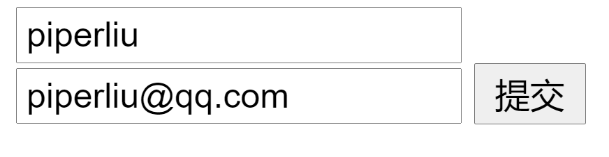
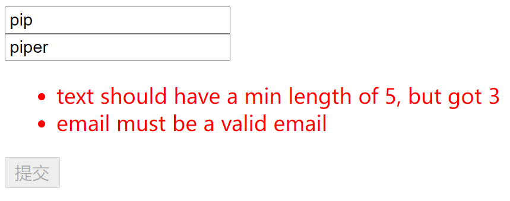

# 国际化

<!-- @import "[TOC]" {cmd="toc" depthFrom=3 depthTo=6 orderedList=false} -->

<!-- code_chunk_output -->

- [基于标记和基于模型](#基于标记和基于模型)
- [表单验证实例（插件）](#表单验证实例插件)

<!-- /code_chunk_output -->

### 基于标记和基于模型

表单验证有两种：
- `Markup-based` 比如 `vee-validate` ，表单验证的规则会在 `html` 标签上，比如可以规定 `<input>` 的最大长度等等；
- `Model-based` 比如 `vuelidate` ，通过 `JavaScript` 实现表单验证
  - `Model-based` 中 `html` 更加清爽
  - `Model-based` 更方便定制验证规则

### 表单验证实例（插件）




这里对应[代码作业(PiperLiu/vue-advanced-workshop)]((https://github.com/PiperLiu/vue-advanced-workshop))的 6.1 。

```html
<script src="../node_modules/vue/dist/vue.js"></script>

<div id="app">
  <form @submit="validate">
    <input v-model="text">
    <br>
    <input v-model="email">

    <ul v-if="!$v.valid" style="color:red">
      <li v-for="error in $v.errors">
        {{ error }}
      </li>
    </ul>

    <input type="submit" :disabled="!$v.valid">
  </form>
</div>

<script>
const validationPlugin = {
  install (Vue) {
    Vue.mixin({
      computed: {
        $v () {
          let valid = true
          const errors = []

          const schema = this.$options.validations
          if (schema) {
            Object.keys(schema).forEach(key => {
              const value = this[key]  // 让 value 是响应性的
              const validateFn = schema[key].validate
              const result = validateFn(value)

              if (!result) {
                valid = false
                errors.push(schema[key].message(key, value))
              }
            })
          }

          return {
            valid,
            errors
          }
        }
      }
    })
  }
}

const emailRE = /^(([^<>()[\]\\.,;:\s@\"]+(\.[^<>()[\]\\.,;:\s@\"]+)*)|(\".+\"))@((\[[0-9]{1,3}\.[0-9]{1,3}\.[0-9]{1,3}\.[0-9]{1,3}\])|(([a-zA-Z\-0-9]+\.)+[a-zA-Z]{2,}))$/

Vue.use(validationPlugin)

new Vue({
  el: '#app',
  data: {
    text: 'foo',
    email: ''
  },
  validations: {
    text: {
      validate: value => value.length >= 5,
      message: (key, value) => `${key} should have a min length of 5, but got ${value.length}`
    },
    email: {
      validate: value => emailRE.test(value),
      message: key => `${key} must be a valid email`
    }
  },
  methods: {
    validate (e) {
      if (!this.$v.valid) {
        e.preventDefault()
        alert('not valid!')
      }
    }
  }
})
</script>
```
