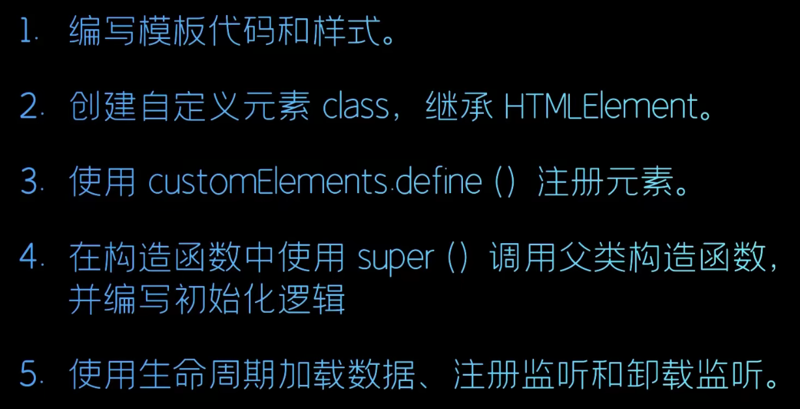
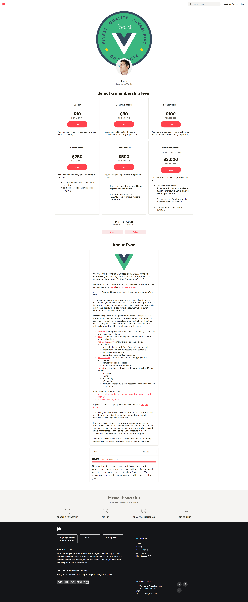

# 一些讨论问题

<!-- @import "[TOC]" {cmd="toc" depthFrom=3 depthTo=6 orderedList=false} -->

<!-- code_chunk_output -->

- [高阶函数和mixin的选择](#高阶函数和mixin的选择)
- [Web Components](#web-components)
- [什么时候使用服务端渲染](#什么时候使用服务端渲染)
- [patreon/evanyou](#patreonevanyou)

<!-- /code_chunk_output -->

### 高阶函数和mixin的选择

参考：[Vue原理实现](https://vue-course-doc.vercel.app/#_5-%E9%AB%98%E9%98%B6%E5%87%BD%E6%95%B0)

用`minxin`可以实现的，但是使用高阶组件有以下特点：

- **重用性。** 因为`minxin`对原组件具有侵入性，这会导致原来组件的可重用性降低，而高阶组件不会，高阶组件对原组件只是一个调用关系，并没有修改原来组件任何内容。
- **可测试性。** 因为高阶组件只是一个嵌套关系，在组件测试的时候，可以单独的测试原始组件和高阶组件。
- **层级问题。** 高阶组件也有他的弊端，如果你高阶组件嵌套层级太深，会导致出错的时候调试困难的问题，所以到底使用高阶组件和minxin需要看实际场景。

### Web Components

> Web Components 是一套不同的技术，允许您创建可重用的定制元素（它们的功能封装在您的代码之外）并且在您的web应用中使用它们。
> - 组件化开发已经是前端主流开发方式，因为组件化开发在代码复用提升团队效率方面有着无可比拟的优势，现在流行的React，Vue都是组件框架。
> - 谷歌公司一直在推动浏览器的原生组件，即 Web Components API。相比第三方框架，原生组件简单直接，符合直觉，不用加载任何外部模块，代码量小。目前，它还在不断发展，但已经可用于生产环境。

什么是 Web Components ：
- MDN：https://developer.mozilla.org/zh-CN/docs/Web/Web_Components
- [视频](https://www.bilibili.com/video/BV1Rh411y7kB)，[知乎文章](什么是web components？)

如上，给我的感觉就是没有响应式数据的 `Vue` 组件。

### 什么时候使用服务端渲染

阅读材料：https://ssr.vuejs.org/zh/

**什么是服务器端渲染 (SSR)？**

Vue.js 是构建客户端应用程序的框架。默认情况下，可以在浏览器中输出 Vue 组件，进行生成 DOM 和操作 DOM。然而，也可以将同一个组件渲染为服务器端的 HTML 字符串，将它们直接发送到浏览器，最后将这些静态标记"激活"为客户端上完全可交互的应用程序。

服务器渲染的 Vue.js 应用程序也可以被认为是"同构"或"通用"，因为应用程序的大部分代码都可以在服务器和客户端上运行。

**为什么使用服务器端渲染 (SSR)？**

与传统 SPA (单页应用程序 (Single-Page Application)) 相比，服务器端渲染 (SSR) 的优势主要在于：

更好的 SEO，由于搜索引擎爬虫抓取工具可以直接查看完全渲染的页面。

请注意，截至目前，Google 和 Bing 可以很好对同步 JavaScript 应用程序进行索引。在这里，同步是关键。如果你的应用程序初始展示 loading 菊花图，然后通过 Ajax 获取内容，抓取工具并不会等待异步完成后再行抓取页面内容。也就是说，如果 SEO 对你的站点至关重要，而你的页面又是异步获取内容，则你可能需要服务器端渲染(SSR)解决此问题。

更快的内容到达时间 (time-to-content)，特别是对于缓慢的网络情况或运行缓慢的设备。无需等待所有的 JavaScript 都完成下载并执行，才显示服务器渲染的标记，所以你的用户将会更快速地看到完整渲染的页面。通常可以产生更好的用户体验，并且对于那些「内容到达时间(time-to-content) 与转化率直接相关」的应用程序而言，服务器端渲染 (SSR) 至关重要。

使用服务器端渲染 (SSR) 时还需要有一些权衡之处：

开发条件所限。浏览器特定的代码，只能在某些生命周期钩子函数 (lifecycle hook) 中使用；一些外部扩展库 (external library) 可能需要特殊处理，才能在服务器渲染应用程序中运行。

涉及构建设置和部署的更多要求。与可以部署在任何静态文件服务器上的完全静态单页面应用程序 (SPA) 不同，服务器渲染应用程序，需要处于 Node.js server 运行环境。

更多的服务器端负载。在 Node.js 中渲染完整的应用程序，显然会比仅仅提供静态文件的 server 更加大量占用 CPU 资源 (CPU-intensive - CPU 密集)，因此如果你预料在高流量环境 (high traffic) 下使用，请准备相应的服务器负载，并明智地采用缓存策略。

在对你的应用程序使用服务器端渲染 (SSR) 之前，你应该问的第一个问题是，是否真的需要它。这主要取决于内容到达时间 (time-to-content) 对应用程序的重要程度。例如，如果你正在构建一个内部仪表盘，初始加载时的额外几百毫秒并不重要，这种情况下去使用服务器端渲染 (SSR) 将是一个小题大作之举。然而，内容到达时间 (time-to-content) 要求是绝对关键的指标，在这种情况下，服务器端渲染 (SSR) 可以帮助你实现最佳的初始加载性能。

### patreon/evanyou

https://www.patreon.com/evanyou

